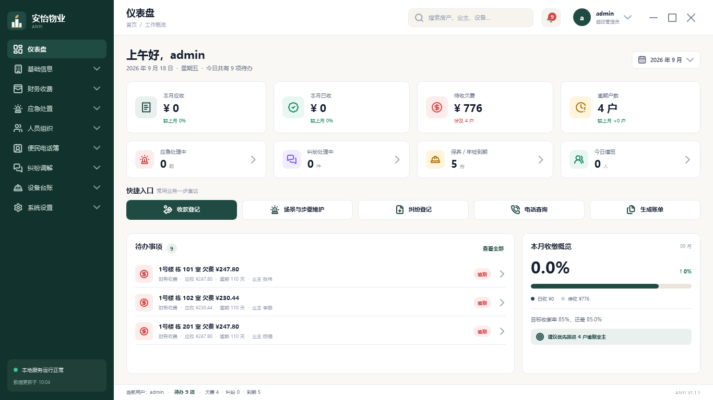
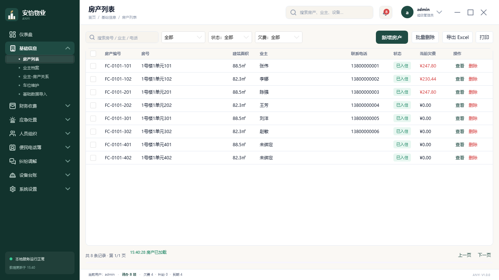
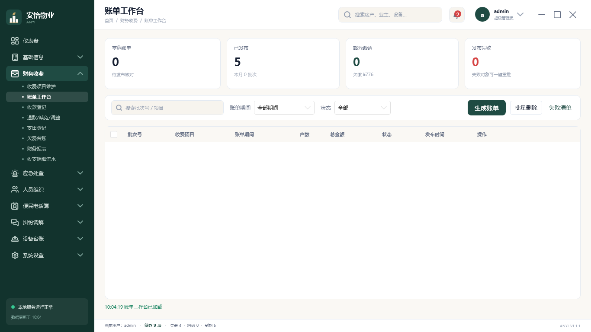
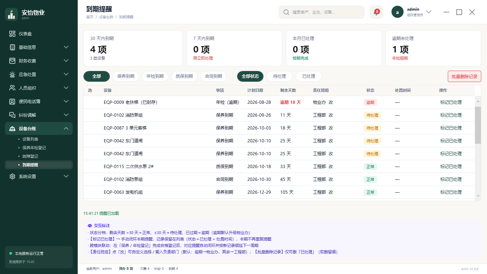
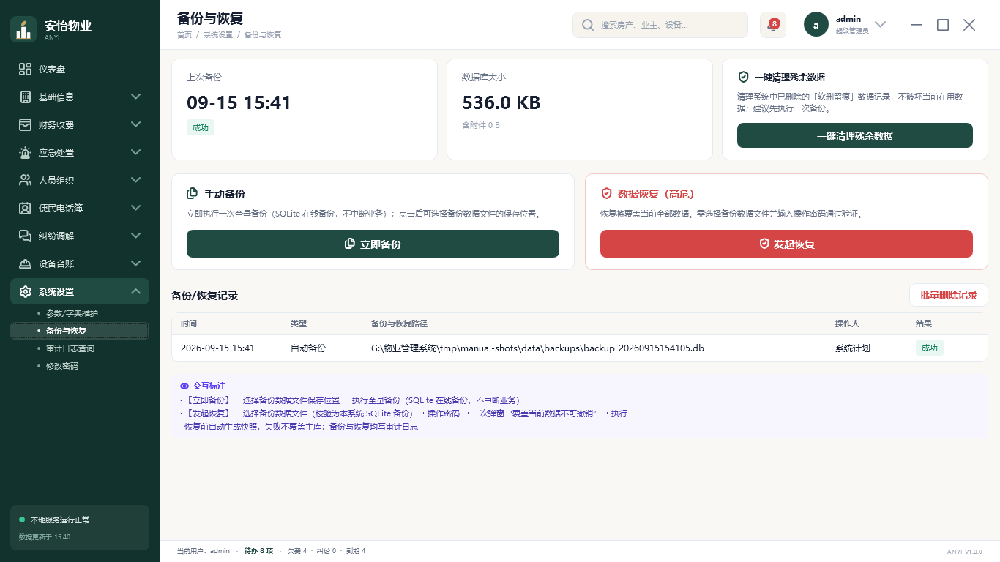
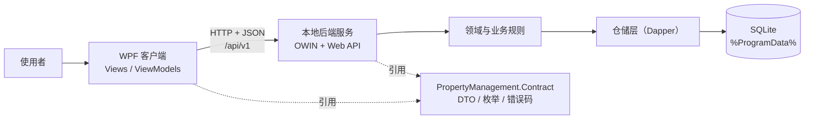

# 安怡物业管理系统

面向中小型住宅小区与商住项目的**单机部署**物业收费与台账管理桌面系统：WPF 客户端 + 本地后端服务，业务数据全部保存在本机，不依赖外部服务器与互联网，适合内网或离线环境。

当前版本 **1.3.1** ｜ 平台 **Windows 7 SP1 及以上** ｜ 运行时 **.NET Framework 4.8** ｜ 许可证 **MIT**



## 功能特性

| 模块 | 主要能力 |
|---|---|
| 仪表盘 | 待办事项、本月收缴概览、到期与应急提示、常用业务快捷入口 |
| 基础信息 | 房产列表、业主档案、业主-房产关系、车位维护、Excel 批量导入（校验不通过不入库并生成错误清单） |
| 财务收费 | 收费项目维护（价目表 + 计量变量 + 出账可改价）、账单工作台（草稿→发布→失败重推）、收款登记（全额/部分缴 + 收据模板导出）、退款减免调整、支出登记、欠费台账、财务报表、收支明细流水 |
| 设备台账 | 设备档案与状态流转、保养/年检登记（合格后自动顺延下一周期）、故障登记与维修工单、到期提醒（30/7/1 天分档） |
| 应急处置 | 应急场景库与标准处置步骤维护（步骤可排序、归档保留历史版本） |
| 人员组织 | 员工档案与离职处理（离职自动停用关联电话簿条目）、排班冲突检查、考勤审核 |
| 便民电话簿 | 电话查询（拼音首字母检索、一键复制、置顶）、条目维护与员工通讯录同步 |
| 纠纷调解 | 纠纷登记、处理进度跟踪、超期标记、结案与补录留痕 |
| 系统设置 | 参数/字典维护、备份与恢复（手动路径选择、恢复前快照）、审计日志查询、修改密码 |

其它工程化能力：

- **操作留痕**：登录、导出、备份、恢复、字典修改等关键操作写入审计日志，可查询、可追溯。
- **软删留痕**：业务数据一律软删除，误删记录保留痕迹，并可在「备份与恢复」页统一清理残余数据。
- **业务联动**：保养/年检登记合格自动闭环到期提醒；员工离职自动停用电话簿条目；账单工作台可直接跳转欠费台账。
- **后端自启与兜底拉起**：安装后以登录启动项隐藏拉起本地服务；客户端启动时以 `/health` 为唯一判据探测，必要时自动拉起，登录页可见服务状态。

| 房产列表 | 账单工作台 |
|---|---|
|  |  |

| 到期提醒 | 备份与恢复 |
|---|---|
|  |  |

## 技术栈与架构

| 层 | 技术 |
|---|---|
| 客户端 | WPF（.NET Framework 4.8）+ HandyControl + CommunityToolkit.Mvvm |
| 后端 | OWIN 自承载 + ASP.NET Web API 2，仅绑定 `127.0.0.1:5210` |
| 数据库 | SQLite（System.Data.SQLite + Dapper），数据库由后端独占访问，前端不直接连库 |
| 契约 | 独立工程 `PropertyManagement.Contract`（DTO/枚举/错误码），前后端同源引用 |
| 报表 | ClosedXML（Excel）+ PDFsharp（PDF）+ WPF 打印（收据） |
| 日志 | NLog（落 `%ProgramData%\PropertyManagement\logs`） |

依赖方向保持单向：**客户端 → 契约 ← 后端**，业务规则只存在于后端领域层。



## 快速开始

**前置条件**

- Windows 7 SP1 及以上（64 位）；**兼容 Win7 是立项要求**，依赖均选用 net45/net46/netstandard2.0 兼容资产
- **验证状态**：已在 Windows 10（64 位）完成端到端开发与测试；**Win7 与 Win11 尚未在真机验证**
- Visual Studio 2019 或 2022，且包含 **.NET Framework 4.8 目标包**（提供 MSBuild 与引用程序集）
- NuGet CLI（或在 Visual Studio 中使用包管理器）
- .NET Framework 4.8 运行时（Win10 1903+ / Win11 通常已内置；Win7 SP1 需安装，安装包已内嵌离线安装器）

**编译与运行**

```powershell
# 1) 还原依赖
nuget restore PropertyManagement.sln

# 2) 编译（如 MSBuild 不在 PATH，请使用 Visual Studio 自带路径）
msbuild PropertyManagement.sln /p:Configuration=Debug /m

# 3) 先启动本地后端，再启动客户端（两个进程可分别开一个终端）
.\PropertyManagement.Server\bin\Debug\PropertyManagement.Server.exe
.\PropertyManagement.Client\bin\Debug\PropertyManagement.Client.exe

# 4) 健康检查（应返回 200）
Invoke-WebRequest http://127.0.0.1:5210/api/v1/health
```

首次启动会在数据目录自动建库并初始化管理员账号，登录后**系统强制修改初始密码**，改密后需重新登录。

> **关于初始口令**：默认管理员账号为 `admin`，初始密码为 `Admin@123`（源码默认值写在 `PropertyManagement.Server\App.config` 的 `DefaultAdminPassword`，安装包即用该默认值），**仅供本机首次登录使用**。系统会在首次登录时**强制修改密码**，且所有数据都保存在本机、不对外提供服务，请在任何共享或对外环境部署前先完成改密。

## 打包与部署

仓库提供脚本化打包入口，产物为单文件安装包（内置 .NET Framework 4.8 离线安装器，可离线安装）：

```powershell
# 前置：安装 Inno Setup 6，并把 .NET Framework 4.8 离线安装器放到 Installer\redist\
powershell -NoProfile -ExecutionPolicy Bypass -File Installer\build-setup.ps1
```

脚本会依次完成：解析 `ISCC.exe` → 编译 Release → 生成向导品牌图 → 编译安装包 → 校验打包完整性并输出 SHA256 与文件清单。安装包默认按 **per-machine** 安装到 `C:\Program Files\PropertyManagement`，运行数据落在 `C:\ProgramData\PropertyManagement`，卸载时默认**保留数据**（可选一并删除并二次确认）。

详细步骤见 [开发者部署操作指南](documentation/deployment/开发者部署操作指南.md)。

## 项目结构

```
PropertyManagement.sln
├─ PropertyManagement.Client       # WPF 客户端：Views / ViewModels / Services / Assets
├─ PropertyManagement.Server       # 本地后端：Api / Services / Domain / Infrastructure
├─ PropertyManagement.Contract     # 共享契约：DTO / 枚举 / 错误码（无业务依赖）
├─ PropertyManagement.Tests        # 单元测试（xUnit + 控制台 runner）
├─ Installer                       # Inno Setup 脚本与打包入口
├─ documentation                   # 对外文档：API、数据库设计、功能说明、架构、部署指南
└─ quanju.pen                      # 界面原型源文件（设计工具格式，供设计参考）
```

## 文档

| 文档 | 说明 |
|---|---|
| [文档索引](documentation/README.md) | 全部对外文档的导航 |
| [API 接口契约](documentation/api/API接口契约.md) | 通用规范、60 用例→端点映射、业务规则落点、错误码清单 |
| [数据库设计](documentation/database/数据库设计.md) | ER 总览、表清单、核心表字段详述 |
| [功能说明](documentation/features/功能说明.md) | 60 个业务用例的模板化描述 |
| [系统架构](documentation/architecture/系统架构.md) / [技术选型](documentation/architecture/技术选型.md) | 分层结构、依赖方向与选型理由 |
| [开发者部署操作指南](documentation/deployment/开发者部署操作指南.md) | 从零到打包的完整步骤与故障排查 |
| [品牌与授权说明](documentation/legal/品牌与授权说明.md) | 品牌素材、字体授权与开源许可关系 |

## 开发规范与贡献

- **分支前缀**：`feature/`、`fix/`、`docs/`
- **提交信息**：`<范围>：<简述>`（中文，例如 `财务收费：修正部分缴款金额校验`）
- **代码风格**：C# 4 空格缩进、Allman 大括号；命名 `PascalCase` / `camelCase`；表字段 `t_xxx` 下划线 ↔ DTO 驼峰
- **架构红线**：契约层只放 DTO/枚举；业务规则只在后端领域层；删除一律软删（`del_flag`）
- **提交前自测**：编译通过 + 单元测试全绿

```powershell
# 单元测试（181 例，使用临时隔离库，不触碰本机数据目录）
powershell -NoProfile -ExecutionPolicy Bypass -File PropertyManagement.Tests\run-tests.ps1
```

更多约定见 [CONTRIBUTING.md](CONTRIBUTING.md)。

## 许可证与致谢

代码与文档以 **MIT License** 发布，详见 [LICENSE](LICENSE)。品牌标识（名称、徽记、字标）不随 MIT 授权，二次发布衍生版本时请替换品牌素材，详见[品牌与授权说明](documentation/legal/品牌与授权说明.md)。

感谢以下开源项目（关键依赖）：

| 用途 | 项目 |
|---|---|
| 界面 | HandyControl、CommunityToolkit.Mvvm |
| 后端 | Microsoft.Owin 4.2.2、Microsoft.AspNet.WebApi 5.2.9 |
| 数据库 | System.Data.SQLite 1.0.118、Dapper 2.1.35 |
| 序列化与日志 | Newtonsoft.Json 13.0.3、NLog 5.3.4 |
| 报表 | ClosedXML 0.102.3、PDFsharp 6.1.1、XLParser 1.5.2 |
| 安全 | BCrypt.Net-Next 4.0.3 |
| 安装包 | Inno Setup 6 |

## 常见问题

| 现象 | 处理 |
|---|---|
| 登录页提示「本地服务未就绪（已超时）」 | 手动启动 `Server\PropertyManagement.Server.exe`；查看数据目录 `logs` 下当日日志；确认 5210 端口未被占用 |
| 提示端口 5210 已被占用 | `netstat -ano` 按端口 5210 过滤，结束占用进程后重试 |
| 提示找不到 `PropertyManagement.Server.exe` | 客户端与后端不在同一目录：客户端会按「同级 Server 目录」查找，请保持打包后的目录结构 |
| 列表没有数据 | 确认筛选条件；新项目需先通过「基础数据导入」建立房产与业主数据，或在开发环境开启 `DevSeedEnabled` 造数 |
| 导出/打印无响应 | 确认导出目录可写且磁盘空间充足；打印需已连接打印机（可先用 Microsoft Print to PDF） |
