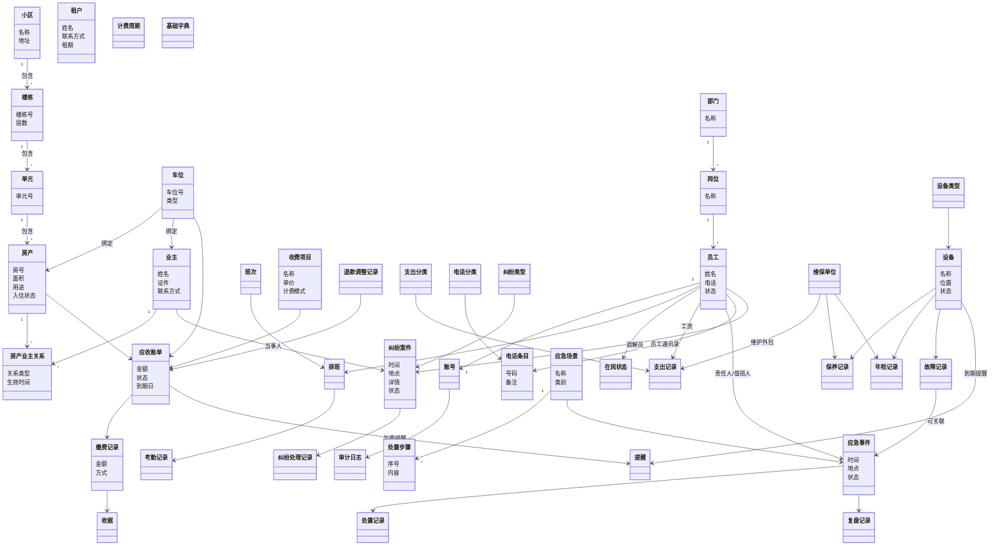

# AM-3 领域概念模型

> 制品：AM-03 ｜ 版本：v0.4（按评审结论调整：移除角色/权限概念）｜ 状态：待评审

## 一、概念清单（43 个）

> 调整说明（v0.2）：系统仅设系统管理员唯一角色，已移除"角色""权限"概念；账号保留用于登录，且与业务员工档案解耦。

### 基础信息（INF，8 个）

| 编号 | 概念 | 说明 | 关键属性（初版） |
|---|---|---|---|
| C-INF-01 | 小区/项目 | 系统所属管理项目 | 名称、地址、建成年份 |
| C-INF-02 | 楼栋 | 小区内楼栋 | 楼栋号、单元数、层数 |
| C-INF-03 | 单元 | 楼栋内单元 | 单元号 |
| C-INF-04 | 房产 | 最小缴费/纠纷对象 | 房号、面积、用途、入住状态 |
| C-INF-05 | 业主 | 房产权利人 | 姓名、证件、联系方式 |
| C-INF-06 | 租户 | 非业主住户（扩展） | 姓名、联系方式、租期 |
| C-INF-07 | 车位 | 停车位 | 车位号、类型（固定/临时）、绑定关系 |
| C-INF-08 | 房产-业主关系 | 业主与房产的关联（自住/出租） | 关系类型、生效时间、变更记录 |

### 人员组织（ORG，10 个）

| 编号 | 概念 | 说明 | 关键属性（初版） |
|---|---|---|---|
| C-ORG-01 | 部门 | 组织单元，可扩展 | 部门名称、上级部门 |
| C-ORG-02 | 岗位 | 部门内岗位 | 岗位名称、所属部门 |
| C-ORG-03 | 员工 | 物业人员档案 | 姓名、电话、入职日期、状态 |
| C-ORG-04 | 账号 | 登录凭证（仅系统管理员） | 用户名、密码、启停状态 |
| C-ORG-05 | 班次 | 排班基本单元 | 班次名称、起止时间 |
| C-ORG-06 | 排班 | 员工 × 班次 × 日期 | 日期、员工、班次、状态 |
| C-ORG-07 | 考勤记录 | 签到/签退/异常 | 日期、时间、类型、审核状态 |
| C-ORG-08 | 在岗状态 | 员工当前状态 | 在岗/离岗/休假 |

### 财务收费（FIN，8 个）

| 编号 | 概念 | 说明 | 关键属性（初版） |
|---|---|---|---|
| C-FIN-01 | 收费项目 | 收入类型 | 名称、计费周期、单价、模式（年/月/临时） |
| C-FIN-02 | 计费周期 | 账单生成周期 | 周期类型、起止日期 |
| C-FIN-03 | 应收账单 | 对房产/车位的应收 | 金额、周期、状态、到期日 |
| C-FIN-04 | 缴费记录 | 一次收款 | 金额、方式、时间、关联账单 |
| C-FIN-05 | 退款/调整记录 | 冲正、减免 | 类型、金额、原因、审核 |
| C-FIN-06 | 支出分类 | 支出类型字典 | 名称、类别（工资/维护/水电/外包/杂项） |
| C-FIN-07 | 支出记录 | 一笔支出 | 金额、日期、分类、关联对象 |
| C-FIN-08 | 收据 | 收款凭证 | 收据号、金额、打印时间 |

### 应急处置（EMG，5 个）

| 编号 | 概念 | 说明 | 关键属性（初版） |
|---|---|---|---|
| C-EMG-01 | 应急场景 | 六大场景 | 名称、类别、启用状态 |
| C-EMG-02 | 处置步骤 | 场景下的步骤清单 | 序号、内容、责任人角色 |
| C-EMG-03 | 应急事件 | 一次实际应急 | 场景、时间、地点、状态 |
| C-EMG-04 | 处置记录 | 过程记录 | 时间、操作、结果、操作人 |
| C-EMG-05 | 复盘记录 | 事后复盘 | 原因、改进措施、完成时间 |

### 便民电话簿（TEL，2 个）

| 编号 | 概念 | 说明 | 关键属性（初版） |
|---|---|---|---|
| C-TEL-01 | 电话分类 | 分类字典 | 分类名称、排序 |
| C-TEL-02 | 电话条目 | 单条电话 | 单位/姓名、号码、备注、置顶、状态 |

### 民事纠纷调解（DIS，3 个）

| 编号 | 概念 | 说明 | 关键属性（初版） |
|---|---|---|---|
| C-DIS-01 | 纠纷案件 | 一次纠纷全流程 | 类型、时间、地点、详情、状态 |
| C-DIS-02 | 纠纷类型 | 邻里/物业业主等 | 类型名称 |
| C-DIS-03 | 处理记录 | 方案与进度 | 处理内容、调解员、时间、进度 |

### 设备资产台账（EQP，6 个）

| 编号 | 概念 | 说明 | 关键属性（初版） |
|---|---|---|---|
| C-EQP-01 | 设备 | 台账主体 | 名称、位置、状态、启用日期 |
| C-EQP-02 | 设备类型 | 电梯/监控/水泵/配电房 | 类型名称、保养周期 |
| C-EQP-03 | 保养记录 | 定期保养 | 日期、内容、结果、保养单位 |
| C-EQP-04 | 年检记录 | 年度检验 | 日期、结果、检验单位 |
| C-EQP-05 | 故障记录 | 故障历史 | 时间、现象、原因、处理 |
| C-EQP-06 | 维保单位 | 外部服务单位 | 单位名称、联系人、电话 |

### 公共（COM，3 个）

| 编号 | 概念 | 说明 | 关键属性（初版） |
|---|---|---|---|
| C-COM-01 | 审计日志 | 敏感操作留痕 | 操作人、时间、操作、对象 |
| C-COM-02 | 基础字典 | 可扩展枚举 | 字典类型、编码、名称 |
| C-COM-03 | 提醒 | 到期/欠费提醒 | 类型、对象、到期日、状态 |

## 二、概念类图

## 三、关键关系说明

1. **房产与业主是多对多**，通过"房产-业主关系"承载（自住/出租、产权变更），避免直接在房产上冗余业主字段；
2. **账单的缴费对象可以是房产或车位**，收费项目决定计费模式（本期年缴，预留月缴/临时）；
3. **员工是"人"类唯一来源**：账号、排班、考勤、在岗状态、应急责任、调解员、工资支出、通讯录都引用员工；
4. **故障记录与应急事件可关联但不强制**，避免两模块强耦合；
5. **提醒统一建模**：欠费提醒（账单到期）、保养/年检提醒（设备周期），仪表盘统一展示。
