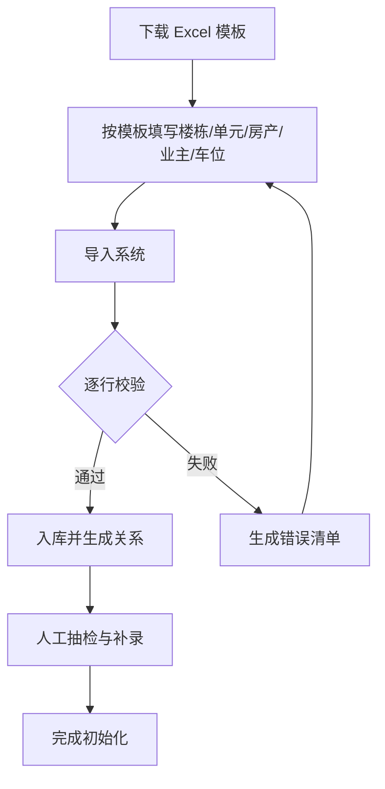
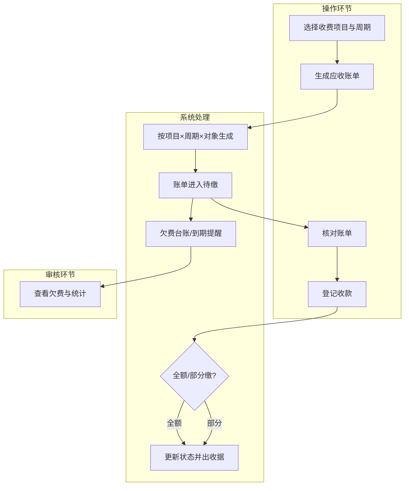
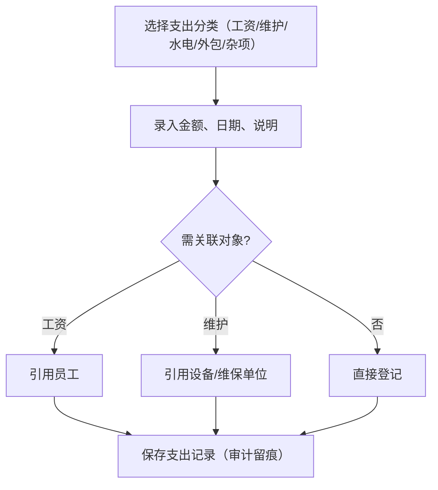
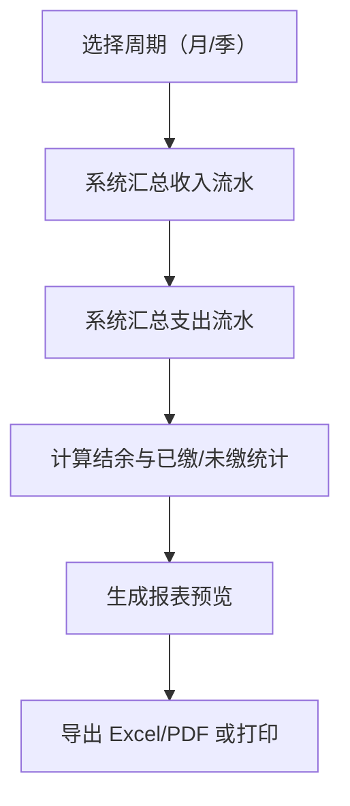
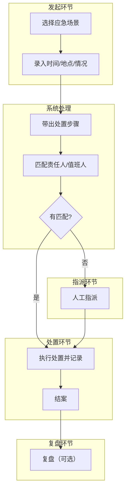
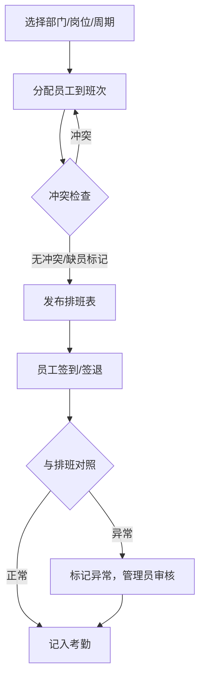
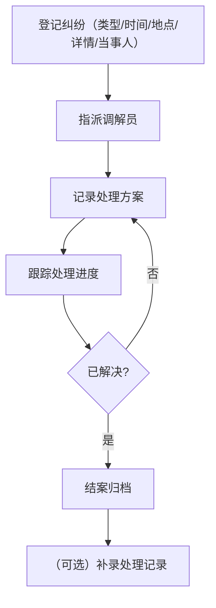
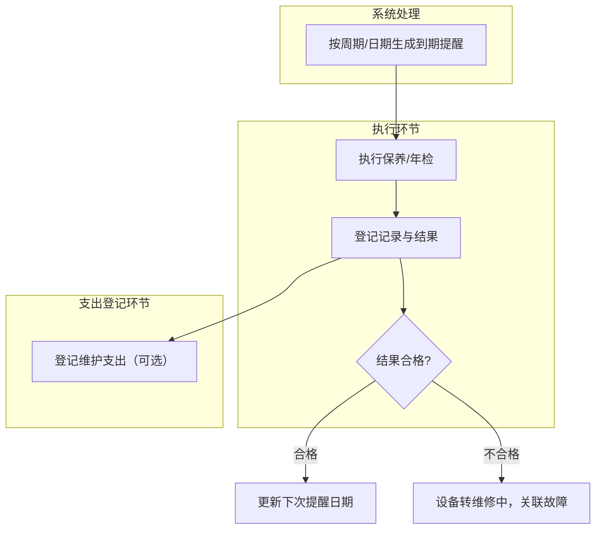

# AM-4 业务流程模型

> 制品：AM-04 ｜ 版本：v0.4（按评审结论调整：流程操作人统一为系统管理员）｜ 状态：待评审

## 一、流程清单（8 个）

| 编号 | 流程名称 | 涉及角色 | 涉及子系统 |
|---|---|---|---|
| FL-INF-01 | 基础信息初始化（Excel 导入） | 系统管理员（唯一角色） | 基础信息 |
| FL-FIN-01 | 缴费与欠费催缴 | 系统管理员（唯一角色） | 财务、基础信息 |
| FL-FIN-02 | 支出记账 | 系统管理员（唯一角色） | 财务、人员、设备 |
| FL-FIN-03 | 月度/季度财务报表 | 系统管理员（唯一角色） | 财务 |
| FL-EMG-01 | 应急响应 | 系统管理员（唯一角色） | 应急、人员、设备、电话簿 |
| FL-ORG-01 | 排班与考勤 | 系统管理员（唯一角色） | 人员 |
| FL-DIS-01 | 纠纷调解 | 系统管理员（唯一角色） | 纠纷、人员、基础信息 |
| FL-EQP-01 | 设备保养与年检 | 系统管理员（唯一角色） | 设备、财务 |

## 二、关键流程活动图

### FL-INF-01 基础信息初始化

### FL-FIN-01 缴费与欠费催缴

### FL-FIN-02 支出记账

### FL-FIN-03 财务报表

### FL-EMG-01 应急响应

### FL-ORG-01 排班与考勤

### FL-DIS-01 纠纷调解

### FL-EQP-01 设备保养与年检

## 三、说明

- 所有操作均由系统管理员（唯一角色）执行；流程中的子图仅为环节分组，不代表系统角色；
- 当前流程图以"子图"近似泳道，评审确认环节归属后正式化；
- 异常路径已覆盖：导入失败、部分缴费、应急无人匹配、排班冲突、纠纷未解决、年检不合格；
- 各流程与用例、规则、状态的追溯将在 v0.2 补齐。
