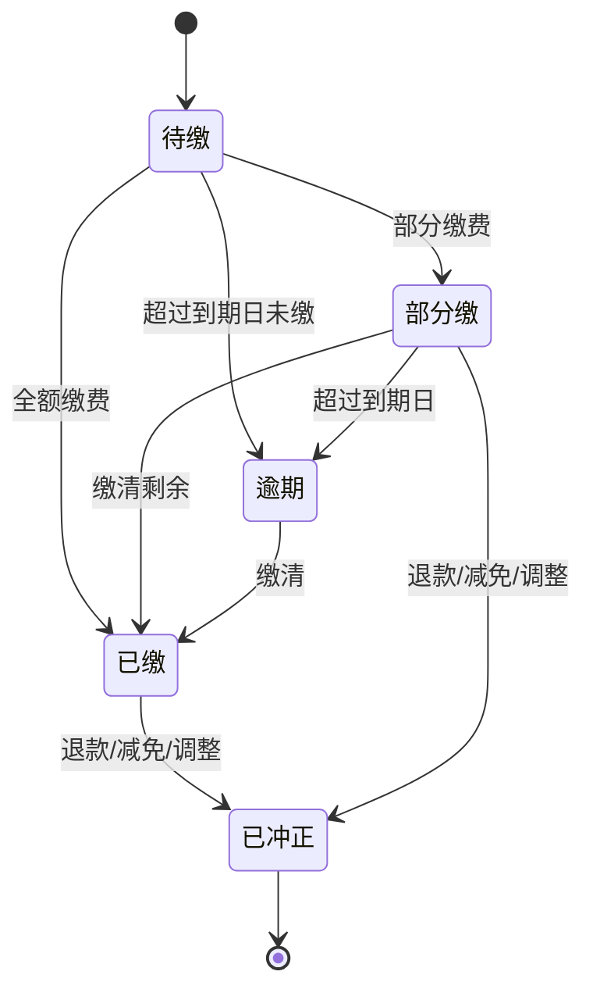
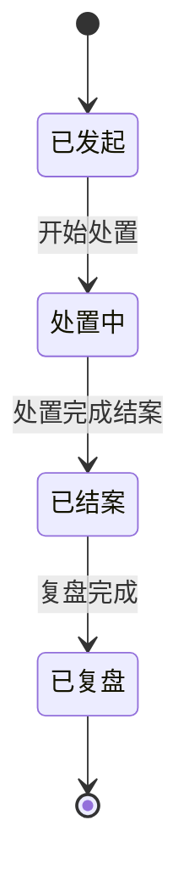
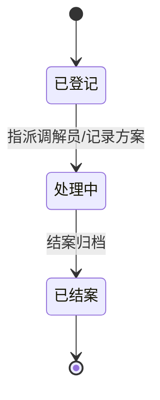
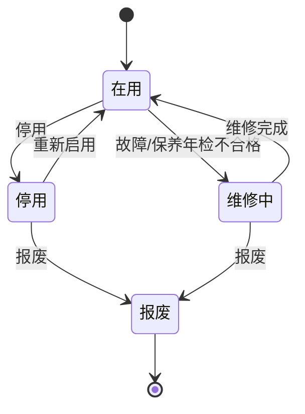
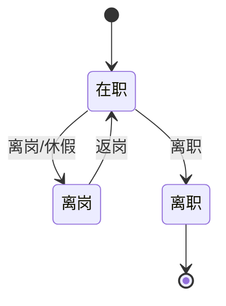
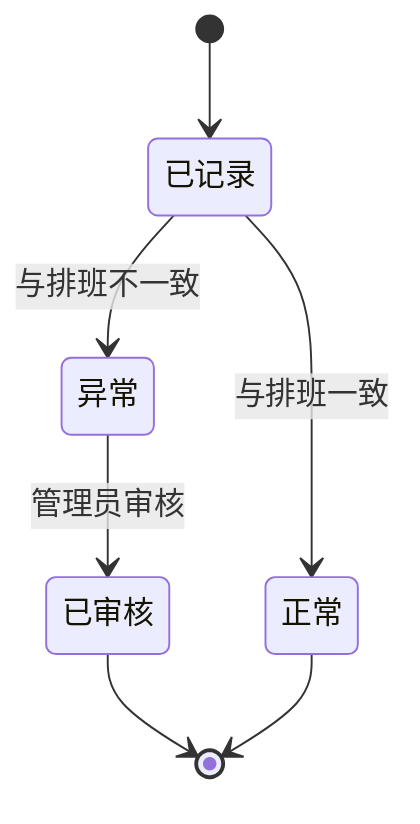
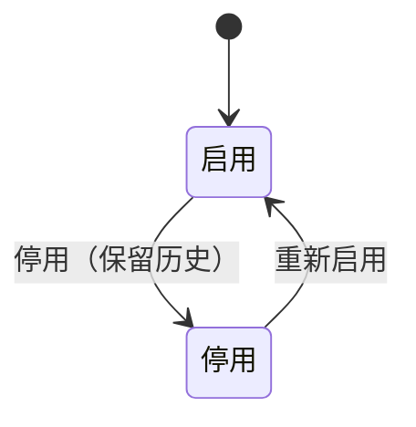

# AM-5 业务状态模型

> 制品：AM-05 ｜ 版本：v0.4（角色简化同步）｜ 状态：待评审

## 一、应收账单状态

| 状态 | 进入条件 | 说明 |
|---|---|---|
| 待缴 | 账单生成发布 | 应缴未缴 |
| 部分缴 | 收款金额 < 账单金额 | 剩余计入欠费 |
| 逾期 | 超过到期日仍有欠款 | 进入欠费台账 |
| 已缴 | 收款金额 = 账单金额 | 正常完结 |
| 已冲正 | 退款/减免/调整 | 保留原记录，审计可查 |

## 二、应急事件状态

| 状态 | 进入条件 | 说明 |
|---|---|---|
| 已发起 | 场景选择并录入信息 | 自动带出步骤、匹配人员 |
| 处置中 | 责任人开始处置 | 记录过程 |
| 已结案 | 处置完成 | 归档，可补录复盘/处置记录 |
| 已复盘 | 复盘记录完成 | 终态 |

## 三、纠纷案件状态

| 状态 | 进入条件 | 说明 |
|---|---|---|
| 已登记 | 纠纷信息录入 | 未开始处理 |
| 处理中 | 指派调解员并记录方案 | 可多次补充处理记录 |
| 已结案 | 问题解决并归档 | 终态，可补录记录 |

## 四、设备状态

| 状态 | 进入条件 | 说明 |
|---|---|---|
| 在用 | 设备启用 | 正常状态 |
| 维修中 | 故障或检验不合格 | 可关联故障记录 |
| 停用 | 人为停用 | 保留档案 |
| 报废 | 报废审批 | 终态，档案保留 |

## 五、员工状态

| 状态 | 进入条件 | 说明 |
|---|---|---|
| 在职 | 入职 | 可排班、可应急匹配 |
| 离岗 | 离岗/休假 | 应急匹配排除 |
| 离职 | 离职办理 | 账号停用、档案保留 |

## 六、考勤记录状态

| 状态 | 进入条件 | 说明 |
|---|---|---|
| 已记录 | 签到/签退 | 待对照 |
| 正常 | 与排班一致 | 自动判定 |
| 异常 | 缺卡/迟到/早退等 | 需审核 |
| 已审核 | 管理员审核通过 | 终态，可修正 |

## 七、补充：电话条目状态

## 八、状态与用例追溯

| 状态模型 | 关联用例 |
|---|---|
| 应收账单 | UC-FIN-002/003/004/007 |
| 应急事件 | UC-EMG-003/005/006/007 |
| 纠纷案件 | UC-DIS-001/004/005/007 |
| 设备 | UC-EQP-001/002/003/004 |
| 员工 | UC-ORG-002/005 |
| 考勤记录 | UC-ORG-004 |
