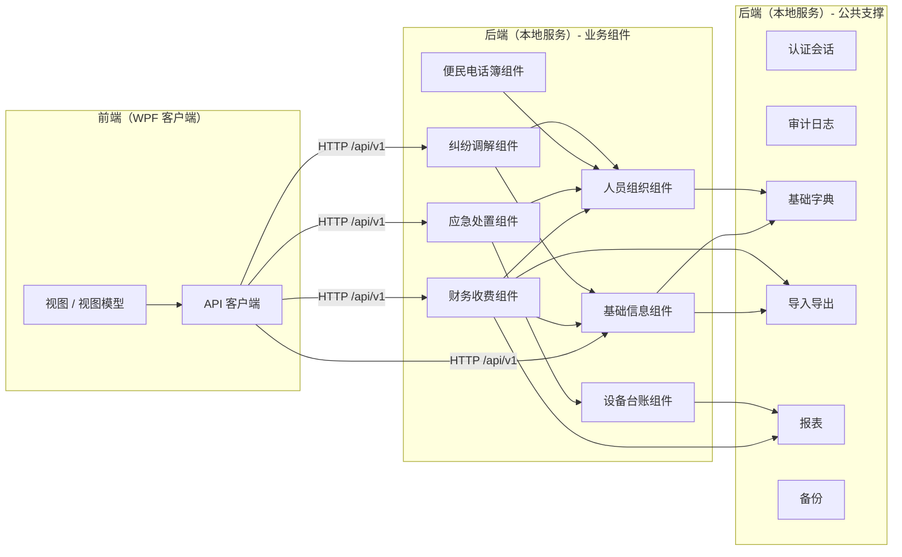

# DM-2 组件与子系统设计

> 制品：DM-02 ｜ 版本：v0.2（前后端分离）｜ 状态：待评审
> 输入：AM-03 概念、AM-08 依赖矩阵、DM-01 架构、技术选型建议

## 一、组件图

## 二、组件职责表

| 组件 | 职责 | 关键服务（接口级） |
|---|---|---|
| 前端 WPF | 界面展示、交互、打印；数据经 API 获取 | 视图、视图模型、API 客户端 |
| 后端 API 层 | 路由、鉴权、DTO 转换、错误处理 | 控制器（/api/v1） |
| 基础信息 | 小区/楼栋/单元/房产/业主/车位/关系维护，Excel 导入 | PropertyService、OwnerService、ParkingService、ImportService |
| 人员组织 | 部门/岗位/员工/排班/考勤/在岗状态 | OrgService、EmployeeService、ScheduleService、AttendanceService |
| 财务收费 | 收费项目/账单/收款/退款调整/支出/报表 | BillService、PaymentService、ExpenseService、FinanceReportService |
| 应急处置 | 场景/步骤/事件/指派/处置/复盘 | EmergencyService、AssignService、ReviewService |
| 便民电话簿 | 分类/条目/员工通讯录同步 | PhoneBookService |
| 纠纷调解 | 案件/处理记录/结案/统计 | DisputeService |
| 设备台账 | 设备/保养/年检/故障/维保/到期提醒 | DeviceService、MaintenanceService、ReminderService |
| 公共支撑 | 登录、字典、审计、导入导出、报表、备份 | AuthService、DictService、AuditService、ExportService、BackupService |

## 三、接口清单（服务级）

> 说明：所有服务接口统一经后端 HTTP API（`/api/v1`）暴露，前端不直接访问服务与数据库；端点规范见 [技术选型建议.md](技术选型建议.md)。

| 组件 | 服务 | 主要操作 | 消费方 |
|---|---|---|---|
| 基础信息 | PropertyService | 维护房产档案、查询缴费对象 | 财务、纠纷 |
| 基础信息 | OwnerService | 维护业主、业主-房产关系、变更留痕 | 财务、纠纷 |
| 基础信息 | ImportService | Excel 导入、逐行校验、错误清单 | 界面 |
| 人员组织 | EmployeeService | 员工档案、离职停用账号 | 财务（工资）、应急（指派）、电话簿（通讯录） |
| 人员组织 | ScheduleService | 排班、冲突检查、发布 | 应急（值班匹配） |
| 人员组织 | AttendanceService | 考勤记录、异常审核 | 界面 |
| 财务收费 | BillService | 生成账单（草稿/发布/撤销）、失败清单 | 报表 |
| 财务收费 | PaymentService | 收款、部分缴、预存抵扣、退款调整 | 收据打印 |
| 财务收费 | ExpenseService | 支出登记、关联对象 | 界面 |
| 财务收费 | FinanceReportService | 月/季报、已缴未缴统计、导出 | 报表组件 |
| 应急处置 | EmergencyService | 发起事件、带出步骤、结案 | 界面 |
| 应急处置 | AssignService | 责任人/值班人匹配、人工指派 | 应急 |
| 应急处置 | ReviewService | 复盘记录、时限提醒 | 仪表盘 |
| 电话簿 | PhoneBookService | 分类/条目维护、员工通讯录同步 | 界面 |
| 纠纷调解 | DisputeService | 登记、处理记录、结案（类型化）、统计 | 界面 |
| 设备台账 | DeviceService | 设备档案、状态变更留痕 | 应急（场景关联） |
| 设备台账 | MaintenanceService | 保养/年检登记、到期提醒计算 | 仪表盘 |
| 公共支撑 | AuthService | 登录、改密、锁定 | 全部 |
| 公共支撑 | AuditService | 敏感操作留痕、查询 | 全部 |
| 公共支撑 | BackupService | 每日备份、手动备份、恢复 | 界面 |

## 四、依赖规则

1. 业务组件只读引用基础数据组件（基础信息、人员组织），禁止反向修改；
2. 财务收费可引用基础信息、人员组织、设备台账（只读）；应急可引用人员组织、设备台账、电话簿；
3. 全部业务组件依赖公共支撑组件（字典/审计/导入导出），公共支撑不依赖任何业务组件；
4. 组件间无循环依赖；新增跨组件引用需评审；
5. 组件边界与七大子系统一一对应，不新增业务组件。
