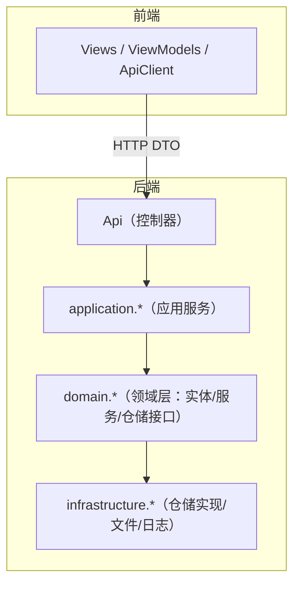
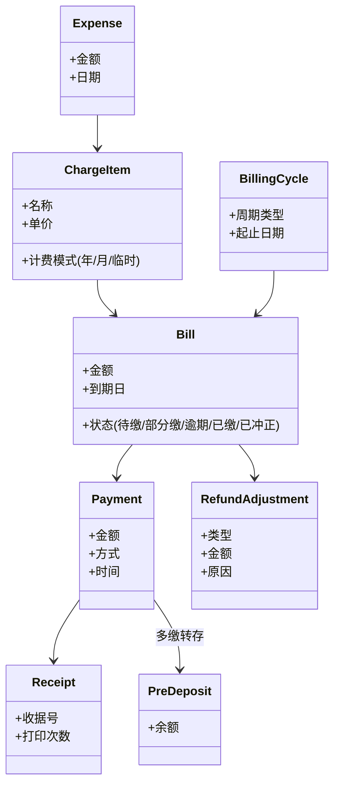
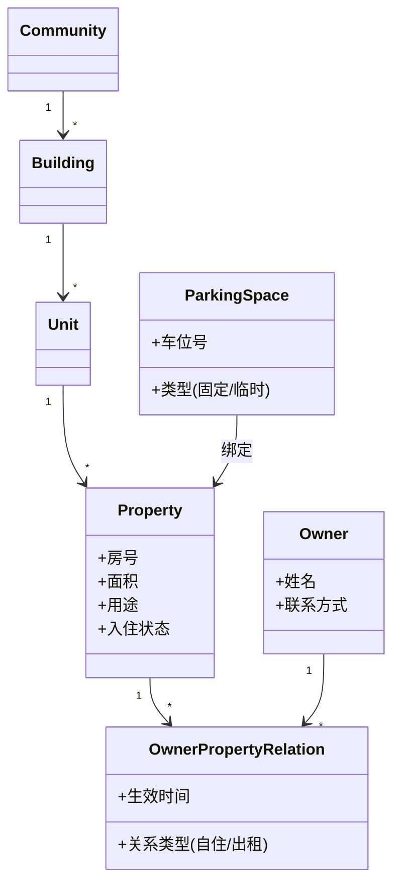
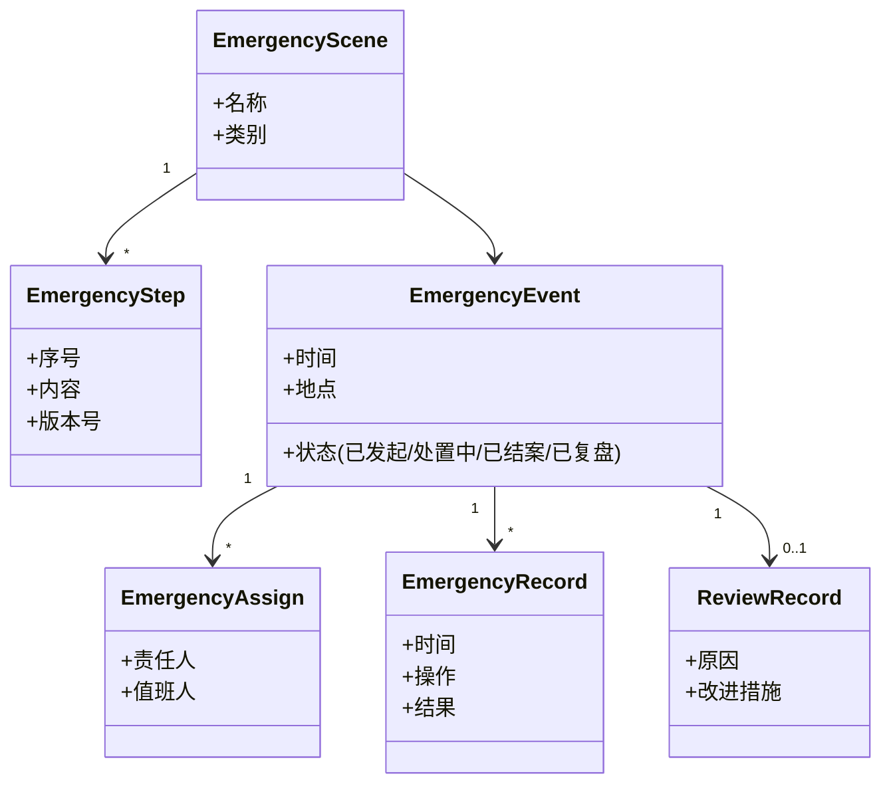
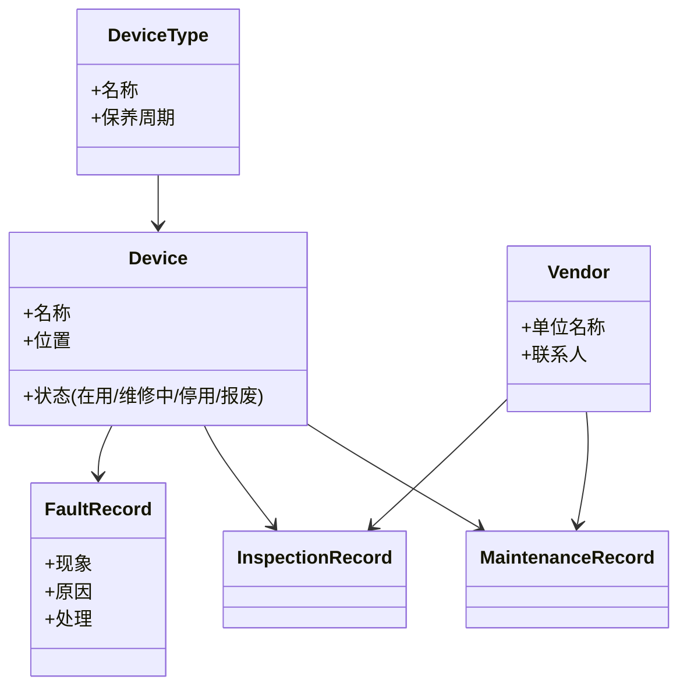

# DM-3 设计类设计

> 制品：DM-03 ｜ 版本：v0.2（前后端分离）｜ 状态：待评审
> 输入：AM-03 概念（43 个）、AM-02 用例、DM-01/02 架构与组件、技术选型建议
> 说明：实体-服务-仓储-视图模型四类职责分离；实体/服务/仓储位于后端，视图模型/API 客户端位于前端。

## 一、包结构

## 二、分层类职责

| 层 | 类类型 | 职责 | 示例（财务） |
|---|---|---|---|
| 前端表现层 | 视图模型（ViewModel）/页面/API 客户端 | 界面状态、命令绑定、HTTP 调用 | PaymentViewModel、BillingApiClient |
| 后端 API 层 | 控制器（Controller） | 路由、鉴权、DTO 转换 | PaymentsController |
| 后端应用服务层 | 用例服务 | 用例编排、事务边界、调用领域规则 | PaymentService |
| 后端领域层 | 实体（Entity）/领域服务/仓储接口 | 状态与不变量、跨实体规则、持久化抽象 | Bill、Payment、IBillRepository |
| 后端基础设施层 | 仓储实现 | 数据库读写 | SqlBillRepository |

## 三、核心领域类图（4 张）

### 3.1 财务领域

### 3.2 基础信息领域

### 3.3 应急领域

### 3.4 设备领域

## 四、设计原则

1. 实体承载状态与规则（如 Bill 的"部分缴/逾期"判定），服务编排用例（PaymentService 组织校验、记账、出票、审计）；
2. 依赖倒置：领域层定义仓储接口，基础设施层实现，领域层不引用任何框架；
3. 视图模型与实体分离，界面不直接操作实体；
4. 每个 AM-03 概念至少映射一个实体类（43 个概念全覆盖），其余为服务/仓储/视图模型类；
5. 技术选型确认后（D-1/D-2），按框架映射本设计（类图不变，只增加注解/映射）。
