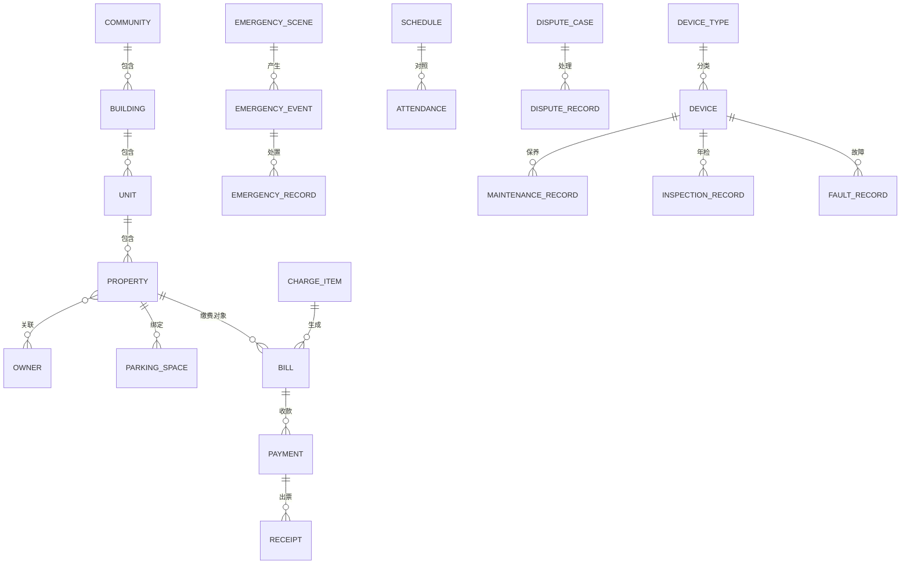

# DM-4 数据库设计

> 制品：DM-04 ｜ 版本：v0.2（数据库归属后端服务）｜ 状态：待评审
> 输入：AM-03 概念、AM-06 规则、P-01~P-09 确认参数
> 说明：逻辑表设计；数据库由后端服务独占访问（前后端分离，前端不直接连库），单机采用 SQLite（D-2 已确认）；表名统一英文小写下划线。

## 一、ER 总览（核心实体）

## 二、表清单（60 张）

### 2.1 公共支撑（7 张）

| 表名 | 用途 | 关键字段 | 约束/关联 |
|---|---|---|---|
| t_user | 登录账号（唯一管理员） | id, username, password_hash, status, last_login_at | username 唯一 |
| t_param | 系统参数 | id, param_key, param_value | P-01~P-09 参数 |
| t_dict_type | 字典类型 | id, type_code, type_name | 扩展点 |
| t_dict_item | 字典项 | id, type_code, item_code, item_name, sort, status | 被引用禁删 |
| t_audit_log | 审计日志 | id, user_id, action, target_type, target_id, detail, created_at | 只追加 |
| t_backup | 备份记录 | id, file_path, size, created_at | 保留 30 份 |
| t_reminder | 提醒 | id, type, target_id, due_at, status | 仪表盘 |
| t_export_log | 导出记录 | id, module, format, file_path, created_at | 列表导出/报表导出留痕 |

### 2.2 基础信息（8 张）

| 表名 | 用途 | 关键字段 | 约束/关联 |
|---|---|---|---|
| t_community | 小区/项目 | id, name, address | 预留多项目 |
| t_building | 楼栋 | id, community_id, building_no, floors | 小区+楼栋号唯一 |
| t_unit | 单元 | id, building_id, unit_no | 楼栋+单元号唯一 |
| t_property | 房产 | id, unit_id, room_no, area, usage, status | 单元+房号唯一（BR-INF-01） |
| t_owner | 业主 | id, name, id_card, phone, status | 变更留痕 |
| t_owner_property_rel | 房产-业主关系 | id, property_id, owner_id, rel_type, effective_at | 关系唯一+变更历史（BR-INF-02） |
| t_parking_space | 车位 | id, space_no, space_type, property_id, owner_id | 固定车位唯一绑定（BR-INF-03） |
| t_base_change_log | 基础信息变更记录 | id, object_type, object_id, change_content, changed_at | 只追加 |

### 2.3 人员组织（7 张）

| 表名 | 用途 | 关键字段 | 约束/关联 |
|---|---|---|---|
| t_department | 部门 | id, name, parent_id, status | 层级可扩展 |
| t_position | 岗位 | id, dept_id, name | 部门下岗位 |
| t_employee | 员工 | id, dept_id, position_id, name, phone, hire_date, status | 离职保留档案（BR-ORG-02） |
| t_employee_status_log | 在岗状态记录 | id, employee_id, status, changed_at | 只追加 |
| t_shift | 班次 | id, name, start_time, end_time | — |
| t_schedule | 排班 | id, employee_id, shift_id, work_date, status | 冲突检查（BR-ORG-03） |
| t_attendance | 考勤记录 | id, employee_id, work_date, check_in, check_out, result, review_by, review_note | 异常需审核（BR-ORG-05） |
| t_schedule_conflict_log | 排班冲突/缺口记录 | id, schedule_id, conflict_type, detail, created_at | 排班发布时生成 |

### 2.4 财务收费（12 张）

| 表名 | 用途 | 关键字段 | 约束/关联 |
|---|---|---|---|
| t_charge_item | 收费项目 | id, name, pay_mode, unit_price, cycle_type, status | pay_mode 枚举（BR-FIN-03） |
| t_billing_cycle | 计费周期 | id, cycle_type, start_date, end_date | — |
| t_bill | 应收账单 | id, charge_item_id, property_id/parking_id, cycle_id, amount, status, due_at | 同对象同周期唯一（BR-FIN-01） |
| t_payment | 缴费记录 | id, bill_id, amount, pay_method, paid_at, status | 审计（BR-COM-01） |
| t_receipt | 收据 | id, payment_id, receipt_no, print_count, printed_at | 收据号唯一（BR-FIN-08） |
| t_payment_refund | 退款/减免/调整 | id, bill_id, refund_type, amount, reason, ref_no, created_at | 超额阻止（BR-FIN-06） |
| t_pre_deposit | 预存款 | id, owner_id, balance, updated_at | P-06 |
| t_expense_category | 支出分类 | id, name, category_type, status | 字典驱动 |
| t_expense | 支出记录 | id, category_id, amount, expense_date, note, status | 软删除（BR-FIN-10） |
| t_expense_object_rel | 支出关联对象 | id, expense_id, object_type, object_id | 员工/设备/维保单位 |
| t_bill_generate_log | 账单生成批次 | id, generate_at, total, success, fail, fail_detail | 失败清单（BR-FIN-01） |
| t_report_log | 报表/导出记录 | id, report_type, period, format, file_path, created_at | — |
| t_bill_status_log | 账单状态变更记录 | id, bill_id, old_status, new_status, changed_at, reason | 只追加，审计口径 |

### 2.5 应急处置（6 张）

| 表名 | 用途 | 关键字段 | 约束/关联 |
|---|---|---|---|
| t_emergency_scene | 应急场景 | id, name, category, status | 字典驱动扩展 |
| t_emergency_step | 处置步骤（含版本） | id, scene_id, step_no, content, version_no, status | 版本化（BR-EMG-05） |
| t_emergency_event | 应急事件 | id, scene_id, event_time, location, description, status, step_version | 必须关联场景（BR-EMG-01） |
| t_emergency_assign | 应急指派 | id, event_id, employee_id, assign_type, assigned_at | 责任人/值班人 |
| t_emergency_record | 处置记录 | id, event_id, record_time, content, result, recorder | 补录留痕 |
| t_emergency_review | 复盘记录 | id, event_id, cause, measure, finish_at, created_at | 时限 3 工作日（P-03） |
| t_event_status_log | 应急事件状态变更记录 | id, event_id, old_status, new_status, changed_at | 只追加 |

### 2.6 便民电话簿（2 张）

| 表名 | 用途 | 关键字段 | 约束/关联 |
|---|---|---|---|
| t_phone_category | 电话分类 | id, name, sort | 字典驱动 |
| t_phone_entry | 电话条目 | id, category_id, entry_type, name, phone, note, is_top, status | 紧急号码置顶禁删（BR-TEL-03） |

### 2.7 纠纷调解（4 张）

| 表名 | 用途 | 关键字段 | 约束/关联 |
|---|---|---|---|
| t_dispute_type | 纠纷类型 | id, name, status | 字典驱动 |
| t_dispute_case | 纠纷案件 | id, type_id, occur_time, location, detail, status, mediator_id | 状态流（BR-DIS-01） |
| t_dispute_party | 纠纷当事人 | id, case_id, party_type, owner_id, name, phone | 业主引用或外部登记 |
| t_dispute_record | 处理记录 | id, case_id, record_time, content, recorder, is_supplement | 补录留痕（BR-DIS-04） |
| t_dispute_status_log | 纠纷状态变更记录 | id, case_id, old_status, new_status, changed_at | 只追加 |

### 2.8 设备资产台账（7 张）

| 表名 | 用途 | 关键字段 | 约束/关联 |
|---|---|---|---|
| t_device_type | 设备类型 | id, name, maintenance_cycle, status | 类型默认周期（P-04） |
| t_device | 设备 | id, type_id, name, location, status, enable_date | 状态流转（BR-EQP-01） |
| t_device_status_log | 设备状态变更 | id, device_id, old_status, new_status, reason, changed_at | 只追加 |
| t_maintenance_record | 保养记录 | id, device_id, vendor_id, m_date, content, result | 不合格转维修（BR-EQP-03） |
| t_inspection_record | 年检记录 | id, device_id, vendor_id, i_date, result | — |
| t_fault_record | 故障记录 | id, device_id, event_id, f_time, symptom, cause, handle | event_id 可空（弱关联） |
| t_vendor | 维保单位 | id, name, contact, phone | — |

### 2.9 导入打印（2 张）

| 表名 | 用途 | 关键字段 | 约束/关联 |
|---|---|---|---|
| t_import_log | 导入批次 | id, module, file_name, total, success, fail, error_file, created_at | 错误清单 |
| t_print_log | 打印记录 | id, biz_type, biz_id, print_count, printed_at | 收据/报表补打 |

## 三、核心表字段详述（6 张）

### t_property（房产）

| 字段 | 类型（逻辑） | 说明 |
|---|---|---|
| id | 整数 | 主键 |
| unit_id | 整数 | 关联 t_unit |
| room_no | 文本 | 房号 |
| area | 小数 | 面积 |
| usage | 枚举 | 住宅/商铺 |
| status | 枚举 | 空置/入住 |
| del_flag | 布尔 | 软删除 |
| created_at / updated_at | 时间 | 审计 |

### t_bill（应收账单）

| 字段 | 类型（逻辑） | 说明 |
|---|---|---|
| id | 整数 | 主键 |
| charge_item_id | 整数 | 关联收费项目 |
| property_id / parking_id | 整数 | 缴费对象（二选一） |
| cycle_id | 整数 | 关联计费周期 |
| amount | 小数 | 应收金额 |
| paid_amount | 小数 | 已收金额 |
| status | 枚举 | 待缴/部分缴/逾期/已缴/已冲正 |
| due_at | 日期 | 到期日（逾期判定 P-01） |
| generate_batch_id | 整数 | 关联生成批次 |
| del_flag | 布尔 | 软删除 |

### t_payment（缴费记录）

| 字段 | 类型（逻辑） | 说明 |
|---|---|---|
| id | 整数 | 主键 |
| bill_id | 整数 | 关联账单 |
| amount | 小数 | 实收金额 |
| pay_method | 枚举 | 现金/转账 |
| paid_at | 时间 | 收款时间 |
| status | 枚举 | 正常/冲正 |
| to_pre_deposit | 小数 | 转预存款金额（P-06） |
| created_at | 时间 | 审计 |

### t_emergency_event（应急事件）

| 字段 | 类型（逻辑） | 说明 |
|---|---|---|
| id | 整数 | 主键 |
| scene_id | 整数 | 关联场景（BR-EMG-01） |
| event_time | 时间 | 发生时间 |
| location | 文本 | 地点 |
| description | 文本 | 初步情况 |
| status | 枚举 | 已发起/处置中/已结案/已复盘 |
| step_version | 文本 | 所引处置步骤版本（BR-EMG-05） |
| record_pending | 布尔 | 处置记录待补标记 |

### t_dispute_case（纠纷案件）

| 字段 | 类型（逻辑） | 说明 |
|---|---|---|
| id | 整数 | 主键 |
| type_id | 整数 | 纠纷类型 |
| occur_time | 时间 | 发生时间 |
| location | 文本 | 地点 |
| detail | 文本 | 详情 |
| status | 枚举 | 已登记/处理中/已结案 |
| close_type | 枚举 | 调解成功/自行和解/转办（P-08） |
| mediator_id | 整数 | 调解员（引用员工） |
| closed_at | 时间 | 结案时间 |

### t_device（设备）

| 字段 | 类型（逻辑） | 说明 |
|---|---|---|
| id | 整数 | 主键 |
| type_id | 整数 | 设备类型 |
| name | 文本 | 名称 |
| location | 文本 | 位置 |
| status | 枚举 | 在用/维修中/停用/报废 |
| enable_date | 日期 | 启用日期 |
| del_flag | 布尔 | 软删除 |

## 四、扩展点落地

- 缴费模式（年/月/临时）：t_charge_item.pay_mode 枚举 + 计费规则扩展（BR-FIN-03）；
- 设备类型/应急场景/支出分类/电话分类/纠纷类型：t_dict_* 字典驱动；
- 预存款：t_pre_deposit（P-06，已确认启用简单版：多缴转存 + 自动抵扣 + 余额退还）；
- 软删除：核心业务表统一 del_flag，查询默认过滤；
- 多项目：t_community 已支持多项目数据，单项目使用仅初始化一条。
