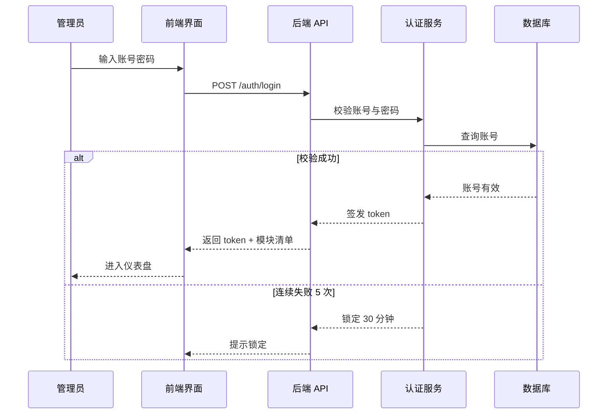
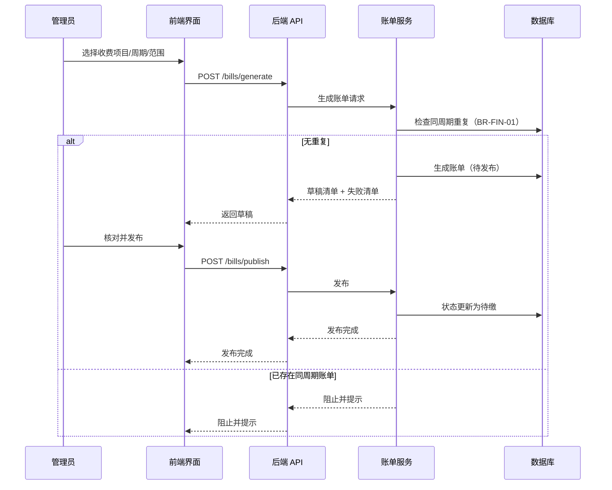
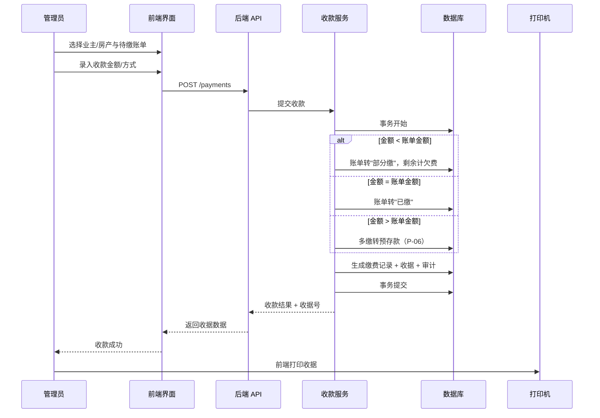
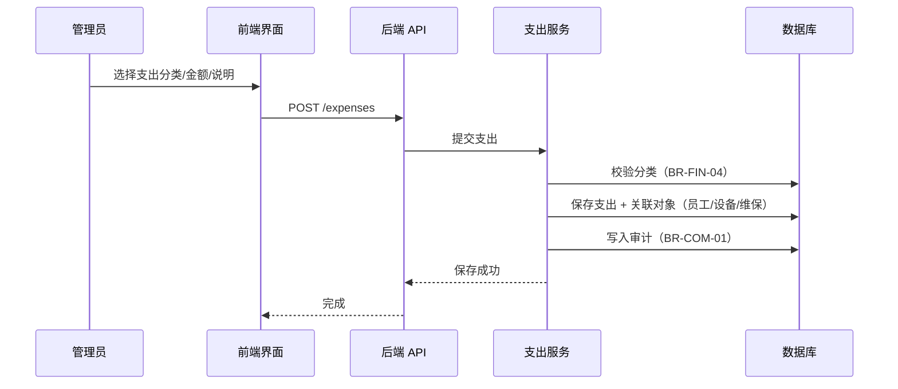
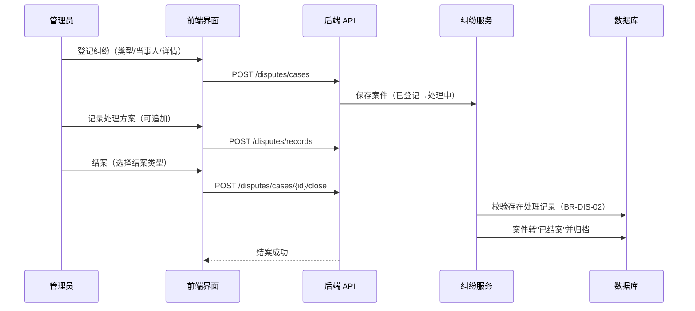
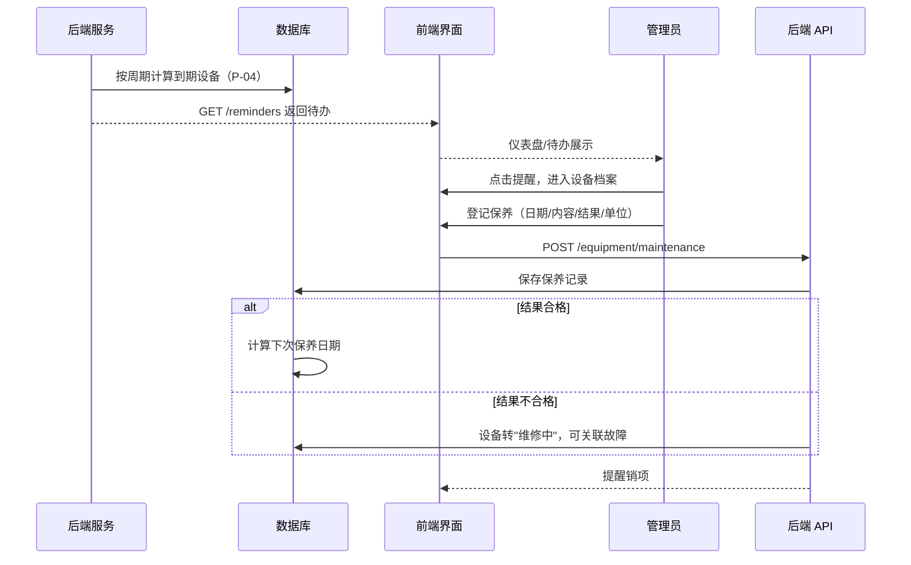
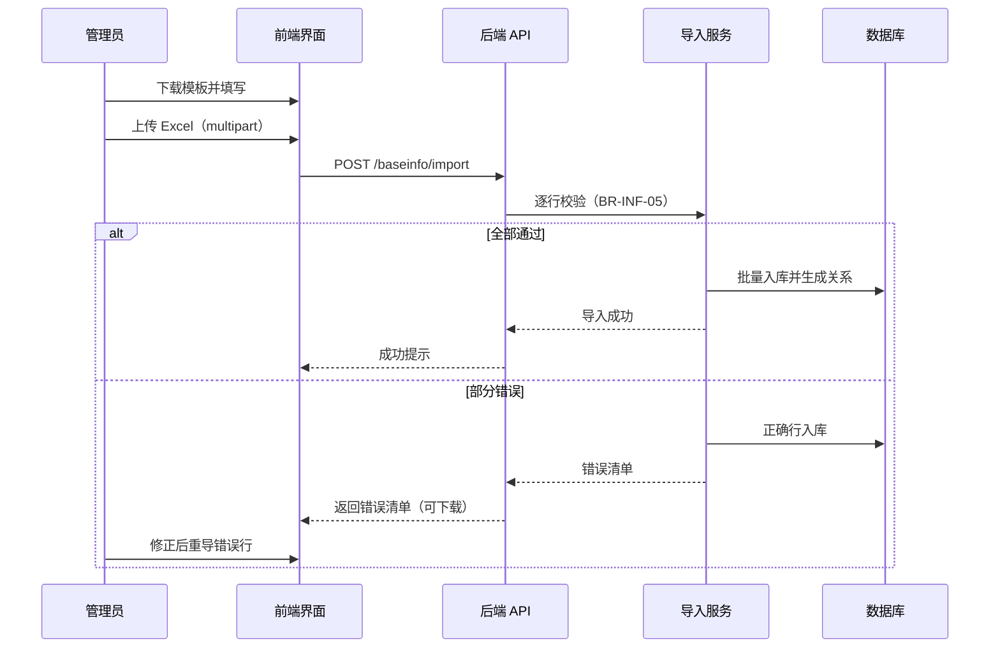

# DM-6 交互时序设计

> 制品：DM-06 ｜ 版本：v0.2（前后端分离，经 HTTP API 交互）｜ 状态：待评审
> 输入：AM-04 关键流程、AM-02 关键用例、技术选型建议
> 说明：8 个关键用例时序图；前端（WPF）与后端（本地 API 服务）之间经 `127.0.0.1:5210/api/v1` HTTP/JSON 交互；参与者为系统管理员（唯一角色）。

## 一、登录

## 二、生成账单（草稿→发布）

## 三、收款（部分缴/预存）→ 收据

## 四、登记支出

## 五、应急响应全流程

```mermaid
sequenceDiagram
  participant A as 管理员
  participant UI as 前端界面
  participant API as 后端 API
  participant ES as 应急服务
  participant DB as 数据库
  A->>UI: 选择场景/录入信息
  UI->>API: POST /emergency/events
  API->>ES: 发起事件
  ES->>DB: 关联场景，带出步骤（当前版本）
  ES->>DB: 匹配责任人/值班人
  alt 有匹配
    ES->>DB: 写入指派
  else 无匹配
    API-->>UI: 提示人工指派或暂不指派
    A->>UI: 人工指派（或确认暂不指派）
    UI->>API: PUT /emergency/events/{id}/assign
    ES->>DB: 发起人默认为第一处置人
  end
  A->>UI: 记录处置过程（可多次）
  UI->>API: POST /emergency/records
  A->>UI: 结案
  UI->>API: POST /emergency/events/{id}/close
  A->>UI: 复盘（3 个工作日内）
  UI->>API: POST /emergency/reviews
  API-->>UI: 事件转"已复盘"
```

## 六、纠纷登记→处理→结案

## 七、设备到期提醒→保养登记

## 八、基础数据 Excel 导入

## 九、追溯说明

- 本制品与 AM-04 流程一一对应：登录/基础信息/账单/收款/支出/应急/纠纷/设备；
- 前端与后端之间仅传输 DTO（JSON），事务边界全部在后端（时序中的"事务开始/提交"）；
- 打印由前端调用本地打印机；导入/导出/备份文件由后端生成，前端负责上传、下载与打开。
