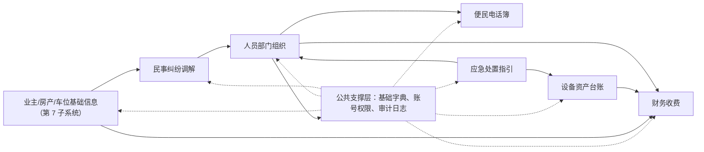
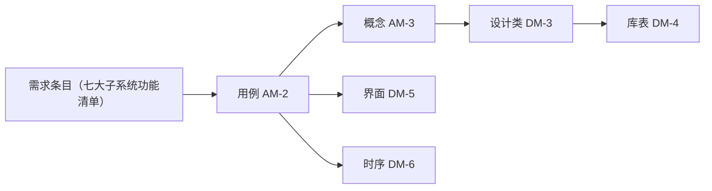

# 物业管理系统｜需求分析与业务建模计划

> 版本：v0.2（评审确认基线）｜ 日期：2026-08-26 ｜ 状态：已确认（M3 完成，基线正式冻结，开发待启动）
> 依据文档：[物业管理系统｜架构设计（初稿）](../specs/物业管理系统｜架构设计（初稿）.md)
> 说明：本文档完成两大任务 —— (1) 对七大子系统需求进行分析并形成基线；(2) 制定"分析模型 + 设计模型"两大板块的业务建模计划，供评审确认后执行。
> 修订记录：v0.1 初稿 → v0.1 修订版（新增第 7 子系统、落实评审反馈）→ v0.2（Q1-Q8 全部确认，计划基线，启动 M1）

## 一、背景与目标

用户计划开发一套桌面端物业管理系统，子系统范围已经冻结为七大核心子系统，不再变动（第 7 个子系统为本轮评审确认新增）：

1. 财务收费子系统
2. 应急处置指引子系统
3. 人员部门组织子系统
4. 便民电话簿子系统
5. 民事纠纷调解子系统
6. 设备资产台账系统
7. 业主/房产/车位基础信息子系统（评审新增）

本阶段目标：

- 完成需求分析：理清每个子系统的业务范围、核心业务对象、关键流程与规则、跨子系统依赖；
- 制定业务建模计划：明确"分析模型（问题域）"与"设计模型（解空间）"两大板块的制品结构、建模方法与里程碑，作为后续建模工作的执行依据和评审基线。

## 二、需求分析结论

### 2.1 项目定位与总体判断

本项目是典型的"运营作业 + 记录台账"型桌面业务系统，使用主体为物业管理处内部人员。七大子系统整体上围绕四类业务：

- 管钱：财务收费（核心刚需）
- 管人管事：人员组织、纠纷调解、设备资产
- 管指引与信息：应急指引、电话簿
- 管基础：业主/房产/车位基础信息（数据底座）

总体判断（分析结论）：

1. **财务收费是系统的业务核心与数据枢纽**。收入（业主缴费）与支出（工资、维护、外包、水电）最终都会汇聚到财务流水，其他模块产生的对象信息（员工、设备）也与财务交叉；
2. **人员部门组织是公共基础模块**。权限、值班、通讯录、应急指派、工资核算都依赖它，应作为"人"类信息的唯一来源建模；
3. **应急、设备、纠纷三个模块具有共同的"事件/案件生命周期"特征**（登记 → 处理 → 结案 → 归档），可以在设计中复用同一套记录、状态与归档模式，降低理解和维护成本；
4. 初稿遗漏的"业主/房产/车位基础信息"经评审确认新增为**第 7 个子系统**，作为财务、纠纷等模块的公共基础数据来源；公共支撑层仅保留基础字典、账号权限、审计日志等系统级能力。

### 2.2 干系人与角色（分析模型输入）

| 角色 | 归属部门 | 主要职责 | 涉及子系统 |
|---|---|---|---|
| 系统管理员 | 综合管理部 | 用户、权限、参数、基础信息维护 | 全部 |
| 物业经理/负责人 | 综合管理部（管理层） | 全局查看、报表审阅、支出审批、复盘审阅 | 财务、应急、纠纷、设备 |
| 财务/收费员 | 综合管理部 | 账单生成、收款、支出记账、报表 | 财务 |
| 客服/前台 | 综合管理部 | 电话簿维护、纠纷登记与跟进、应急信息查询 | 电话簿、纠纷、应急 |
| 秩序/安保人员 | 安保秩序部 | 值班、应急响应执行、消防/巡检记录 | 应急、人员、设备 |
| 工程/设备维护人员 | 安保秩序部或工程岗 | 设备台账、保养/年检、故障登记、电梯/配电应急 | 设备、应急、财务 |
| 保洁人员 | 保洁环保部 | 考勤、排班 | 人员 |
| 值班调度/班长 | 各业务部门 | 排班、应急责任人/值班人匹配 | 人员、应急 |
| 业主/住户 | — | 不使用本系统（已确认物业端专用），相关业务由前台/收费员代办 | 不直接涉及 |

> 注：已确认业主不使用本系统，仅做物业端。分析模型中业主不直接参与用例，相关业务由物业人员办理（系统仅设系统管理员一个登录角色）；未来业主自助端仍作为扩展点预留。
>
> 注（评审确认 2026-08-26）：系统登录角色仅设"系统管理员"一个（小镇物业人员配置少）；上表其余角色仅用于业务分析（理解谁在什么场景做什么），不作为系统账号角色，不进入 AM-01 权限模型。

### 2.3 七大子系统需求分析

#### 2.3.1 财务收费子系统（核心）

**定位**：系统最核心、最刚需模块，覆盖全部收支，自动记账、欠费统计、收费台账。

**核心业务对象**：收费项目、应收账单、缴费记录、退款/调整记录、支出分类、支出记录、收据凭证、业主/房产、车位。

**主要功能（用例规划）**：

- 收费项目维护（物业费、停车费、商铺管理费、其他杂项收入）
- 按期生成应收账单（按户/按期/按年）
- 收款登记（现金/转账等，打印或补开收据）
- 退款、减免、调整
- 支出登记（员工工资、电梯维护、监控维护、公共水电、工程外包、日常杂项）
- 欠费台账与已缴/未缴统计
- 月度/季度财务报表（收入、支出、结余）
- 收支明细流水查询
- 扩展预留：停车费月缴、临时停车缴费

**关键业务规则（初版）**：

- 应收账单按"收费项目 × 计费周期 × 缴费对象（房产/车位）"生成；
- 停车费本期按年缴实现，计费模式设计为可扩展枚举（年/月/临时）；
- 欠费口径需区分：未生成、待缴、部分缴、逾期、已缴；
- 支出必须关联支出分类；工资支出引用员工，维护/外包支出可引用设备或维保单位；
- 涉及金额的删除/修改/退款操作必须留审计痕迹。

**跨系统依赖**：员工工资 ← 人员组织；设备维护支出 ← 设备台账；业主/房产/车位 ← 业主/房产/车位基础信息子系统。

#### 2.3.2 应急处置指引子系统

**定位**：突发故障/险情的快速处置与流程标准化，目标是"新人可直接照做"。

**六大应急场景**：电力故障、自来水、电梯、天然气、消防、极端天气。

**核心业务对象**：应急场景、处置步骤（步骤化/清单化）、应急事件、处置记录、复盘记录、责任人与值班人。

**主要功能**：

- 应急场景与处置步骤文档维护（含版本更新）
- 发起应急事件（选择场景 → 自动带出处置步骤与责任人/值班人匹配）
- 处置过程记录（时间、操作、结果）
- 应急记录存档
- 事故复盘记录（原因、改进措施）
- 历史应急与复盘查询

**关键规则（初版）**：

- 每个应急事件必须关联一个应急场景；
- 事件处置完成后需结案；复盘记录可在结案后补录；
- 责任人/值班人匹配引用人员组织模块的在岗状态与排班。

**跨系统依赖**：值班人/责任人 ← 人员组织；电梯/配电房设备信息 ← 设备台账；紧急电话（119/120/110）← 电话簿。

#### 2.3.3 人员部门组织子系统

**定位**：人事架构与现场作业管理的公共基础。

**部门架构（初版）**：物业综合管理部（管理层）、安保秩序部、保洁环保部；部门应支持扩展。

**核心业务对象**：部门、岗位、员工、排班班次、排班表、考勤记录、在岗状态、账号与权限。

**主要功能**：

- 部门架构维护（支持层级与扩展）
- 员工档案（入职、转岗、离职，状态管理）
- 值班排班表（按部门/岗位排班）
- 考勤记录（签到/签退/异常，与排班对照）
- 在岗/离岗状态维护（供应急匹配与通讯录展示）

**关键规则（初版）**：

- 系统仅设系统管理员唯一角色（评审确认），员工/岗位仅作为业务数据维护，不做系统授权；
- 离职员工保留档案但停用账号；
- 排班与考勤是应急值班匹配的数据来源。

**跨系统依赖**：通讯录 ← 电话簿；工资核算 ← 财务；值班匹配 ← 应急；账号权限 ← 全部子系统。

#### 2.3.4 便民电话簿子系统

**定位**：日常与应急场景下的一键查号工具。

**分类（初版）**：水电维修、天然气抢修、电梯维保、下水道/排污、监控维修、环保局/城管/居委会、物业员工通讯录、社区警务、应急急救（119/120/110）。

**核心业务对象**：电话分类、电话条目、员工通讯录（联动人员组织）。

**主要功能**：

- 电话分类与条目维护（新增、修改、停用）
- 按分类/关键字快速查询与拨打（可点击复制）
- 员工通讯录自动同步（来自人员组织，避免重复维护）
- 应急电话置顶/常用标记

**关键规则（初版）**：电话条目需区分"内部员工"与"外部单位"；停用条目保留历史但不展示。

**跨系统依赖**：员工通讯录 ← 人员组织；应急急救号码 → 应急指引。

#### 2.3.5 民事纠纷调解子系统

**定位**：邻里/物业纠纷登记、处理、结案的全过程管理。

**管理内容**：邻里纠纷（噪音、漏水、占道、邻里矛盾）、物业业主纠纷；纠纷责任人；发生时间、地点、详情；处理方案；进度跟踪；结案归档。

**核心业务对象**：纠纷案件、纠纷类型、纠纷责任人（当事人）、处理记录、处理进度、结案归档信息。

**主要功能**：

- 纠纷登记（类型、时间、地点、详情、当事人）
- 处理方案记录（调解措施、调解员）
- 处理进度跟踪（状态更新、节点记录）
- 结案归档（结论、归档日期，支持补录）
- 纠纷查询与统计（按类型/区域/时间段）

**关键规则（初版）**：

- 状态流：已登记 → 处理中 → 已结案（归档）；支持结案后补录处理记录；
- 结案必须存在至少一条处理方案记录；
- 调解员引用员工档案。

**跨系统依赖**：调解员/责任员工 ← 人员组织；业主信息 ← 业主/房产/车位基础信息子系统。

#### 2.3.6 设备资产台账系统

**定位**：核心设备的全生命周期档案管理。

**设备范围**：电梯、监控、水泵、配电房设备；设备类型应支持扩展。

**核心业务对象**：设备、设备类型、设备位置（楼栋/配电房等）、保养记录、年检记录、故障记录、维保单位/责任人。

**主要功能**：

- 设备台账维护（档案、位置、状态）
- 定期保养记录（按周期提醒）
- 年检记录与到期提醒
- 故障历史登记（现象、原因、处理）
- 关联维保单位与责任人
- 设备档案查询

**关键规则（初版）**：

- 设备状态：在用、维修中、停用、报废；
- 保养/年检到期提醒（如电梯半月保养、年度年检）；
- 故障记录可与应急事件、维护支出关联。

**跨系统依赖**：维护支出 ← 财务；故障/配电应急 ← 应急；责任人 ← 人员组织。

#### 2.3.7 业主/房产/车位基础信息子系统（评审新增）

**定位**：全系统的基础数据底座，为财务收费、纠纷调解等模块提供业主、房产、车位的统一数据来源；本子系统经评审确认新增为第 7 个子系统。

**核心业务对象**：小区/项目、楼栋、单元、房产（房间）、业主、租户、车位、房产-业主关系。

**主要功能**：

- 小区/楼栋/单元/房产档案维护（房号、面积、用途、入住状态）
- 业主档案维护（姓名、联系方式、证件、与房产关系：自住/出租）
- 车位档案维护（车位号、类型、绑定业主/房产）
- 数据导入（Excel）与批量初始化
- 按楼栋/业主/状态查询与导出

**关键规则（初版）**：

- 房产为缴费对象主体，可关联一个或多个业主；车位可绑定房产或业主；
- 业主/房产信息变更留痕（联系方式、产权变更）；
- "业主-房产-车位"关系由本子系统统一维护，财务账单按该关系生成。

**跨系统依赖**：财务收费（缴费对象）、纠纷调解（当事人）引用本子系统；公共支撑层（账号权限、审计）支撑本子系统。

### 2.4 跨子系统关系与公共支撑层



**依赖关系结论（分析要点）**：

1. 人员组织是所有"人"类信息的唯一来源（员工、值班、权限、通讯录、工资、调解员、应急责任人）；
2. 业主/房产/车位基础信息（第 7 子系统）是"物"类基础数据的唯一来源（缴费对象、纠纷当事人），虽编号为第 7，但在数据关系上是全系统的底座；
3. 财务收费是数据汇聚中心：收入（业主缴费）与支出（工资、维护、水电、外包、杂项）最终都要进入财务流水；
4. 应急、设备、纠纷三者的共同点是"事件生命周期"，建议在设计中采用一致的记录/状态/归档模式，降低理解和维护成本；
5. 公共支撑层仅承载基础字典、账号权限、审计日志等系统级能力，不属于业务子系统。

### 2.5 非功能需求（初版）

| 类别 | 需求（初版，待评审补充） |
|---|---|
| 部署形态 | 桌面端，单机部署（已确认）；前后端分离：WPF 客户端 + 本地后端 API 服务；数据库本地化 |
| 易用性 | 应急/值班场景要求快速检索（电话、步骤、设备）；界面贴近物业人员习惯，减少录入负担 |
| 数据可靠性 | 定期备份；账务数据不可随意删除（软删除 + 审计） |
| 安全性 | 账号 + 密码登录；按岗位授权；敏感操作审计留痕 |
| 可扩展性 | 缴费模式（年/月/临时）、部门/设备类型/应急场景可扩展，无需改代码结构 |
| 报表 | 财务月/季报表、统计表支持预览与导出（已确认 Excel/PDF）；收据打印 |

### 2.6 范围约束与扩展预留

**已冻结（本期必须覆盖）**：

- 七大子系统的模块范围，按初稿架构执行（第 7 个为评审新增的业主/房产/车位基础信息子系统）；
- 停车费按年缴计算；收支类型按初稿清单执行。

**预留扩展（本期不实现，建模时留扩展点）**：

- 停车费月缴、临时停车缴费模式；
- 业主自助端（缴费查询、线上报修/投诉）；
- 多小区/多项目集团化支持；
- 更多应急场景、设备类型、支出分类的扩展。

### 2.7 开放问题与评审确认结果（已更新）

| 编号 | 问题 | 评审确认结论 | 状态 |
|---|---|---|---|
| Q1 | 业主/房产/车位基础数据从何而来？ | 新增第 7 个子系统"业主/房产/车位基础信息"，含录入 + Excel 导入 | 已确认 |
| Q2 | 业主是否直接使用系统？ | 否，仅做物业端，业主业务由前台/收费员代办 | 已确认 |
| Q3 | 部署形态：单机还是局域网多机？ | 单机部署 | 已确认 |
| Q4 | 技术栈是否有倾向？ | 已确认：WPF + .NET Framework 4.8 + SQLite；前后端分离（WPF 客户端 + 本地 API 服务） | 已确认 |
| Q5 | 财务是否需要收据/发票打印？ | 需要收据打印 | 已确认 |
| Q6 | 报表导出格式？ | Excel 与 PDF | 已确认 |
| Q7 | 是否已有纸质台账需要迁移？ | 手动补录（已确认），必要时提供 Excel 导入模板辅助初始化 | 已确认 |
| Q8 | 支出是否需要审批流？ | 本期仅登记 + 权限控制，不做多级审批 | 已确认 |

## 三、业务建模计划

### 3.1 建模目标与原则

**目标**：在需求分析基线之上，产出"分析模型 + 设计模型"两大板块的完整模型文档，使业务人员可评审、开发人员可落地、需求可追溯。

**两大板块定义**：

- **分析模型（Analysis Model）**：问题域建模，回答"业务是什么"。描述角色、业务对象、业务流程、业务状态、业务规则、用例，与实现技术无关，是业务人员与开发人员的共同语言；
- **设计模型（Design Model）**：解空间建模，回答"系统怎么做"。在分析模型基础上做系统架构、组件划分、类设计、数据库、界面、交互、权限与非功能设计，是开发实现与测试验收的依据。

**建模原则**：

1. 范围对齐：所有模型制品必须能与七大子系统一一对应，不新增业务子系统；
2. 用例驱动：以用例为主线组织分析模型，每个用例说明覆盖主流程、分支、异常与业务规则；
3. 对象为中心：领域概念统一建模，同一概念（员工、业主、设备、账单）全系统唯一，杜绝各模块各自建模；
4. 规则显式化：业务规则编号化（BR-xx），避免散落在文字中；
5. 两板可追溯：分析模型元素 ↔ 设计模型元素 ↔ 需求条目建立追溯关系；
6. 图形统一：文档内图统一使用 Mermaid（便于版本管理与评审），复杂图可另用 PlantUML/StarUML 出图并附源文件。

### 3.2 建模总体流程


**输入**：需求分析结论（本文档）＋ 七大子系统范围（冻结，第 7 个为本轮评审新增）＋ 开放问题确认结果。

**输出**：两大板块模型文档 + 追溯矩阵。

### 3.3 板块一：分析模型（Analysis Model）

#### 3.3.1 制品清单

| 编号 | 制品 | 内容说明 | 载体/符号 | 验收标准 |
|---|---|---|---|---|
| AM-1 | 角色与权限需求 | 角色清单（仅系统管理员）、各模块访问权限、安全原则 | 角色表 + 模块访问表 | 仅保留系统管理员唯一角色；业务岗位不作为系统角色 |
| AM-2 | 业务用例模型 | 七模块用例图；每个用例一个模板化说明（名称、参与者、前置条件、主流程、扩展/异常、业务规则、关联对象） | UML 用例图 + 用例说明模板 | 每个子系统用例与功能清单一一对应，无遗漏 |
| AM-3 | 领域概念模型 | 概念类图（含属性、概念间关系与多重性）、概念清单（约 42-52 个概念） | UML 类图（概念级） | 概念无重名异义，覆盖全部核心业务对象 |
| AM-4 | 业务流程模型 | 关键业务流程活动图（泳道）：缴费与欠费催缴、支出记账、应急响应、纠纷调解、设备保养/年检提醒、排班考勤 | UML 活动图/泳道图 | 每个流程有起点、终点、分支与异常路径 |
| AM-5 | 业务状态模型 | 状态图：账单、应急事件、纠纷案件、设备、员工、考勤等生命周期 | UML 状态图 | 状态转换完备，无死状态 |
| AM-6 | 业务规则清单 | 全部规则编号化（BR-xx），含规则描述、触发点、优先级 | 规则表 | 每条规则可追溯到用例或概念 |
| AM-7 | 业务术语表 | 业主/租户/台账/欠费/结案/年检等术语统一定义，含别名 | 术语表 | 全文档术语一致 |
| AM-8 | 跨子系统依赖矩阵 | 模块间共享对象、数据流、调用关系 | 矩阵 + 图 | 与 2.4 依赖结论一致 |

#### 3.3.2 制品模板示例（评审用）

**用例说明模板（AM-2）**：

```
用例编号：UC-FIN-003
用例名称：登记收款
参与者：财务/收费员
前置条件：存在待缴账单；收款人已登录且有收费权限
主流程：
  1. 选择业主/房产，系统展示待缴账单
  2. 收费员选择账单并录入收款金额、方式（现金/转账）
  3. 系统校验金额与账单一致，生成缴费记录
  4. 系统更新账单状态并出具收据
扩展流程：
  E1 部分缴费 → 账单进入"部分缴"状态
  E2 金额不符 → 提示并阻止提交
业务规则：BR-FIN-02（部分缴口径）、BR-AUD-01（收款操作审计）
关联对象：业主、房产、账单、缴费记录
```

**规则模板（AM-6）**：

```
规则编号：BR-FIN-02
规则描述：缴费金额小于账单金额时，账单状态为"部分缴"，剩余金额计入欠费
触发点：收款登记提交时
优先级：高
来源用例：UC-FIN-003
```

#### 3.3.3 分析模型评审要点

- 与七大子系统范围逐项对照，确认无新增、无遗漏；
- 关键流程是否覆盖"日常操作 + 异常处理"（如欠费催缴、应急夜间值班、设备到期）；
- 状态图是否覆盖全部生命周期（含归档/停用/报废等终态）；
- 业务人员是否认可角色、术语、规则表达。

### 3.4 板块二：设计模型（Design Model）

#### 3.4.1 制品清单

| 编号 | 制品 | 内容说明 | 载体/符号 | 验收标准 |
|---|---|---|---|---|
| DM-1 | 系统架构视图 | 分层架构（表现层/应用服务层/领域层/基础设施层）、桌面端部署视图（单机/局域网）、技术选型建议 | 架构图 + 说明 | 与 Q3/Q4 确认结果一致，分层职责清晰 |
| DM-2 | 组件与子系统设计 | 七大业务组件 + 公共支撑组件（基础字典、认证权限、审计、报表、导入导出）；组件接口与依赖 | 组件图 + 接口清单 | 组件边界与七大子系统对应，无循环依赖 |
| DM-3 | 设计类设计 | 实体类、服务类、仓储/数据访问类（后端）、视图模型与 API 客户端（前端） | UML 类图 | 覆盖 AM-3 全部概念；责任单一 |
| DM-4 | 数据库设计 | 概念 ER 图 → 逻辑表设计（表清单约 55-70 张，含主外键、关键字段、约束、索引建议）、预留扩展字段 | ER 图 + 表设计 | 与 AM-3 概念一致；缴费模式/设备类型等可扩展 |
| DM-5 | 界面设计 | 桌面端主窗口布局（左侧七大模块导航 + 仪表盘首页）、各模块主界面与关键录入/查询页说明、报表预览 | 布局图 + 页面说明 | 覆盖七模块全部主要功能；操作路径 ≤ 3 步可达 |
| DM-6 | 交互时序设计 | 关键用例时序图：账单生成 → 收款 → 记账 → 报表；应急发起 → 指派 → 处置 → 复盘；纠纷登记 → 处理 → 结案；设备到期提醒 → 保养记录 | UML 时序图 | 与 AM-4 流程一一对应 |
| DM-7 | 权限与安全设计 | 权限说明（唯一系统管理员 × 七模块全操作）、登录与会话、审计日志、数据备份 | 说明 + 矩阵 | 与 AM-1 一致，覆盖敏感操作 |
| DM-8 | 非功能与扩展设计 | 备份恢复、导入导出（Excel）、报表导出、扩展点说明（缴费模式、场景/设备类型/部门扩展） | 说明 + 接口定义 | 每项预留扩展点有明确落点 |

#### 3.4.2 界面设计总原则（桌面端）

- 主窗口左侧为七大子系统导航，顶部为全局操作与当前用户；
- 首页仪表盘展示关键指标：本月应收/已收/欠费、应急待办、纠纷处理中、保养/年检到期、今日值班；
- 列表-详情布局为通用范式，查询优先（电话簿、设备、纠纷、账单均适用）；
- 应急场景提供"一键发起"入口，减少操作步骤。

#### 3.4.3 设计模型评审要点

- 架构与部署是否匹配确认后的部署形态；
- 库表设计是否能支撑全部用例与规则（尤其欠费口径、状态流转、到期提醒）；
- 界面是否覆盖分析模型全部用例，是否存在无法落地的功能；
- 扩展点是否真正可扩展（枚举/字典驱动，而非硬编码）。

### 3.5 模型追溯关系

建立双向追溯矩阵，贯穿"需求 → 用例 → 概念 → 设计 → 实现/测试"：



追溯矩阵形态（随模型产出）：

| 需求条目 | 用例 | 关键概念 | 设计类 | 库表 | 界面 |
|---|---|---|---|---|---|
| 收款登记 | UC-FIN-003 | 账单/缴费记录 | 收款服务等 | t_bill / t_payment | 收款页 |

### 3.6 建模步骤与里程碑

| 里程碑 | 阶段工作 | 交付物 | 评审点 |
|---|---|---|---|
| M0（本文档） | 需求分析、计划制定 | 本计划文档（基线版，含第 7 子系统） | Q1-Q8 全部确认、制品清单确认（已完成） |
| M1 分析模型 | 制品 AM-1 ~ AM-9 + 核对清单 | 分析模型 v0.4 | 与七大子系统对照、业务评审（已完成，待评审归档） |
| M2 设计模型 | 制品 DM-1 ~ DM-8 + 技术选型建议 | 设计模型 v0.2 | 可落地性评审（架构/库表/界面）（已完成，待评审归档） |
| M3 基线定稿 | 修订、追溯矩阵、一致性检查 | 模型基线 v1.0 + 全量追溯矩阵 | 最终基线确认（已完成，2026-08-26 正式冻结） |

每阶段建议的评审方式：文档走查 + 评审清单逐项核对。分析模型阶段请业务侧人员（物业人员）参与，设计模型阶段请开发人员参与。

### 3.7 规模预估（供工作量评估）

| 制品 | 预估规模 |
|---|---|
| 用例数 | 约 55-75 个（七模块） |
| 概念数 | 约 42-52 个 |
| 业务流程活动图 | 约 10-15 张 |
| 状态图 | 约 5-8 张 |
| 设计类图 | 约 15-20 张 |
| 库表 | 约 55-70 张 |
| 界面说明 | 约 35-45 个页面 |
| 时序图 | 约 8-12 张 |

### 3.8 风险与应对

| 风险 | 影响 | 应对 |
|---|---|---|
| 业主/房产/车位关系定义不清（自住/出租/产权变更） | 账单生成与纠纷当事人引用错误 | AM-3 显式建模关系与生命周期，M1 评审专项确认 |
| 基础信息初始化工作量大（手工补录） | 上线前录入耗时 | 提供 Excel 导入模板与批量校验（Q7 已确认手动补录） |
| 依赖包与 Win7 兼容性 | 运行库版本不兼容导致部署失败 | 锁定兼容 .NET Framework 4.8 / Win7 的版本并验证（见技术选型建议） |
| 范围蔓延（模块之外的需求） | 超出冻结范围 | 变更一律走评审，模型基线控制 |
| 业务规则理解偏差 | 财务口径、状态流转错误 | 规则编号化 + 业务人员参与评审 |

## 四、评审确认清单

评审确认记录（2026-08-25）：

1. 第 7 个子系统（业主/房产/车位基础信息）定位、范围与功能规划确认通过；
2. Q1-Q8 全部确认：Q7 纸质台账按手动补录处理；
3. 两大板块结构与制品清单确认通过；
4. 里程碑与规模预估确认通过，按 M1 启动。

## 五、M1 执行记录

- 任务列表：[M1 任务列表（分析模型 v0.4）](./M1-任务列表（分析模型v0.1）.md)
- 模型输出：[分析模型 v0.4](../models/分析模型-v0.1/README.md)

## 六、M2 执行记录

- 任务列表：[M2 任务列表（设计模型 v0.2）](./M2-任务列表（设计模型v0.1）.md)
- 模型输出：[设计模型 v0.2](../models/设计模型-v0.1/README.md)
- 技术选型：[技术选型建议（确认稿）](../models/设计模型-v0.1/技术选型建议.md)

## 七、M3 执行记录

- 任务列表：[M3 任务列表（基线定稿 v1.0）](./M3-任务列表（基线定稿v1.0）.md)
- 模型基线：[模型基线 v1.0](../models/模型基线-v1.0/README.md)
- 全量追溯矩阵：[追溯矩阵](../models/模型基线-v1.0/追溯矩阵.md)
