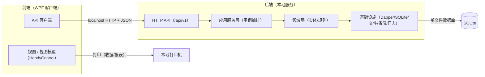

# 技术选型

> 适用版本：安怡物业管理系统 1.2.0
## 一、决策记录

| 编号 | 决策点 | 结论 |
|---|---|---|
| 架构形态 | 前后端分离式 | WPF 客户端（前端）+ 本地后端 API 服务，localhost HTTP/JSON |
| 桌面框架 | WPF + .NET Framework 4.8 + HandyControl | 兼容 Win7 SP1 及以上（立项兼容红线） |
| 数据库 | SQLite（System.Data.SQLite + Dapper） | 单文件、零配置、事务支持 |
| 报表 | ClosedXML（Excel）+ PDFsharp（PDF）+ WPF 打印（收据） | 已确认双格式导出 |
| 目标环境 | Windows 7 SP1 及以上，单机 | 单机部署，无需网络 |

## 二、总体架构（前后端分离）



- 前端只负责界面与交互，不直接访问数据库；
- 后端拥有全部业务逻辑与数据，通过 HTTP API 暴露；
- 单机双进程：客户端 + 本地后端服务（安装包自动部署，服务开机自启）。

## 三、工程结构

```
PropertyManagement.sln
├─ PropertyManagement.Contract        # 前后端共享契约（DTO、枚举）
├─ PropertyManagement.Server          # 本地后端服务（自承载 HTTP API）
│  ├─ Api/                            # 控制器 / 路由（/api/v1）
│  ├─ Services/                       # 用例编排服务
│  ├─ Domain/                         # 实体与业务规则（BR）
│  └─ Infrastructure/                 # Dapper、SQLite、文件、备份、日志
├─ PropertyManagement.Client          # WPF 前端
│  ├─ Views/                          # 页面与控件
│  ├─ ViewModels/                     # MVVM
│  ├─ Services/                       # API 客户端封装
│  └─ Assets/                         # 主题、图标、样式
└─ Installer/                         # Inno Setup 安装脚本
```

## 四、前后端交互与 API 规范

- 基址：`http://127.0.0.1:{port}/api/v1/`，默认端口 5210（可配置）；
- 格式：JSON；认证：登录后签发 token，请求头携带 `Authorization: Bearer {token}`；
- 端点分组（与 DM-02 组件对应）：

| 分组 | 示例端点 | 说明 |
|---|---|---|
| auth | POST /api/v1/auth/login、/change-password | 登录/改密 |
| baseinfo | GET/POST /api/v1/properties、/owners、/parking、/import | 基础信息 |
| org | /api/v1/departments、/employees、/schedules、/attendances | 人员组织 |
| billing | POST /api/v1/bills/generate、GET /api/v1/bills/arrears | 账单与欠费 |
| payments | POST /api/v1/payments、/refunds | 收款/退款 |
| expenses | POST /api/v1/expenses | 支出 |
| reports | GET /api/v1/reports/monthly | 财务报表/导出 |
| emergency | POST /api/v1/emergency/events、/records、/reviews | 应急 |
| phonebook | GET/POST /api/v1/phonebook/entries | 电话簿 |
| disputes | /api/v1/disputes/cases、/records | 纠纷 |
| equipment | /api/v1/equipment/devices、/maintenance、/inspection | 设备 |
| common | /api/v1/common/dicts、/audit、/backup、/export | 公共 |

- 契约共享：Contract 项目定义 DTO，前后端同解决方案引用；将来如需独立团队可拆分版本管理。

## 五、关键依赖包清单

| 用途 | 包 | 说明 |
|---|---|---|
| UI 控件 | HandyControl | 支持 .NET Framework 4.0~4.8.1，Win7 可用 |
| MVVM | CommunityToolkit.Mvvm | netstandard2.0，兼容 .NET Framework 4.8 |
| JSON | Newtonsoft.Json | 前后端通用 |
| 后端 API | Microsoft.AspNet.WebApi.OwinSelfHost（OWIN/Katana） | .NET Framework 自承载 HTTP API，支持 Win7 |
| 数据访问 | Dapper + System.Data.SQLite | 轻量 ORM + SQLite 原生驱动 |
| Excel | ClosedXML | MIT 许可（选 netstandard2.0 兼容版本） |
| PDF | PDFsharp | 选择支持 .NET Framework 4.8 的版本 |
| 密码 | BCrypt.Net-Next | 密码哈希 |
| 日志 | NLog | 运行日志/审计 |
| 安装 | Inno Setup | 打包客户端 + 后端服务 + .NET Framework 4.8 离线安装器 |

> 注：各包具体版本以"兼容 .NET Framework 4.8 + Win7"为准，开发初始化时锁定并验证。

## 六、Win7 兼容要点

1. .NET Framework 4.8 是最后一个支持 Win7 SP1 的版本，Win7 机器需安装 SP1 与 4.8（安装包自动处理）；
2. 后端自承载使用 OWIN（Katana），官方支持 .NET Framework，Win7 可运行；
3. System.Data.SQLite 原生库注意 x86/x64 位数与目标平台匹配；
4. WPF 客户端与后端均基于 .NET Framework 4.8，Win10 1903+ / Win11 自带运行时，Win7 SP1 需安装 4.8（安装包已内嵌离线安装器）；
5. Win7 已停止安全更新（2020-01 起），建议 Win7 机器离线使用，逐步升级；
6. **验证状态**：当前仅在工作站 Windows 10（64 位）完成端到端开发与测试；Win7 SP1 尚未在真机验证，其兼容性由上述依赖红线（net45/net46/netstandard2.0 兼容资产）与内嵌 .NET 4.8 离线安装器保障。

## 七、端口与安全

- 后端默认绑定 `127.0.0.1:5210`，仅本机访问，不暴露局域网（避免防火墙与外部访问问题）；
- 将来需要局域网多机或业主自助端时，再开放绑定与防火墙规则，API 本身无需改动；
- 登录签发 token，后端逐请求校验；单管理员账号（AM-01）；
- 审计日志由后端写入，前端不可直接修改。

## 八、升级路径

- **局域网多机**：后端改绑定 + 防火墙规则 + 多客户端连接；
- **业主自助端**：复用现有 API，新增 Web/移动前端；
- **运行时升级**：后端 OWIN 可平滑迁移至 ASP.NET Core（接口不变），客户端 WPF 迁移至 .NET 8/10 LTS（XAML 与 MVVM 代码基本不变）。
