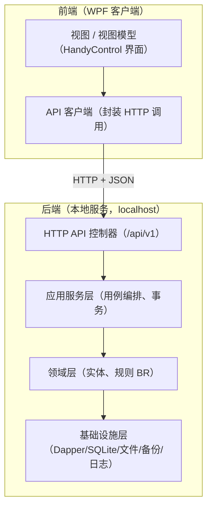
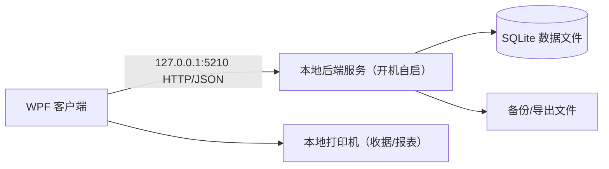
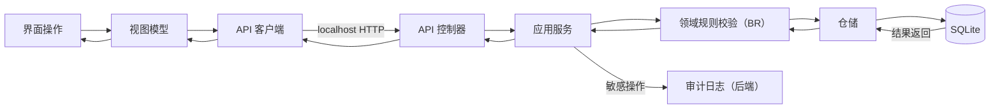

# 系统架构

> 适用版本：安怡物业管理系统 1.1.1 ｜ 形态：单机部署（WPF 客户端 + 本地后端服务）
## 一、分层架构（前后端分离）

**分层职责**：

| 层 | 位置 | 职责 | 依赖方向 |
|---|---|---|---|
| 表现层（前端） | WPF 客户端 | 界面展示与交互、打印 | 只调 API，不碰数据库 |
| API 层（后端） | 本地服务 | 路由、参数校验、鉴权、DTO 转换 | 只调应用服务层 |
| 应用服务层（后端） | 本地服务 | 用例编排、事务边界 | 只依赖领域层 |
| 领域层（后端） | 本地服务 | 实体状态、业务规则（BR） | 不依赖任何上层与框架 |
| 基础设施层（后端） | 本地服务 | 数据库、文件、备份、日志实现 | 被领域层接口反向依赖 |

## 二、部署视图（单机、前后端双进程）

- 单机部署，安装包一次装好"客户端 + 后端服务 + 运行时"；后端服务开机自启；
- 后端仅绑定本机回环地址，不暴露局域网；
- 数据库、备份、导出文件由后端管理；收据/报表打印由前端调用本地打印机。

## 三、技术栈

| 决策点 | 结论 | 说明 |
|---|---|---|
| 桌面框架 | WPF + .NET Framework 4.8 + HandyControl | 兼容 Win7 SP1 及以上 |
| 数据库 | SQLite（System.Data.SQLite + Dapper） | 单文件、零配置 |
| 报表 | ClosedXML（Excel）+ PDFsharp（PDF）+ WPF 打印 | 双格式导出 |
| 后端 API | OWIN（Katana）自承载 HTTP API | .NET Framework 4.8，Win7 可运行 |

详细依据见 [技术选型建议.md](技术选型建议.md)。

## 四、关键数据流

- 所有写操作经后端应用服务层，保证事务与审计统一；
- 导出/备份文件由后端生成到本地约定目录，前端负责打开与打印；
- 前端与后端之间只传输 DTO（JSON），不直接暴露实体与数据库结构。

## 五、与需求对齐

- 七大子系统对应七大业务组件（后端），公共支撑组件承载登录、字典、审计、导入导出、报表、备份（详见 DM-02）；
- 单机部署满足 Q3；技术栈满足 Q4（采用确认的技术栈）；前后端分离采用方案 A；
- 预存款、结案类型化等设计结论已在对应组件与库表中落地。
