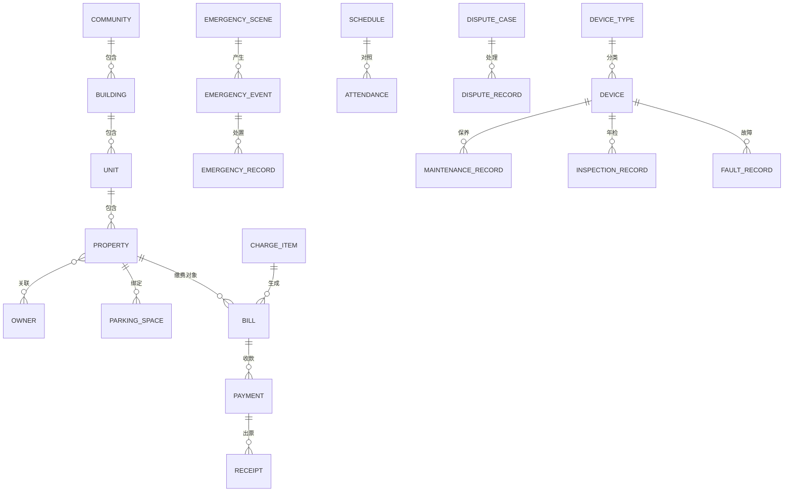

# 数据库设计

> 适用版本：安怡物业管理系统 1.3.1 ｜ 数据库：SQLite（由后端服务独占访问，前端不直接连库）
## 一、ER 总览（核心实体）

## 二、表清单（61 张）

### 2.1 公共支撑（7 张）

| 表名 | 用途 | 关键字段 | 约束/关联 |
|---|---|---|---|
| t_user | 登录账号（唯一管理员） | id, username, password_hash, status, last_login_at | username 唯一 |
| t_param | 系统参数 | id, param_key, param_value, remark | P-01~P-09 参数 + v1.1.0 第 7 轮新增 `finance.budget.monthly`（月度支出预算，元，0=未设置；支出登记页卡片内设置） |
| t_dict_type | 字典类型 | id, type_code, type_name | 扩展点 |
| t_dict_item | 字典项 | id, type_code, item_code, item_name, sort, status | 被引用禁删 |
| t_audit_log | 审计日志 | id, user_id, action, target_type, target_id, detail, created_at | 只追加 |
| t_backup | 备份记录 | id, file_path, size, created_at | 保留 30 份 |
| t_reminder | 提醒 | id, type, target_id, due_at, status | 仪表盘 |
| t_export_log | 导出记录 | id, module, format, file_path, created_at | 列表导出/报表导出留痕 |

### 2.2 基础信息（8 张）

| 表名 | 用途 | 关键字段 | 约束/关联 |
|---|---|---|---|
| t_community | 小区/项目 | id, name, address | 预留多项目 |
| t_building | 楼栋 | id, community_id, building_no, floors | 小区+楼栋号唯一（**`del_flag = 0` 部分唯一索引**，软删留痕后可重建；v1.1.0 `migration_033`） |
| t_unit | 单元 | id, building_id, unit_no | 楼栋+单元号唯一（**同上口径**，`migration_033`） |
| t_property | 房产 | id, building_id, unit_id（可空）, room_no, area, usage, status | 有单元按「单元+房号」、无单元按「楼栋+房号」唯一（BR-INF-01；`migration_023/031`，`del_flag = 0` 部分唯一索引） |
| t_owner_property_rel | 房产-业主关系 | id, property_id, owner_id, rel_type, share, effective_at, expire_at, rel_status | 「房产+业主+生效日期」唯一（BR-INF-02 关系唯一+历史）；**`del_flag = 0` 部分唯一索引** ⇒ **解除（软删留痕）后可再次绑定**（v1.1.0 `migration_034`） |
| t_dict_item | 字典项 | id, type_code, item_code, item_name, display_value, sort, status | 「类型+项编码」唯一（**`del_flag = 0` 部分唯一索引**，软删留痕后可重建同编码项；v1.1.0 `migration_034`） |
| t_parking_space | 车位 | id, space_no, area, space_type, status, property_id, owner_id | 车位编号唯一（**`del_flag = 0` 部分唯一索引**，软删留痕后可重建同编号车位；v1.1.0 `migration_034`） |
| t_owner | 业主 | id, name, id_card, phone, status | 变更留痕 |
| t_base_change_log | 基础信息变更记录 | id, object_type, object_id, change_content, changed_at | 只追加 |

### 2.3 人员组织（7 张）

| 表名 | 用途 | 关键字段 | 约束/关联 |
|---|---|---|---|
| t_department | 部门 | id, name, parent_id, status | 层级可扩展 |
| t_position | 岗位 | id, dept_id, name | 部门下岗位 |
| t_employee | 员工 | id, dept_id, position_id, name, phone, hire_date, status | 离职保留档案（BR-ORG-02） |
| t_employee_status_log | 在岗状态记录 | id, employee_id, status, changed_at | 只追加 |
| t_shift | 班次 | id, name, start_time, end_time | — |
| t_schedule | 排班 | id, employee_id, shift_id, work_date, status | 冲突检查（BR-ORG-03） |
| t_attendance | 考勤记录 | id, employee_id, work_date, check_in, check_out, result, review_by, review_note | 异常需审核（BR-ORG-05） |
| t_schedule_conflict_log | 排班冲突/缺口记录 | id, schedule_id, conflict_type, detail, created_at | 排班发布时生成 |

### 2.4 财务收费（13 张）

| 表名 | 用途 | 关键字段 | 约束/关联 |
|---|---|---|---|
| t_charge_item | 收费项目 | id, name, pay_mode, unit_price, cycle_type, status, method_code, **object_type**, **object_code**, **formula** | pay_mode 枚举（BR-FIN-03）；object_type＝缴费对象（0 房产／1 车位／2 业主／**3 自定义**）；object_code＝`charge_object` 字典项编码（property/parking/owner 为系统固定项，其余为自定义项，见 migration_042）；**formula＝自定义计价公式**（v1.1.2，migration_045；为空沿用内置口径） |
| t_bill_generate_log | 账单生成批次 | id, generate_at, total, success, fail, fail_detail, scope_summary, **retried_at**, **retried_count** | 失败清单 JSON（含缴费对象信息）；`retried_at`/`retried_count` 为「发布失败批次一键重推」闭环留痕（migration_044）——失败对象重推成功且无遗留失败时，批次状态显示「已重推」 |
| t_billing_cycle | 计费周期 | id, cycle_type, start_date, end_date | — |
| t_bill | 应收账单 | id, charge_item_id, property_id/parking_id/owner_id, **payer_name**, cycle_id, amount, status, due_at | 缴费对象四选一：房产/车位/业主/**自定义缴费对象名称**（payer_name 见 migration_043）；同对象同周期同项目**允许重复出账**（v1.1.0 第 18 轮判重废止，原唯一索引已移除） |
| t_payment | 缴费记录 | id, bill_id, amount, pay_method, paid_at, status, batch_no | 审计（BR-COM-01）；batch_no＝统一收款流水号，多账单同批共享（migration_040） |
| t_receipt | 收据（**v1.1.0 第 15 轮起为存量表**） | id, payment_id, receipt_no, print_count, printed_at | 收据号唯一（BR-FIN-08）；新收款不再写入，历史行供收支流水「关联单据」追溯 |
| t_payment_refund | 退款/减免/调整 | id, **bill_id（可空）**, refund_type, amount, reason, ref_no, **method**, **adjust_dir**, **operator_name**, created_at | 超额阻止分链路（BR-FIN-06）：**退款/调减冲正**累计不得超 `t_bill.paid_amount`（净实缴，调增补收不计入）；**减免（refund_type = 1）**累计不得超未收余额（`amount − paid_amount`），落账改 `t_bill.amount`（v1.1.2 CHG-40）；**bill_id = NULL 表示无关联账单的冲正/补收调整**（migration_046 重建为可空）；method＝处理方式文本（退款「原路退回/现金/转账」、减免「直接调减账单应收」、调整「调增补收/调减冲正」；历史减免旧文案由 migration_055 订正为「直接调减账单应收」，账目未回填者如实标注「历史减免（旧口径）」）、adjust_dir＝方向（0 非调整/未指定、1 调增补收＋、2 调减冲正−，migration_047）；**operator_name＝登记经办人**（v1.1.2 CHG-41，migration_054 新增并自审计日志回填，用于单据 PDF 与审计追溯） |
| t_arrear_dismiss | 欠费台账移出记录 | id, bill_id（唯一）, reason, operator, created_at | v1.1.2（migration_045）：台账「移出台账」= 只写本表，**不软删账单**；删除本行即「恢复台账」 |
| t_pre_deposit | 预存款 | id, owner_id, balance, updated_at | P-06 |
| t_expense_category | 支出分类 | id, name, category_type, status | 字典驱动 |
| t_expense | 支出记录 | id, category_id, amount, expense_date, note, status | 软删除（BR-FIN-10） |
| t_expense_object_rel | 支出关联对象 | id, expense_id, object_type, object_id | 员工/设备/维保单位 |
| t_bill_generate_log | 账单生成批次 | id, generate_at, total, success, fail, fail_detail, scope_summary | 失败清单（BR-FIN-01）；scope_summary＝本次出账范围摘要（v1.1.0 第 9 轮，migration_038） |
| t_report_log | 报表/导出记录 | id, report_type, period, format, file_path, created_at | — |
| t_bill_status_log | 账单状态变更记录 | id, bill_id, old_status, new_status, changed_at, reason | 只追加，审计口径 |

### 2.5 应急处置（6 张）

| 表名 | 用途 | 关键字段 | 约束/关联 |
|---|---|---|---|
| t_emergency_scene | 应急场景 | id, name, category, status | 字典驱动扩展 |
| t_emergency_step | 处置步骤（含版本） | id, scene_id, step_no, content, version_no, status | 版本化（BR-EMG-05） |
| t_emergency_event | 应急事件 | id, scene_id, event_time, location, description, status, step_version | 必须关联场景（BR-EMG-01） |
| t_emergency_assign | 应急指派 | id, event_id, employee_id, assign_type, assigned_at | 责任人/值班人 |
| t_emergency_record | 处置记录 | id, event_id, record_time, content, result, recorder | 补录留痕 |
| t_emergency_review | 复盘记录 | id, event_id, cause, measure, finish_at, created_at | 时限 3 工作日（P-03） |
| t_event_status_log | 应急事件状态变更记录 | id, event_id, old_status, new_status, changed_at | 只追加 |

### 2.6 便民电话簿（2 张）

| 表名 | 用途 | 关键字段 | 约束/关联 |
|---|---|---|---|
| t_phone_category | 电话分类 | id, name, sort | 字典驱动 |
| t_phone_entry | 电话条目 | id, category_id, entry_type, name, phone, note, is_top, status | 紧急号码置顶禁删（BR-TEL-03） |

### 2.7 纠纷调解（4 张）

| 表名 | 用途 | 关键字段 | 约束/关联 |
|---|---|---|---|
| t_dispute_type | 纠纷类型 | id, name, status | 字典驱动 |
| t_dispute_case | 纠纷案件 | id, type_id, occur_time, location, detail, status, mediator_id | 状态流（BR-DIS-01） |
| t_dispute_party | 纠纷当事人 | id, case_id, party_type, owner_id, name, phone | 业主引用或外部登记 |
| t_dispute_record | 处理记录 | id, case_id, record_time, content, recorder, is_supplement | 补录留痕（BR-DIS-04） |
| t_dispute_status_log | 纠纷状态变更记录 | id, case_id, old_status, new_status, changed_at | 只追加 |

### 2.8 设备资产台账（7 张）

| 表名 | 用途 | 关键字段 | 约束/关联 |
|---|---|---|---|
| t_device_type | 设备类型 | id, name, maintenance_cycle, status | 类型默认周期（P-04） |
| t_device | 设备 | id, type_id, name, location, status, enable_date | 状态流转（BR-EQP-01） |
| t_device_status_log | 设备状态变更 | id, device_id, old_status, new_status, reason, changed_at, del_flag | 只追加；v1.1.0 `migration_036` 起删除设备时随设备软删留痕（`del_flag=1`，由「一键清理残余数据」回收，避免孤儿引用） |
| t_maintenance_record | 保养记录 | id, device_id, vendor_id, m_date, content, result | 不合格转维修（BR-EQP-03） |
| t_inspection_record | 年检记录 | id, device_id, vendor_id, i_date, result | — |
| t_fault_record | 故障记录 | id, device_id, event_id, f_time, symptom, cause, handle | event_id 可空（弱关联） |
| t_vendor | 维保单位 | id, name, contact, phone | — |

### 2.9 导入打印（3 张）

| 表名 | 用途 | 关键字段 | 约束/关联 |
|---|---|---|---|
| t_import_log | 导入批次 | id, module, file_name, total, success, **updated_count**, fail, error_file, status, created_by, created_at, del_flag | 错误清单；v1.1.0 起支持批次记录批量删除（软删留痕 `del_flag=1`，由「一键清理残余数据」物理回收）；**updated_count＝覆盖条数**（v1.1.2，migration_045：重复数据做覆盖处理） |
| t_import_error | 导入错误行 | id, import_id, row_no, field, content, reason, suggestion | 无 `del_flag`；随父批次留痕一并被「一键清理残余数据」清理（避免孤儿残余数据） |
| t_print_log | 打印记录 | id, biz_type, biz_id, print_count, printed_at | 收据/报表补打 |

## 三、核心表字段详述（6 张）

### t_property（房产）

| 字段 | 类型（逻辑） | 说明 |
|---|---|---|
| id | 整数 | 主键 |
| unit_id | 整数 | 关联 t_unit |
| room_no | 文本 | 房号 |
| area | 小数 | 建筑面积。**保留原始精度**（前端最多 2 位小数录入、展示不四舍五入）；计费按全精度面积 × 单价后对金额四舍五入到分（v1.1.0 CHG-v1.1.0-03） |
| usage | 枚举 | 住宅/商铺 |
| status | 枚举 | 空置/入住 |
| del_flag | 布尔 | 软删除 |
| created_at / updated_at | 时间 | 审计 |

### t_bill（应收账单）

| 字段 | 类型（逻辑） | 说明 |
|---|---|---|
| id | 整数 | 主键 |
| charge_item_id | 整数 | 关联收费项目 |
| property_id / parking_id | 整数 | 缴费对象（二选一） |
| cycle_id | 整数 | 关联计费周期 |
| amount | 小数 | 应收金额（退款不动、**减免直接调减本列**） |
| paid_amount | 小数 | 已收金额（**净实缴**：退款/调减冲减、调增补收增加；减免不动本列） |
| status | 枚举 | 待缴/部分缴/逾期/已缴/已冲正 |
| due_at | 日期 | 到期日（逾期判定 P-01） |
| generate_batch_id | 整数 | 关联生成批次 |
| del_flag | 布尔 | 软删除 |

### t_payment（缴费记录）

| 字段 | 类型（逻辑） | 说明 |
|---|---|---|
| id | 整数 | 主键 |
| bill_id | 整数 | 关联账单 |
| amount | 小数 | 实收金额 |
| pay_method | 枚举 | 现金/转账 |
| paid_at | 时间 | 收款时间 |
| status | 枚举 | 正常/冲正 |
| to_pre_deposit | 小数 | 转预存款金额（P-06；v1.1.2 CHG-51 起收款不再产生新预存，恒为 0，字段保留兼容存量） |
| created_at | 时间 | 审计 |

### t_emergency_event（应急事件）

| 字段 | 类型（逻辑） | 说明 |
|---|---|---|
| id | 整数 | 主键 |
| scene_id | 整数 | 关联场景（BR-EMG-01） |
| event_time | 时间 | 发生时间 |
| location | 文本 | 地点 |
| description | 文本 | 初步情况 |
| status | 枚举 | 已发起/处置中/已结案/已复盘 |
| step_version | 文本 | 所引处置步骤版本（BR-EMG-05） |
| record_pending | 布尔 | 处置记录待补标记 |

### t_dispute_case（纠纷案件）

| 字段 | 类型（逻辑） | 说明 |
|---|---|---|
| id | 整数 | 主键 |
| type_id | 整数 | 纠纷类型 |
| occur_time | 时间 | 发生时间 |
| location | 文本 | 地点 |
| detail | 文本 | 详情 |
| status | 枚举 | 已登记/处理中/已结案 |
| close_type | 枚举 | 调解成功/自行和解/转办（P-08） |
| mediator_id | 整数 | 调解员（引用员工） |
| closed_at | 时间 | 结案时间 |

### t_device（设备）

| 字段 | 类型（逻辑） | 说明 |
|---|---|---|
| id | 整数 | 主键 |
| type_id | 整数 | 设备类型 |
| name | 文本 | 名称 |
| location | 文本 | 位置 |
| status | 枚举 | 在用/维修中/停用/报废 |
| enable_date | 日期 | 启用日期 |
| del_flag | 布尔 | 软删除 |

## 四、扩展点落地

- 缴费模式（年/月/临时）：t_charge_item.pay_mode 枚举 + 计费规则扩展（BR-FIN-03）；
- **自定义计价公式（v1.1.2）**：`t_charge_item.formula` 存放用户自定义公式（如 `单价 * 面积 * 月数`）。
  可用变量 `单价 / 面积 / 月数 / 天数 / 数量`（月数＝含首尾自然月，天数＝含首尾），运算符仅 `+ - * / ( )`；
  服务端自写词法+语法解析（不使用任何动态求值），为空时沿用内置口径（按建筑面积 = 单价 × 面积、其余 = 单价）；
  变量缺失或公式非法 → 出账入失败清单并点名原因（migration_045）；
- **欠费台账移出与账单删除边界（v1.1.2）**：
  台账「移出台账」只写 `t_arrear_dismiss`（账单与其它模块数据一律不变，可恢复）；
  账单/批次删除则统一按 `t_bill.del_flag` 收敛下游口径 —— 收款登记、退款记录、欠费台账、财务报表、收支明细流水同步不再计入，
  底层流水行保留留痕（不物理销毁）；
- 设备类型/应急场景/支出分类/电话分类/纠纷类型：t_dict_* 字典驱动；
- 缴费对象（v1.1.0 第 17 轮）：`charge_object` 字典驱动项目出账对象 —— 房产/车位/业主为系统固定项（不可停用/删除，
  出账跨模块引用基础信息档案），其余为自定义项（租户/广告商等，无档案，暂不支持批量出账）；
  项目侧以 `t_charge_item.object_code` 记录字典编码，`object_type = 3` 表示自定义（migration_042）；
- 自定义缴费对象出账（v1.1.0 第 18 轮）：生成账单表单手工填写缴费人名称 → `t_bill.payer_name` 落库（与
  property_id/parking_id/owner_id 互斥），收款/台账/流水按名称聚合（migration_043）；
  同对象同周期同项目判重口径废止，重复出账放行；
- 预存款：t_pre_deposit（P-06；v1.1.2 CHG-51 起**多缴转存已下线** —— 收款金额不得超过账单未收金额，
  存量余额仍自动抵扣与可退还，表结构保留）；
- 软删除：核心业务表统一 del_flag，查询默认过滤；删除入口按 v1.1.0 R1 先校验跨模块在用引用（房产/业主/车位/设备），
  避免「一键清理残余数据」物理回收留痕父行后，在用子行（账单/维保记录等）失去主体；
- 多项目：t_community 已支持多项目数据，单项目使用仅初始化一条。

## 五、v1.1.2 收费项目「价目表 + 计量变量」（CHG-v1.1.2-25 ~ 32，SchemaVersion 47 → 50）

**三层模型**：收费标准（定价标准）→ 规格明细（价目表条目）→ 收费项目（可出账项，绑收费标准 + 缴费对象）。

| 表 | 说明 | 关键列 |
|---|---|---|
| t_charge_standard | 收费标准（价目表主体） | id, name, category, remark, status, del_flag |
| t_charge_standard_spec | 规格明细（同标准多规格＝差异化收费） | id, standard_id, spec_name, match_usage, match_status, match_space_type, match_building, is_fallback, unit_price, formula, formula_vars, price_unit, cycle_name, effective_from, remark, status, del_flag |
| t_charge_variable | 计量变量字典（系统预置 + 用户自建） | id, var_code, var_name, unit, value_type, source, default_value, object_scope, field_key, is_builtin, remark, status, del_flag, sort |
| t_charge_standard_variable | 收费标准引用的变量 | id, standard_id, variable_id, is_custom, sort |

**加列**：`t_charge_item` + `standard_id`、`allow_price_override`；`t_bill` + `charge_spec_id`、`measure_snapshot`、`unit_price_snapshot`、`formula_snapshot`（账单固化命中的规格、计量取值、单价与公式，金额可复算；历史账单不回填）。

**变量来源四态**：`0 档案自动 / 1 周期派生 / 2 手填 / 3 固定值`。预置 19 个内置变量（建筑面积、套内面积、户数、月数、天数、数量、桶数、车次、台数、人次、工时、张数、次数、度数、吨数、占用面积、楼栋数、车位数，migration_049 幂等插入；**年数**由 migration_051 幂等插入），字典分类 `charge_variable`（计量变量）与「计费方式 / 收费类别 / 缴费对象」同级。

**周期派生变量的取值口径（`月数 / 天数 / 年数`）**：以**规格上的计费周期**为准折算 —— 每年 → 12 个月 / 360 天 / 1 年，每半年 → 6 / 180 / 0.5，每季 → 3 / 90 / 0.25，每月 → 1 / 30 / 0.0833；**「一次性」三项均为 1（不纳入计算规则）**；规格计费周期为「自定义」或未设置时，回落账期起止日期跨度（`月数` = 含首尾自然月、`天数` = 实际天数、`年数` = 月数 ÷ 12）。账单落库时该组取值写入 `t_bill.measure_snapshot`。

**出账计价口径**：按缴费对象属性（房产用途 / 状态、车位类型、楼栋）命中规格，未命中回落 `is_fallback = 1` 的兜底规格；无兜底 → 该行入失败明细。自定义缴费对象无档案属性 → **规格由用户手选 + 计量参数出账时手填**。公式以 `{v:变量ID}` 引用变量（改名不影响历史公式），单价单位由公式中非固定值变量的单位自动推导（元/㎡·月、元/桶、元/台·月…）。

**存量搬迁**（migration_050，幂等）：每条收费项目 → 1 条收费标准 + 1 条兜底规格（规格名「统一价」，继承原单价 / 公式 / 单位 / 周期）+ 回填 `t_charge_item.standard_id`；历史账单金额与既有列一律保留。
