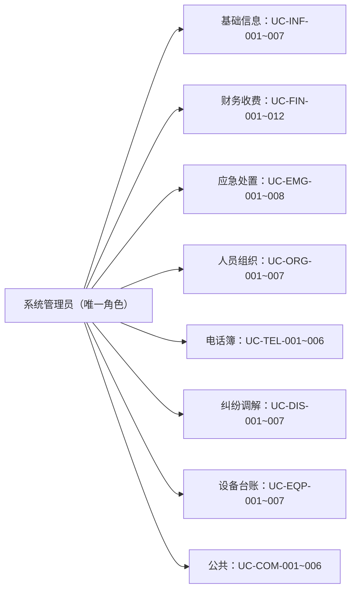
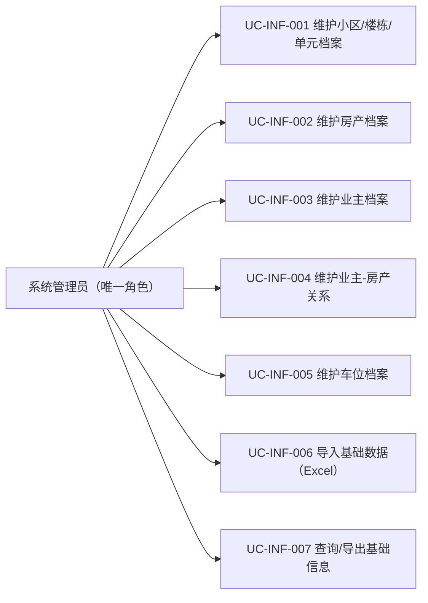
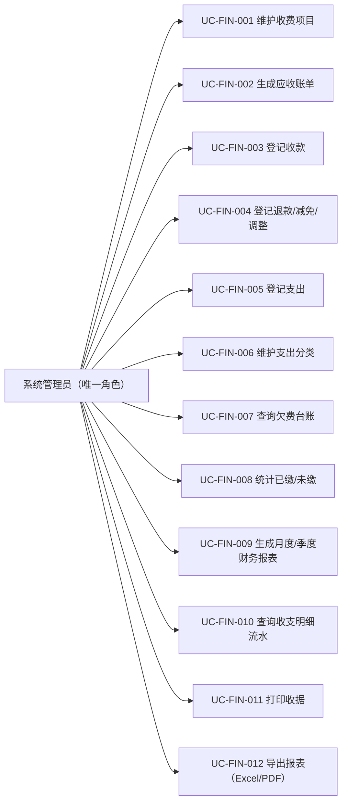
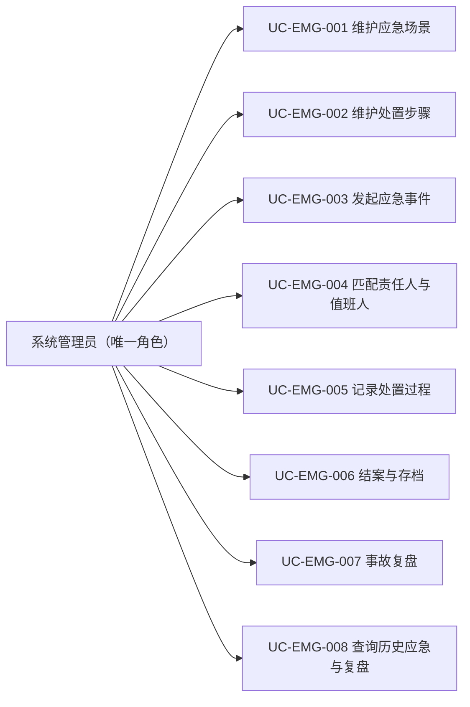
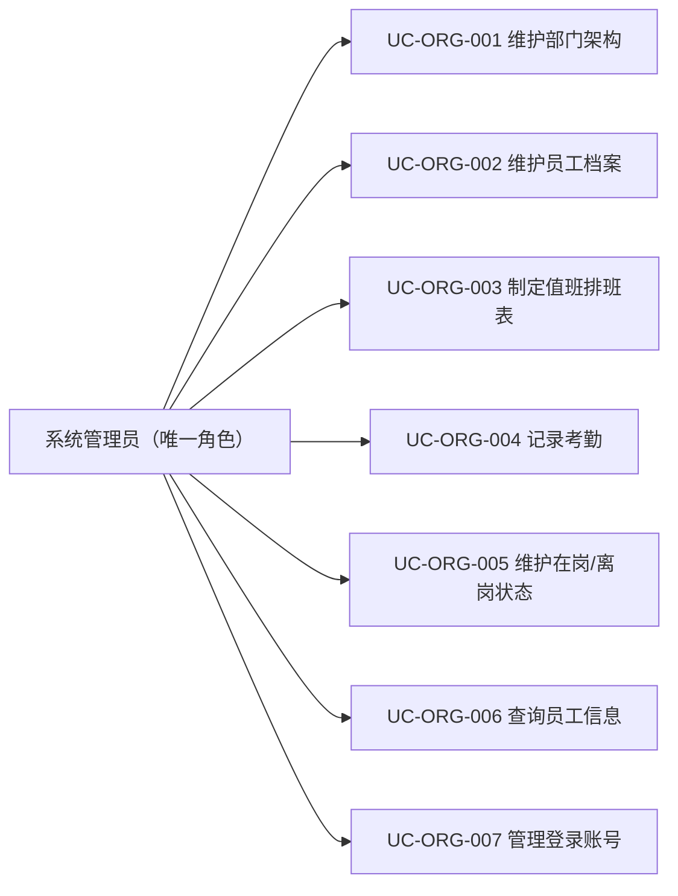
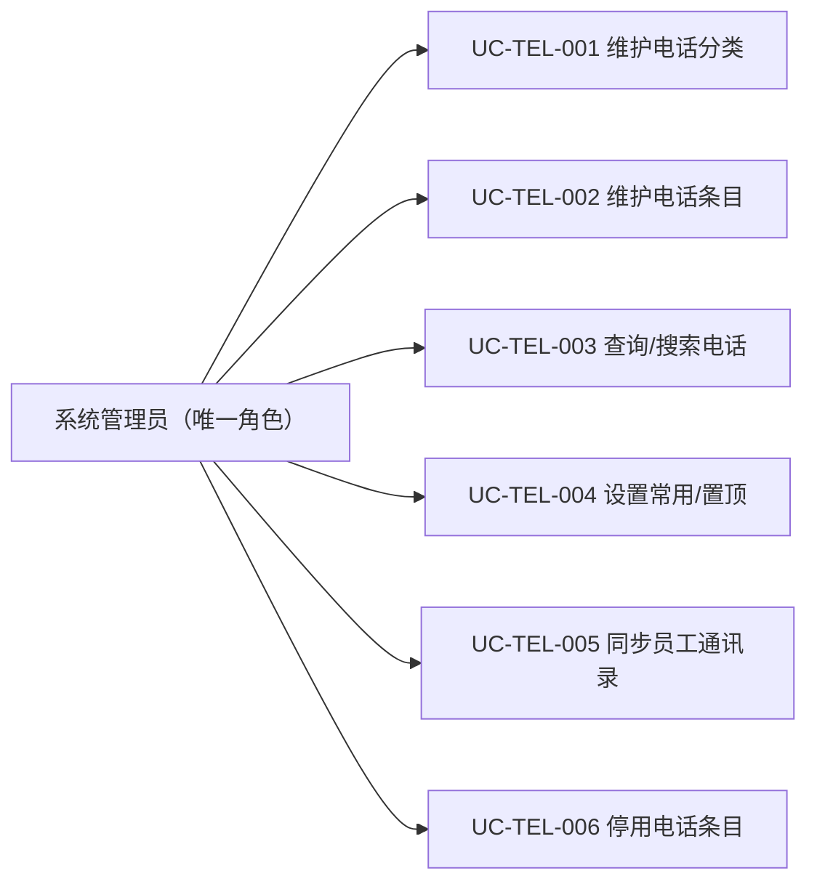
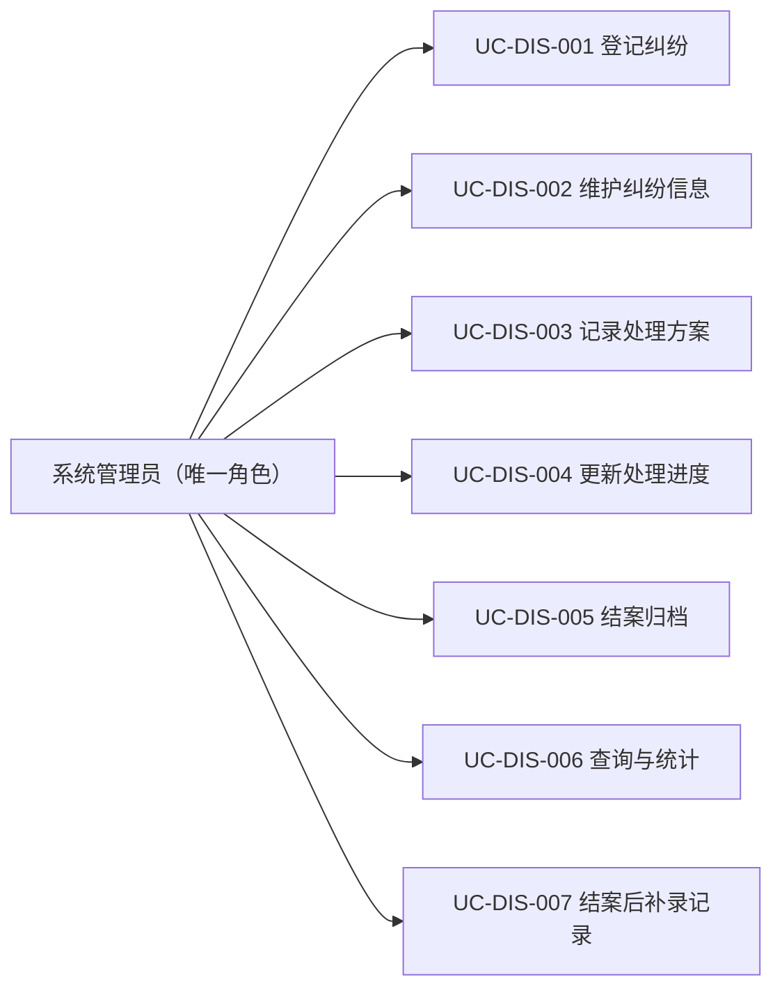
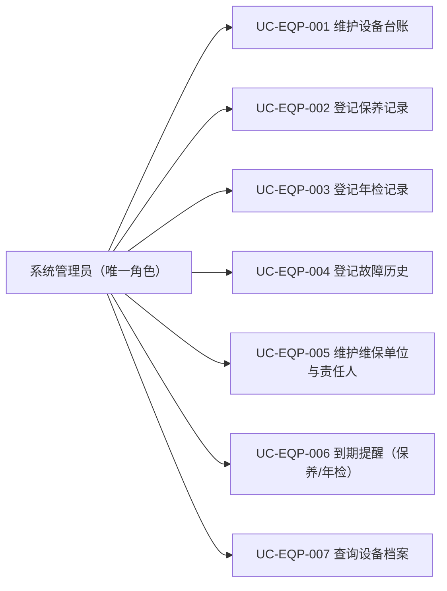
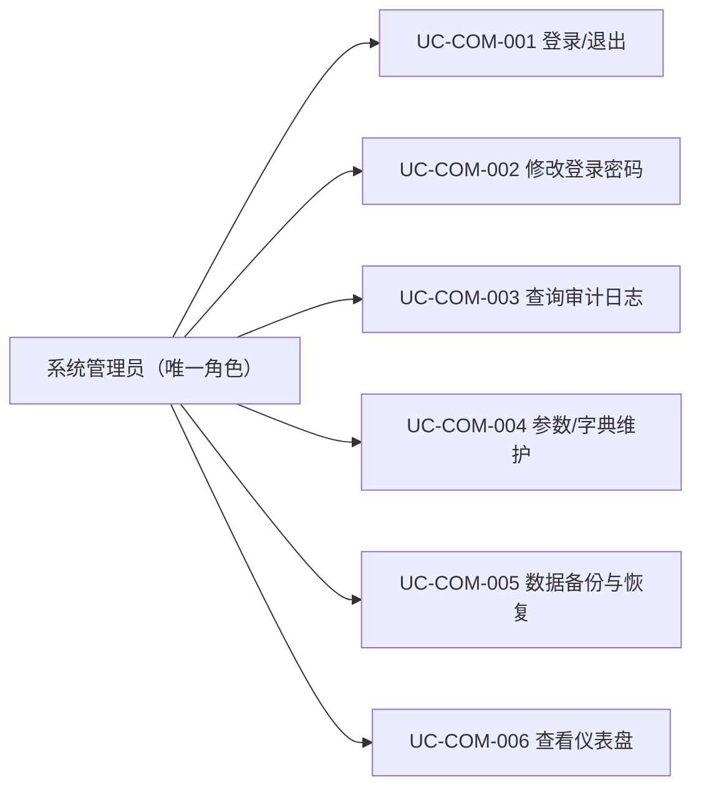

# 功能说明（业务用例）

> 适用版本：安怡物业管理系统 1.0.0 ｜ 覆盖 60 个业务用例
## 一、编号规则

用例编号 = `UC-模块-序号`，模块码：INF 基础信息、FIN 财务收费、EMG 应急处置、ORG 人员组织、TEL 电话簿、DIS 纠纷调解、EQP 设备资产、COM 公共。

## 二、角色说明

系统仅设**系统管理员**一个登录角色，因此所有用例的参与者均为系统管理员；业务上的分工（谁收费、谁处置、谁值班）由现场安排，系统不区分操作人身份。

## 三、用例图

### 3.1 模块总览



### 3.2 逐用例图（按模块）

#### 基础信息（INF）



#### 财务收费（FIN）



#### 应急处置（EMG）



#### 人员组织（ORG）



#### 便民电话簿（TEL）



#### 民事纠纷调解（DIS）



#### 设备资产台账（EQP）



#### 公共（COM）



## 四、用例详述（60 个）

### 4.1 基础信息（INF，7 个）

| 编号 | 用例名称 | 优先级 |
|---|---|---|
| UC-INF-001 | 维护小区/楼栋/单元档案 | 高 |
| UC-INF-002 | 维护房产档案 | 高 |
| UC-INF-003 | 维护业主档案 | 高 |
| UC-INF-004 | 维护业主-房产关系 | 高 |
| UC-INF-005 | 维护车位档案 | 高 |
| UC-INF-006 | 导入基础数据（Excel） | 中 |
| UC-INF-007 | 查询/导出基础信息 | 高 |

#### UC-INF-001 维护小区/楼栋/单元档案

```
用例编号：UC-INF-001
用例名称：维护小区/楼栋/单元档案
参与者：系统管理员（唯一角色）
前置条件：无
主流程：
  1. 新增/编辑小区档案（名称、地址、建成年份）
  2. 在小区下新增楼栋（楼栋号、层数）
  3. 在楼栋下新增单元（单元号）
  4. 保存并生成"小区-楼栋-单元"层级关系
扩展流程：
  E1 楼栋/单元号重复 → 校验阻止
  E2 删除档案 → 存在下级或关联记录时阻止，改为软删除
业务规则：BR-INF-01
关联对象：小区、楼栋、单元
```

#### UC-INF-002 维护房产档案

```
用例编号：UC-INF-002
用例名称：维护房产档案
参与者：系统管理员（唯一角色）
前置条件：已维护楼栋/单元档案
主流程：
  1. 选择楼栋/单元，新增或编辑房产
  2. 录入房号、面积、用途（住宅/商铺）、入住状态
  3. 保存并建立房产档案
扩展流程：
  E1 房产已存在 → 提示并转为编辑
  E2 房号重复 → 校验阻止
业务规则：BR-INF-02、BR-INF-04
关联对象：楼栋、单元、房产
```

#### UC-INF-003 维护业主档案

```
用例编号：UC-INF-003
用例名称：维护业主档案
参与者：系统管理员（唯一角色）
前置条件：无
主流程：
  1. 新增业主（姓名、证件、联系方式）
  2. 编辑联系方式、证件信息
  3. 保存并生成业主档案
扩展流程：
  E1 业主已存在 → 提示并转为编辑
  E2 联系方式变更 → 系统记录变更留痕
业务规则：BR-INF-04
关联对象：业主
```

#### UC-INF-004 维护业主-房产关系

```
用例编号：UC-INF-004
用例名称：维护业主-房产关系
参与者：系统管理员（唯一角色）
前置条件：业主与房产档案已存在
主流程：
  1. 选择房产，关联业主并指定关系类型（自住/出租）
  2. 多业主场景可关联多个业主
  3. 保存关系并记录生效时间
扩展流程：
  E1 关系变更（产权变更/出租转自住） → 留痕并保留历史关系
业务规则：BR-INF-02、BR-INF-04
关联对象：房产、业主、房产-业主关系
```

#### UC-INF-005 维护车位档案

```
用例编号：UC-INF-005
用例名称：维护车位档案
参与者：系统管理员（唯一角色）
前置条件：小区/房产/业主档案已存在
主流程：
  1. 新增车位（车位号、类型：固定/临时）
  2. 固定车位绑定房产或业主
  3. 保存车位档案
扩展流程：
  E1 车位号重复 → 校验阻止
  E2 固定车位已有绑定 → 需先解绑再改绑
业务规则：BR-INF-03
关联对象：车位、房产、业主
```

#### UC-INF-006 导入基础数据（Excel）

```
用例编号：UC-INF-006
用例名称：导入基础数据（Excel）
参与者：系统管理员（唯一角色）
前置条件：已获取导入模板
主流程：
  1. 下载导入模板（楼栋/单元/房产/业主/车位分表）
  2. 填写数据并上传
  3. 系统逐行校验
  4. 正确行入库并生成关系；错误行输出错误清单
扩展流程：
  E1 部分行错误 → 生成清单，修正后重新导入
  E2 模板格式不符 → 阻止并提示
业务规则：BR-INF-05
关联对象：小区、楼栋、单元、房产、业主、车位
```

#### UC-INF-007 查询/导出基础信息

```
用例编号：UC-INF-007
用例名称：查询/导出基础信息
参与者：系统管理员（唯一角色）
前置条件：无
主流程：
  1. 选择查询条件（楼栋/业主/入住状态等）
  2. 系统展示房产、业主、车位列表
  3. 导出 Excel
扩展流程：
  E1 无结果 → 提示并允许放宽条件
业务规则：—
关联对象：房产、业主、车位
```

### 4.2 财务收费（FIN，12 个）

| 编号 | 用例名称 | 优先级 |
|---|---|---|
| UC-FIN-001 | 维护收费项目 | 高 |
| UC-FIN-002 | 生成应收账单 | 高 |
| UC-FIN-003 | 登记收款 | 高 |
| UC-FIN-004 | 登记退款/减免/调整 | 高 |
| UC-FIN-005 | 登记支出 | 高 |
| UC-FIN-006 | 维护支出分类 | 中 |
| UC-FIN-007 | 查询欠费台账 | 高 |
| UC-FIN-008 | 统计已缴/未缴 | 高 |
| UC-FIN-009 | 生成月度/季度财务报表 | 高 |
| UC-FIN-010 | 查询收支明细流水 | 高 |
| UC-FIN-011 | 打印收据 | 高 |
| UC-FIN-012 | 导出报表（Excel/PDF） | 中 |

#### UC-FIN-001 维护收费项目

```
用例编号：UC-FIN-001
用例名称：维护收费项目
参与者：系统管理员（唯一角色）
前置条件：无
主流程：
  1. 新增收费项目（名称、计费模式、单价、周期）
  2. 设置适用对象（房产/车位）
  3. 保存并启用
扩展流程：
  E1 停车费 → 计费模式本期仅"年缴"，月缴/临时预留
  E2 停用项目 → 不删除，历史账单保留
业务规则：BR-FIN-03
关联对象：收费项目
```

#### UC-FIN-002 生成应收账单

```
用例编号：UC-FIN-002
用例名称：生成应收账单
参与者：系统管理员（唯一角色）
前置条件：收费项目已维护；缴费对象（房产/车位）存在
主流程：
  1. 选择收费项目与计费周期
  2. 选择缴费对象范围（全部/按楼栋/按业主）
  3. 系统按"项目 × 周期 × 对象"生成应收账单
  4. 核对并确认发布
扩展流程：
  E1 已生成同周期账单 → 提示避免重复
  E2 部分对象无计费依据 → 生成失败清单
业务规则：BR-FIN-01、BR-FIN-03
关联对象：收费项目、房产、车位、应收账单
```

#### UC-FIN-003 登记收款

```
用例编号：UC-FIN-003
用例名称：登记收款
参与者：系统管理员（唯一角色）
前置条件：存在待缴账单；管理员已登录且有收费权限
主流程：
  1. 选择业主/房产，系统展示待缴账单
  2. 选择账单并录入收款金额、方式（现金/转账）
  3. 系统校验金额与账单一致，生成缴费记录
  4. 系统更新账单状态并出具收据
扩展流程：
  E1 部分缴费 → 账单进入"部分缴"状态
  E2 金额不符 → 提示并阻止提交
业务规则：BR-FIN-02、BR-COM-01
关联对象：业主、房产、应收账单、缴费记录、收据
```

#### UC-FIN-004 登记退款/减免/调整

```
用例编号：UC-FIN-004
用例名称：登记退款/减免/调整
参与者：系统管理员（唯一角色）
前置条件：存在已缴/部分缴账单
主流程：
  1. 选择账单，选择操作类型（退款/减免/调整）
  2. 录入金额与原因
  3. 保存并更新账单状态（已冲正/金额变更）
  4. 系统写入审计日志
扩展流程：
  E1 退款金额超过已缴金额 → 阻止
业务规则：BR-FIN-06、BR-FIN-10、BR-COM-01
关联对象：应收账单、退款/调整记录
```

#### UC-FIN-005 登记支出

```
用例编号：UC-FIN-005
用例名称：登记支出
参与者：系统管理员（唯一角色）
前置条件：支出分类已维护
主流程：
  1. 选择支出分类（工资/维护/水电/外包/杂项）
  2. 录入金额、日期、说明
  3. 按分类关联对象（工资→员工；维护→设备/维保单位）
  4. 保存支出记录并审计留痕
扩展流程：
  E1 关联对象缺失 → 允许登记但标记待补
业务规则：BR-FIN-04、BR-FIN-05、BR-COM-01
关联对象：支出分类、支出记录、员工、设备、维保单位
```

#### UC-FIN-006 维护支出分类

```
用例编号：UC-FIN-006
用例名称：维护支出分类
参与者：系统管理员（唯一角色）
前置条件：无
主流程：
  1. 新增/编辑支出分类（名称、类别）
  2. 保存
扩展流程：
  E1 分类已被支出引用 → 禁止删除，可停用
业务规则：BR-COM-05
关联对象：支出分类
```

#### UC-FIN-007 查询欠费台账

```
用例编号：UC-FIN-007
用例名称：查询欠费台账
参与者：系统管理员（唯一角色）
前置条件：无
主流程：
  1. 选择查询条件（楼栋/业主/周期/状态）
  2. 系统按欠费口径（待缴/部分缴/逾期/已缴）展示台账
  3. 查看明细并可导出
扩展流程：
  E1 按状态筛选 → 联动更新统计数
业务规则：BR-FIN-07
关联对象：应收账单、房产、业主
```

#### UC-FIN-008 统计已缴/未缴

```
用例编号：UC-FIN-008
用例名称：统计已缴/未缴
参与者：系统管理员（唯一角色）
前置条件：无
主流程：
  1. 选择统计范围与周期
  2. 系统计算已缴/部分缴/未缴金额与户数
  3. 展示汇总并可下钻
业务规则：BR-FIN-07
关联对象：应收账单、缴费记录
```

#### UC-FIN-009 生成月度/季度财务报表

```
用例编号：UC-FIN-009
用例名称：生成月度/季度财务报表
参与者：系统管理员（唯一角色）
前置条件：存在收支流水
主流程：
  1. 选择周期（月/季）
  2. 系统汇总收入流水、支出流水
  3. 计算结余与分类小计
  4. 生成报表预览
业务规则：BR-FIN-09
关联对象：缴费记录、支出记录
```

#### UC-FIN-010 查询收支明细流水

```
用例编号：UC-FIN-010
用例名称：查询收支明细流水
参与者：系统管理员（唯一角色）
前置条件：无
主流程：
  1. 选择条件（时间/类型/分类/关键字）
  2. 展示收入与支出流水
  3. 可导出
业务规则：—
关联对象：缴费记录、支出记录
```

#### UC-FIN-011 打印收据

```
用例编号：UC-FIN-011
用例名称：打印收据
参与者：系统管理员（唯一角色）
前置条件：已生成缴费记录
主流程：
  1. 选择缴费记录
  2. 预览收据
  3. 打印/补打
扩展流程：
  E1 补打 → 记录打印历史
业务规则：BR-FIN-08
关联对象：收据、缴费记录
```

#### UC-FIN-012 导出报表（Excel/PDF）

```
用例编号：UC-FIN-012
用例名称：导出报表（Excel/PDF）
参与者：系统管理员（唯一角色）
前置条件：报表已生成
主流程：
  1. 选择报表类型与周期
  2. 选择导出格式（Excel/PDF）
  3. 生成并保存文件
业务规则：—
关联对象：报表数据（流水/台账）
```

### 4.3 应急处置（EMG，8 个）

| 编号 | 用例名称 | 优先级 |
|---|---|---|
| UC-EMG-001 | 维护应急场景 | 高 |
| UC-EMG-002 | 维护处置步骤 | 高 |
| UC-EMG-003 | 发起应急事件 | 高 |
| UC-EMG-004 | 匹配责任人与值班人 | 高 |
| UC-EMG-005 | 记录处置过程 | 高 |
| UC-EMG-006 | 结案与存档 | 高 |
| UC-EMG-007 | 事故复盘 | 中 |
| UC-EMG-008 | 查询历史应急与复盘 | 高 |

#### UC-EMG-001 维护应急场景

```
用例编号：UC-EMG-001
用例名称：维护应急场景
参与者：系统管理员（唯一角色）
前置条件：无
主流程：
  1. 新增应急场景（电力/自来水/电梯/天然气/消防/极端天气或扩展）
  2. 设置启用状态
  3. 保存
扩展流程：
  E1 停用场景 → 历史事件保留，不可新发起
业务规则：BR-COM-05
关联对象：应急场景
```

#### UC-EMG-002 维护处置步骤

```
用例编号：UC-EMG-002
用例名称：维护处置步骤
参与者：系统管理员（唯一角色）
前置条件：应急场景已存在
主流程：
  1. 选择场景
  2. 新增/编辑步骤（序号、内容、责任人角色）
  3. 发布新版本
扩展流程：
  E1 版本更新 → 保留历史版本
业务规则：BR-EMG-05
关联对象：应急场景、处置步骤
```

#### UC-EMG-003 发起应急事件

```
用例编号：UC-EMG-003
用例名称：发起应急事件
参与者：系统管理员（唯一角色）
前置条件：应急场景与处置步骤已维护
主流程：
  1. 选择应急场景（电力/自来水/电梯/天然气/消防/极端天气）
  2. 录入发生时间、地点、初步情况
  3. 系统自动带出处置步骤并匹配责任人与值班人
  4. 事件进入"处置中"
扩展流程：
  E1 无人匹配 → 提示人工指派（管理员介入指派）
  E2 场景步骤缺失 → 仍可发起并标注"步骤待补"
业务规则：BR-EMG-01、BR-EMG-02
关联对象：应急场景、处置步骤、应急事件、员工
```

#### UC-EMG-004 匹配责任人与值班人

```
用例编号：UC-EMG-004
用例名称：匹配责任人与值班人
参与者：系统管理员（唯一角色）
前置条件：排班与在岗状态已维护
主流程：
  1. 根据事件时间自动检索值班人与在岗人员
  2. 展示候选并确认责任人/值班人
  3. 写入应急事件
扩展流程：
  E1 无匹配 → 提示人工指派
业务规则：BR-EMG-03、BR-ORG-06
关联对象：排班、在岗状态、员工、应急事件
```

#### UC-EMG-005 记录处置过程

```
用例编号：UC-EMG-005
用例名称：记录处置过程
参与者：系统管理员（唯一角色）
前置条件：应急事件处于处置中
主流程：
  1. 录入处置时间、操作内容、结果
  2. 保存处置记录
扩展流程：
  E1 多次处置 → 追加记录
业务规则：BR-EMG-04
关联对象：应急事件、处置记录
```

#### UC-EMG-006 结案与存档

```
用例编号：UC-EMG-006
用例名称：结案与存档
参与者：系统管理员（唯一角色）
前置条件：处置完成
主流程：
  1. 核对处置记录完整性
  2. 结案并归档
扩展流程：
  E1 处置记录缺失 → 提示补录后结案
业务规则：BR-EMG-02、BR-EMG-06
关联对象：应急事件
```

#### UC-EMG-007 事故复盘

```
用例编号：UC-EMG-007
用例名称：事故复盘
参与者：系统管理员（唯一角色）
前置条件：应急事件已结案
主流程：
  1. 录入原因分析
  2. 录入改进措施与完成时间
  3. 保存复盘记录
扩展流程：
  E1 复盘可后补，结案后任意时间录入
业务规则：BR-EMG-02
关联对象：应急事件、复盘记录
```

#### UC-EMG-008 查询历史应急与复盘

```
用例编号：UC-EMG-008
用例名称：查询历史应急与复盘
参与者：系统管理员（唯一角色）
前置条件：无
主流程：
  1. 按场景/时间/状态查询应急事件
  2. 查看处置记录与复盘
  3. 可导出统计
业务规则：BR-EMG-06
关联对象：应急事件、复盘记录
```

### 4.4 人员组织（ORG，7 个）

| 编号 | 用例名称 | 优先级 |
|---|---|---|
| UC-ORG-001 | 维护部门架构 | 高 |
| UC-ORG-002 | 维护员工档案 | 高 |
| UC-ORG-003 | 制定值班排班表 | 高 |
| UC-ORG-004 | 记录考勤 | 高 |
| UC-ORG-005 | 维护在岗/离岗状态 | 高 |
| UC-ORG-006 | 查询员工信息 | 中 |
| UC-ORG-007 | 管理登录账号 | 高 |

> 调整说明：原"分配岗位与权限"用例已移除（系统仅系统管理员一个角色，无需授权功能）。

#### UC-ORG-001 维护部门架构

```
用例编号：UC-ORG-001
用例名称：维护部门架构
参与者：系统管理员（唯一角色）
前置条件：无
主流程：
  1. 新增部门（名称、上级部门）
  2. 调整层级关系
  3. 保存
扩展流程：
  E1 部门下存在员工 → 禁止删除，可停用
业务规则：BR-ORG-07
关联对象：部门
```

#### UC-ORG-002 维护员工档案

```
用例编号：UC-ORG-002
用例名称：维护员工档案
参与者：系统管理员（唯一角色）
前置条件：部门/岗位已维护
主流程：
  1. 新增员工（姓名、电话、部门、岗位、入职日期）
  2. 转岗/离职操作
  3. 保存档案并同步状态
扩展流程：
  E1 离职 → 档案保留、账号停用
业务规则：BR-ORG-02
关联对象：部门、岗位、员工、账号
```

#### UC-ORG-003 制定值班排班表

```
用例编号：UC-ORG-003
用例名称：制定值班排班表
参与者：系统管理员（唯一角色）
前置条件：部门、岗位、员工档案已维护
主流程：
  1. 选择部门/岗位与排班周期
  2. 分配员工到班次
  3. 检查冲突（同人同时多班、缺员）
  4. 发布排班表
扩展流程：
  E1 冲突 → 提示并阻止发布
  E2 缺员 → 允许发布但标记缺口
业务规则：BR-ORG-03、BR-ORG-04
关联对象：部门、岗位、员工、班次、排班
```

#### UC-ORG-004 记录考勤

```
用例编号：UC-ORG-004
用例名称：记录考勤
参与者：系统管理员（唯一角色）
前置条件：排班表已发布
主流程：
  1. 记录员工签到/签退（或批量录入）
  2. 系统与排班对照
  3. 正常自动入账；异常标记
  4. 管理员审核异常
扩展流程：
  E1 补卡/修正 → 审核通过后更新
业务规则：BR-ORG-05
关联对象：排班、考勤记录、员工
```

#### UC-ORG-005 维护在岗/离岗状态

```
用例编号：UC-ORG-005
用例名称：维护在岗/离岗状态
参与者：系统管理员（唯一角色）
前置条件：员工档案已存在
主流程：
  1. 选择员工
  2. 更新在岗/离岗/休假状态
  3. 保存
扩展流程：
  E1 应急匹配时自动参考最新状态
业务规则：BR-ORG-06
关联对象：员工、在岗状态
```

#### UC-ORG-006 查询员工信息

```
用例编号：UC-ORG-006
用例名称：查询员工信息
参与者：系统管理员（唯一角色）
前置条件：无
主流程：
  1. 按部门/岗位/状态查询
  2. 查看档案（含离职历史）
  3. 联动通讯录信息
业务规则：BR-ORG-02
关联对象：员工、部门、岗位
```

#### UC-ORG-007 管理登录账号

```
用例编号：UC-ORG-007
用例名称：管理登录账号
参与者：系统管理员（唯一角色）
前置条件：系统管理员已登录
主流程：
  1. 查看当前账号信息
  2. 修改密码/启停账号
  3. 保存
扩展流程：
  E1 账号停用后 → 禁止登录
业务规则：BR-COM-02、BR-COM-03
关联对象：账号
```

### 4.5 便民电话簿（TEL，6 个）

| 编号 | 用例名称 | 优先级 |
|---|---|---|
| UC-TEL-001 | 维护电话分类 | 中 |
| UC-TEL-002 | 维护电话条目 | 高 |
| UC-TEL-003 | 查询/搜索电话 | 高 |
| UC-TEL-004 | 设置常用/置顶 | 低 |
| UC-TEL-005 | 同步员工通讯录 | 高 |
| UC-TEL-006 | 停用电话条目 | 中 |

#### UC-TEL-001 维护电话分类

```
用例编号：UC-TEL-001
用例名称：维护电话分类
参与者：系统管理员（唯一角色）
前置条件：无
主流程：
  1. 新增/编辑分类（名称、排序）
  2. 保存
业务规则：BR-COM-05
关联对象：电话分类
```

#### UC-TEL-002 维护电话条目

```
用例编号：UC-TEL-002
用例名称：维护电话条目
参与者：系统管理员（唯一角色）
前置条件：分类已维护
主流程：
  1. 新增条目（单位/姓名、号码、分类、备注）
  2. 校验号码格式
  3. 保存
扩展流程：
  E1 员工条目 → 改为从人员组织同步，不手工维护
  E2 紧急号码 → 自动置顶且不可删除
业务规则：BR-TEL-01、BR-TEL-03、BR-TEL-04
关联对象：电话分类、电话条目
```

#### UC-TEL-003 查询/搜索电话

```
用例编号：UC-TEL-003
用例名称：查询/搜索电话
参与者：系统管理员（唯一角色）
前置条件：电话条目已维护
主流程：
  1. 按分类浏览或输入关键字搜索
  2. 系统展示匹配条目（号码、单位、备注）
  3. 点击复制/拨打
扩展流程：
  E1 无匹配 → 提示"未收录"并给出新增建议
业务规则：BR-TEL-02
关联对象：电话分类、电话条目
```

#### UC-TEL-004 设置常用/置顶

```
用例编号：UC-TEL-004
用例名称：设置常用/置顶
参与者：系统管理员（唯一角色）
前置条件：电话条目已存在
主流程：
  1. 选择条目，设置置顶/常用标记
  2. 保存
扩展流程：
  E1 紧急号码 → 置顶状态不可取消
业务规则：BR-TEL-03
关联对象：电话条目
```

#### UC-TEL-005 同步员工通讯录

```
用例编号：UC-TEL-005
用例名称：同步员工通讯录
参与者：系统管理员（唯一角色）
前置条件：员工档案已存在
主流程：
  1. 触发同步（手动或自动）
  2. 系统从人员组织生成/更新员工电话条目
  3. 完成同步
扩展流程：
  E1 离职员工 → 同步为停用条目
业务规则：BR-TEL-01
关联对象：员工、电话条目
```

#### UC-TEL-006 停用电话条目

```
用例编号：UC-TEL-006
用例名称：停用电话条目
参与者：系统管理员（唯一角色）
前置条件：电话条目已存在
主流程：
  1. 选择条目停用
  2. 系统隐藏但不删除
扩展流程：
  E1 重新启用 → 恢复展示
业务规则：BR-TEL-02
关联对象：电话条目
```

### 4.6 民事纠纷调解（DIS，7 个）

| 编号 | 用例名称 | 优先级 |
|---|---|---|
| UC-DIS-001 | 登记纠纷 | 高 |
| UC-DIS-002 | 维护纠纷信息 | 高 |
| UC-DIS-003 | 记录处理方案 | 高 |
| UC-DIS-004 | 更新处理进度 | 高 |
| UC-DIS-005 | 结案归档 | 高 |
| UC-DIS-006 | 查询与统计 | 中 |
| UC-DIS-007 | 结案后补录记录 | 中 |

#### UC-DIS-001 登记纠纷

```
用例编号：UC-DIS-001
用例名称：登记纠纷
参与者：系统管理员（唯一角色）
前置条件：业主信息已维护（当事人可引用）
主流程：
  1. 选择纠纷类型（邻里/物业业主）
  2. 录入发生时间、地点、详情、当事人/责任人
  3. 指派调解员（引用员工档案）
  4. 案件进入"处理中"
扩展流程：
  E1 当事人非业主 → 允许登记外部人员信息
业务规则：BR-DIS-01、BR-DIS-02
关联对象：纠纷案件、纠纷类型、业主、员工
```

#### UC-DIS-002 维护纠纷信息

```
用例编号：UC-DIS-002
用例名称：维护纠纷信息
参与者：系统管理员（唯一角色）
前置条件：纠纷案件已登记
主流程：
  1. 补充/修改责任人、地点、详情
  2. 当事人可引用业主或登记外部人员
  3. 保存
业务规则：BR-DIS-05
关联对象：纠纷案件、业主
```

#### UC-DIS-003 记录处理方案

```
用例编号：UC-DIS-003
用例名称：记录处理方案
参与者：系统管理员（唯一角色）
前置条件：纠纷处于处理中
主流程：
  1. 录入处理方案（措施、调解员、时间）
  2. 保存处理记录
扩展流程：
  E1 多次方案 → 追加记录
业务规则：BR-DIS-03
关联对象：纠纷案件、纠纷处理记录、员工
```

#### UC-DIS-004 更新处理进度

```
用例编号：UC-DIS-004
用例名称：更新处理进度
参与者：系统管理员（唯一角色）
前置条件：纠纷案件已登记
主流程：
  1. 更新案件状态（处理中/结案）
  2. 记录进度节点
  3. 保存
业务规则：BR-DIS-01
关联对象：纠纷案件
```

#### UC-DIS-005 结案归档

```
用例编号：UC-DIS-005
用例名称：结案归档
参与者：系统管理员（唯一角色）
前置条件：存在至少一条处理方案记录
主流程：
  1. 录入结案结论与归档日期
  2. 结案归档
扩展流程：
  E1 无处理方案 → 阻止结案
业务规则：BR-DIS-01、BR-DIS-02
关联对象：纠纷案件
```

#### UC-DIS-006 查询与统计

```
用例编号：UC-DIS-006
用例名称：查询与统计
参与者：系统管理员（唯一角色）
前置条件：无
主流程：
  1. 按类型/区域/时间段查询
  2. 统计未结/已结案件
  3. 可导出
业务规则：—
关联对象：纠纷案件
```

#### UC-DIS-007 结案后补录记录

```
用例编号：UC-DIS-007
用例名称：结案后补录记录
参与者：系统管理员（唯一角色）
前置条件：案件已结案
主流程：
  1. 选择已结案案件
  2. 补录处理记录
  3. 保存
业务规则：BR-DIS-04
关联对象：纠纷案件、纠纷处理记录
```

### 4.7 设备资产台账（EQP，7 个）

| 编号 | 用例名称 | 优先级 |
|---|---|---|
| UC-EQP-001 | 维护设备台账 | 高 |
| UC-EQP-002 | 登记保养记录 | 高 |
| UC-EQP-003 | 登记年检记录 | 高 |
| UC-EQP-004 | 登记故障历史 | 高 |
| UC-EQP-005 | 维护维保单位与责任人 | 中 |
| UC-EQP-006 | 到期提醒（保养/年检） | 高 |
| UC-EQP-007 | 查询设备档案 | 高 |

#### UC-EQP-001 维护设备台账

```
用例编号：UC-EQP-001
用例名称：维护设备台账
参与者：系统管理员（唯一角色）
前置条件：设备类型已维护（可扩展）
主流程：
  1. 新增设备（名称、类型、位置、启用日期）
  2. 设置初始状态（在用）
  3. 保存
扩展流程：
  E1 状态变更（维修/停用/报废）→ 留痕
业务规则：BR-EQP-01、BR-EQP-05
关联对象：设备、设备类型
```

#### UC-EQP-002 登记保养记录

```
用例编号：UC-EQP-002
用例名称：登记保养记录
参与者：系统管理员（唯一角色）
前置条件：设备台账已存在
主流程：
  1. 选择设备
  2. 录入保养日期、内容、结果、保养单位
  3. 系统按类型周期计算下次提醒
扩展流程：
  E1 保养不合格 → 设备转维修中
业务规则：BR-EQP-02、BR-EQP-06
关联对象：设备、保养记录、维保单位
```

#### UC-EQP-003 登记年检记录

```
用例编号：UC-EQP-003
用例名称：登记年检记录
参与者：系统管理员（唯一角色）
前置条件：设备台账已存在
主流程：
  1. 选择设备
  2. 录入年检日期、结果、单位
  3. 系统记录并计算下次年检提醒
扩展流程：
  E1 年检不合格 → 设备进入"维修中"，关联故障
业务规则：BR-EQP-03、BR-EQP-04
关联对象：设备、年检记录、维保单位
```

#### UC-EQP-004 登记故障历史

```
用例编号：UC-EQP-004
用例名称：登记故障历史
参与者：系统管理员（唯一角色）
前置条件：设备台账已存在
主流程：
  1. 选择设备
  2. 录入故障时间、现象、原因、处理结果
  3. 保存（可关联应急事件）
扩展流程：
  E1 故障未处理完 → 设备转维修中
业务规则：BR-EQP-04
关联对象：设备、故障记录、应急事件
```

#### UC-EQP-005 维护维保单位与责任人

```
用例编号：UC-EQP-005
用例名称：维护维保单位与责任人
参与者：系统管理员（唯一角色）
前置条件：无
主流程：
  1. 新增维保单位（名称、联系人、电话）
  2. 指定设备责任人（引用员工）
  3. 保存
业务规则：BR-EQP-06
关联对象：维保单位、员工、设备
```

#### UC-EQP-006 到期提醒（保养/年检）

```
用例编号：UC-EQP-006
用例名称：到期提醒（保养/年检）
参与者：系统管理员（唯一角色）
前置条件：设备存在保养/年检周期
主流程：
  1. 系统按周期计算到期设备
  2. 仪表盘与提醒列表展示
  3. 完成保养/年检后更新提醒
业务规则：BR-EQP-02
关联对象：设备、保养记录、年检记录、提醒
```

#### UC-EQP-007 查询设备档案

```
用例编号：UC-EQP-007
用例名称：查询设备档案
参与者：系统管理员（唯一角色）
前置条件：无
主流程：
  1. 按类型/位置/状态查询
  2. 查看保养/年检/故障历史
  3. 可导出
业务规则：—
关联对象：设备、保养记录、年检记录、故障记录
```

### 4.8 公共（COM，6 个）

| 编号 | 用例名称 | 优先级 |
|---|---|---|
| UC-COM-001 | 登录/退出 | 高 |
| UC-COM-002 | 修改登录密码 | 高 |
| UC-COM-003 | 查询审计日志 | 中 |
| UC-COM-004 | 参数/字典维护 | 中 |
| UC-COM-005 | 数据备份与恢复 | 中 |
| UC-COM-006 | 查看仪表盘 | 高 |

> 调整说明：原"角色与权限管理"用例已移除（系统仅系统管理员一个角色）。

#### UC-COM-001 登录/退出

```
用例编号：UC-COM-001
用例名称：登录/退出
参与者：系统管理员（唯一角色）
前置条件：账号已开通且未停用
主流程：
  1. 输入账号密码
  2. 系统校验并加载权限（全部模块）
  3. 进入仪表盘
扩展流程：
  E1 密码错误 → 提示重试，连续失败锁定
  E2 账号停用 → 阻止登录
业务规则：BR-COM-02、BR-COM-03
关联对象：账号
```

#### UC-COM-002 修改登录密码

```
用例编号：UC-COM-002
用例名称：修改登录密码
参与者：系统管理员（唯一角色）
前置条件：系统管理员已登录
主流程：
  1. 输入原密码与新密码
  2. 校验原密码
  3. 保存新密码
扩展流程：
  E1 原密码错误 → 提示重试
业务规则：—
关联对象：账号
```

#### UC-COM-003 查询审计日志

```
用例编号：UC-COM-003
用例名称：查询审计日志
参与者：系统管理员（唯一角色）
前置条件：系统管理员已登录
主流程：
  1. 选择时间/操作类型/对象
  2. 展示审计记录（操作人、时间、操作、对象）
  3. 可导出
业务规则：BR-COM-01
关联对象：审计日志、账号
```

#### UC-COM-004 参数/字典维护

```
用例编号：UC-COM-004
用例名称：参数/字典维护
参与者：系统管理员（唯一角色）
前置条件：系统管理员已登录
主流程：
  1. 选择字典类型（缴费模式/设备类型/应急场景/支出分类等）
  2. 新增/编辑字典项
  3. 保存
扩展流程：
  E1 字典项被引用 → 禁止删除，可停用
业务规则：BR-COM-05
关联对象：基础字典
```

#### UC-COM-005 数据备份与恢复

```
用例编号：UC-COM-005
用例名称：数据备份与恢复
参与者：系统管理员（唯一角色）
前置条件：系统管理员已登录
主流程：
  1. 触发备份（手动或按周期）
  2. 系统生成备份文件
  3. 恢复时选择备份文件并执行
扩展流程：
  E1 恢复操作需二次确认
业务规则：BR-COM-04
关联对象：—
```

#### UC-COM-006 查看仪表盘

```
用例编号：UC-COM-006
用例名称：查看仪表盘
参与者：系统管理员（唯一角色）
前置条件：系统管理员已登录
主流程：
  1. 进入首页
  2. 查看本月应收/已收/欠费、应急待办、纠纷处理中、保养/年检到期、今日值班
  3. 点击下钻
业务规则：—
关联对象：应收账单、应急事件、纠纷案件、设备、提醒
```

## 五、完成情况（v0.4）

待深化项三件已全部完成：

1. **逐用例图形化**：见 3.2 节，60 个用例均以节点出现在各模块用例图中；
3. **异常路径现场核对清单**：见 [AM-02-异常路径核对清单.md](AM-02-异常路径核对清单.md)，将各用例异常路径整理为待现场确认的问题清单。
