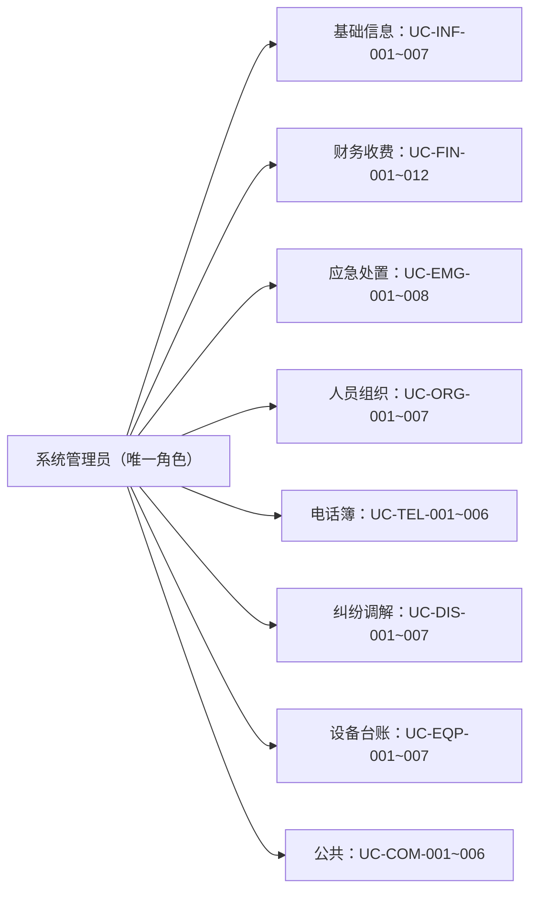
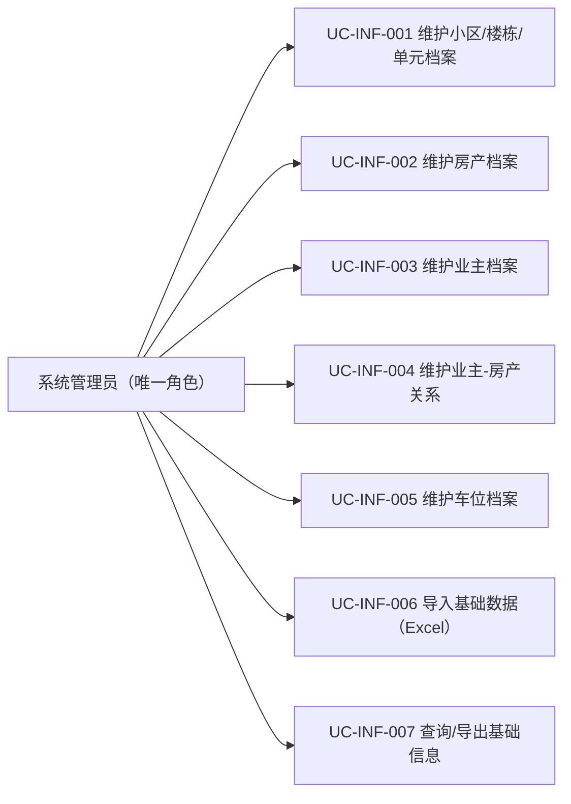
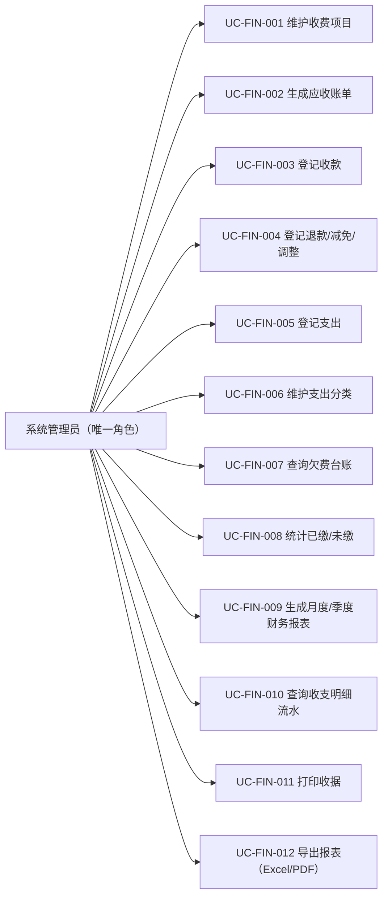
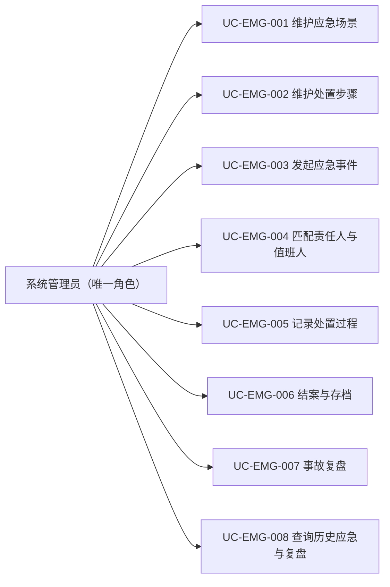
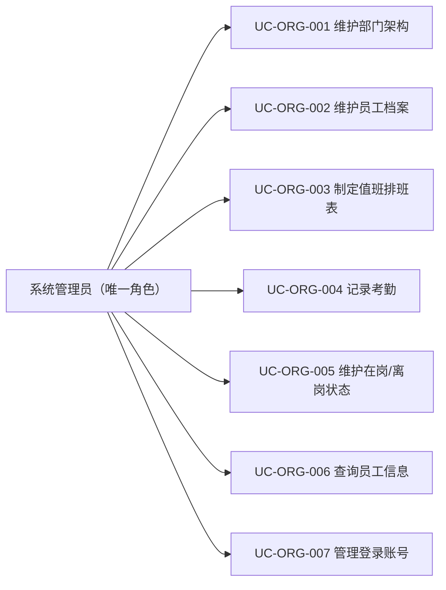
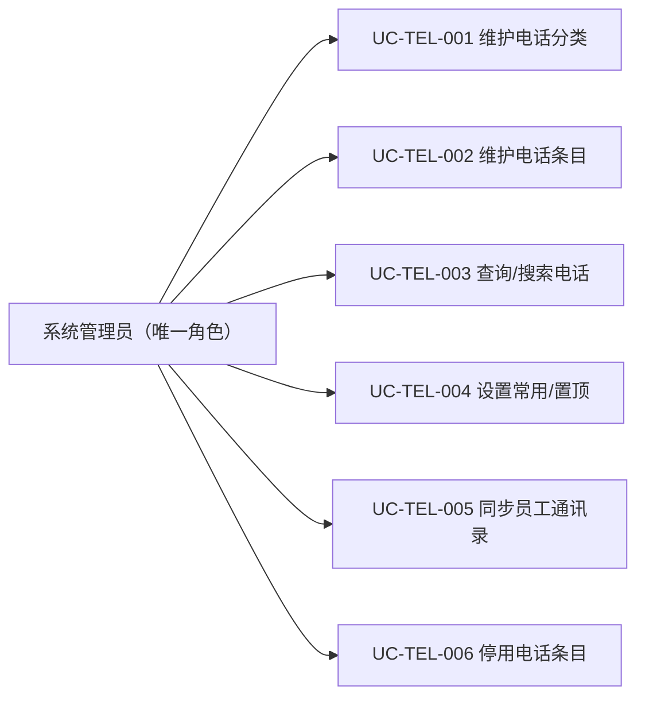
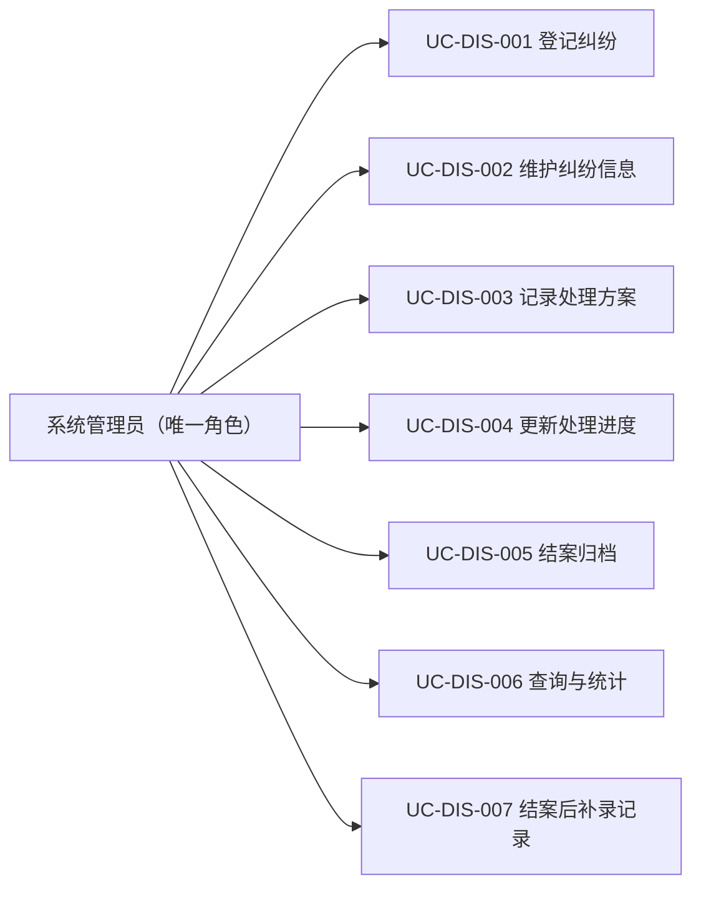
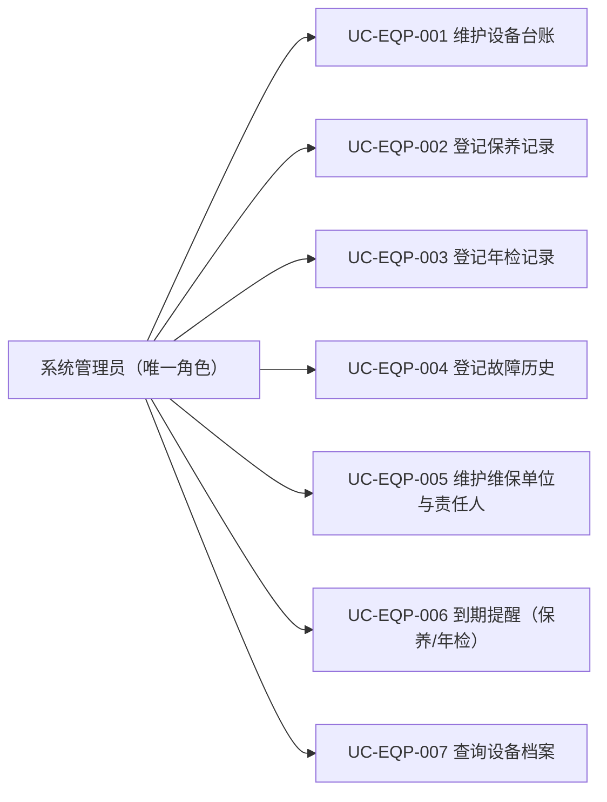
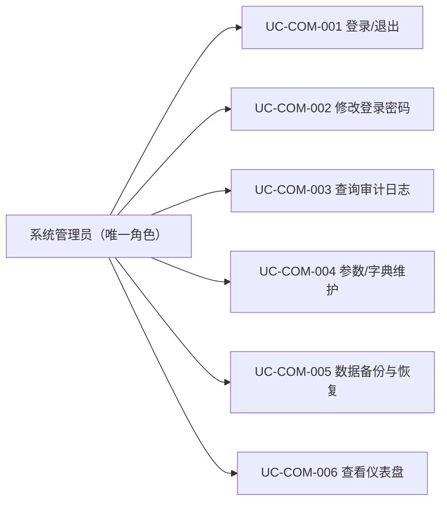

# 功能说明（业务用例）

> 适用版本：安怡物业管理系统 1.1.2 ｜ 覆盖 60 个业务用例
## 一、编号规则

用例编号 = `UC-模块-序号`，模块码：INF 基础信息、FIN 财务收费、EMG 应急处置、ORG 人员组织、TEL 电话簿、DIS 纠纷调解、EQP 设备资产、COM 公共。

## 二、角色说明

系统仅设**系统管理员**一个登录角色，因此所有用例的参与者均为系统管理员；业务上的分工（谁收费、谁处置、谁值班）由现场安排，系统不区分操作人身份。

## 三、用例图

### 3.1 模块总览



### 3.2 逐用例图（按模块）

#### 基础信息（INF）



#### 财务收费（FIN）



#### 应急处置（EMG）



#### 人员组织（ORG）



#### 便民电话簿（TEL）



#### 民事纠纷调解（DIS）



#### 设备资产台账（EQP）



#### 公共（COM）



## 四、用例详述（60 个）

### 4.1 基础信息（INF，7 个）

| 编号 | 用例名称 | 优先级 |
|---|---|---|
| UC-INF-001 | 维护小区/楼栋/单元档案 | 高 |
| UC-INF-002 | 维护房产档案 | 高 |
| UC-INF-003 | 维护业主档案 | 高 |
| UC-INF-004 | 维护业主-房产关系 | 高 |
| UC-INF-005 | 维护车位档案 | 高 |
| UC-INF-006 | 导入基础数据（Excel） | 中 |
| UC-INF-007 | 查询/导出基础信息 | 高 |

#### UC-INF-001 维护小区/楼栋/单元档案

```
用例编号：UC-INF-001
用例名称：维护小区/楼栋/单元档案
参与者：系统管理员（唯一角色）
前置条件：无
主流程：
  1. 新增/编辑小区档案（名称、地址、建成年份）
  2. 在小区下新增楼栋（楼栋号、层数）
  3. 在楼栋下新增单元（单元号）
  4. 保存并生成"小区-楼栋-单元"层级关系
扩展流程：
  E1 楼栋/单元号重复 → 校验阻止
  E2 删除档案 → 存在下级或关联记录时阻止，改为软删除
业务规则：BR-INF-01
关联对象：小区、楼栋、单元
```

#### UC-INF-002 维护房产档案

```
用例编号：UC-INF-002
用例名称：维护房产档案
参与者：系统管理员（唯一角色）
前置条件：已维护楼栋/单元档案
主流程：
  1. 选择楼栋/单元，新增或编辑房产
  2. 录入房号、**建筑面积（最多 2 位小数，可直接输入小数点，如 138.66）**、用途（住宅/商铺）、入住状态
  3. 保存并建立房产档案
扩展流程：
  E1 房产已存在 → 提示并转为编辑
  E2 房号重复 → 校验阻止
  E3 单元选填 → 老旧小区无单元时选择「（无单元）」，按「楼栋 + 房号」判重
  E4 面积超过 2 位小数 → 行内提示「建筑面积最多 2 位小数」并阻止保存
  E5 删除房产 → 跨模块引用校验（v1.1.0）：存在业主绑定关系 / 未删除账单 / 绑定车位时**禁止删除**并提示先处理
     （口径：能删 ⇒ 必无在用子行；避免「一键清理残余数据」回收留痕房产后账单/车位失去主体）
说明：列表/详情展示的面积与录入值完全一致（最多 2 位小数、不四舍五入，例：138.66㎡）；
      计费按原始精度面积 × 单价计算后对金额四舍五入到分。
业务规则：BR-INF-02、BR-INF-04
关联对象：楼栋、单元、房产
```

#### UC-INF-003 维护业主档案

```
用例编号：UC-INF-003
用例名称：维护业主档案
参与者：系统管理员（唯一角色）
前置条件：无
主流程：
  1. 新增业主（姓名、证件、联系方式）
  2. 编辑联系方式、证件信息
  3. 保存并生成业主档案
扩展流程：
  E1 业主已存在 → 提示并转为编辑
  E2 联系方式变更 → 系统记录变更留痕
  E3 删除业主 → 跨模块引用校验（v1.1.0）：存在房产绑定关系 / 名下绑定车位 / 预存款 / 纠纷案件当事人时**禁止删除**并提示先处理
业务规则：BR-INF-04
关联对象：业主
```

#### UC-INF-004 维护业主-房产关系

```
用例编号：UC-INF-004
用例名称：维护业主-房产关系
参与者：系统管理员（唯一角色）
前置条件：业主与房产档案已存在
主流程：
  1. 选择房产，关联业主并指定关系类型（自住/出租）
  2. 多业主场景可关联多个业主
  3. 保存关系并记录生效时间
扩展流程：
  E1 关系变更（产权变更/出租转自住） → 留痕并保留历史关系
业务规则：BR-INF-02、BR-INF-04
关联对象：房产、业主、房产-业主关系
```

#### UC-INF-005 维护车位档案

```
用例编号：UC-INF-005
用例名称：维护车位档案
参与者：系统管理员（唯一角色）
前置条件：小区/房产/业主档案已存在
主流程：
  1. 新增车位（车位号、类型：固定/临时）
  2. 绑定业主（表单内单框检索：业主按姓名/手机）；**绑定房产由系统按业主自动引用**，不再手工指定
  3. 保存车位档案
扩展流程：
  E1 车位号重复 → 校验阻止
  E2 一房最多绑定一个产权车位（BR-INF-03）；产权车位标记已售需先绑定业主
  E3 删除车位 → 跨模块引用校验（v1.1.0）：存在未删除账单时**禁止删除**并提示先处理
业务规则：BR-INF-03
关联对象：车位、房产、业主
```

> 口径补充（v1.1.0 第 10 轮）：车位**不再承载计费规则** —— 数据表格「租金/租期至」列、新增/编辑表单
> 的租金与租期至字段、详情面板对应字段一并下线，定价统一由财务收费的**收费项目**维护；
> 表单新增「绑定业主」，同时数据表格与详情新增「绑定业主」展示列。
> 存量 `monthly_rent / rent_mode / rent_to` 列仍保留在库中，编辑车位时原样带回、不再改值（避免覆盖历史数据），
> 但不再作为任何计算依据。
> 口径补充（v1.1.0 第 12 轮）：**绑定房产改为由绑定业主自动引用**（业主名下有效房产 ≥1 套即自动引用，
> 编辑时优先保留原绑定；0 套则不绑定，界面显示「未绑定」），避免与「业主-房产关系」模块产生重复口径；
> 统计卡「已出租」副文案由「月租金收入」改为「含绑定业主 N 户」。

#### UC-INF-006 导入基础数据（Excel）

```
用例编号：UC-INF-006
用例名称：导入基础数据（Excel）
参与者：系统管理员（唯一角色）
前置条件：已获取导入模板
主流程：
  1. 下载导入模板（房产/业主/车位/业主-房产关系分表；模板含 1 行示例与「填写说明」页）
  2. 填写数据并上传
  3. 系统逐行校验
  4. 正确行入库并生成关系；错误行输出错误清单
扩展流程：
  E1 部分行错误 → 生成清单，修正后重新导入
  E2 模板格式不符 → 阻止并提示
  E3 老旧小区无单元 → 房产/关系模板的「单元号」留空即可导入，按「楼栋 + 房号」定位
  E4 同楼栋存在多个同名房号 → 关系/车位绑定提示「补填单元号」，不猜测目标房产
  E5 业主同名且未填证件号/电话 → 拒绝导入并提示补充，避免误并档
  E6 批次记录需要清理 → 「导入批次记录」工具栏【批量删除记录】→ 点击后才显示勾选框 → 勾选 → 二次确认删除
     （软删留痕，记录不再出现在列表；已导入的业务数据不受影响；留痕由「备份与恢复 → 一键清理残余数据」回收）
  E7 重复数据（v1.1.2）→ **做覆盖处理**，不再报「房号已存在 / 该业主已存在 / 车位编号已存在 / 关系已存在」：
     命中既有记录时按「只覆盖文件里填了值的字段」更新（空单元格保留库内原值），覆盖条数计入批次「覆盖」列并写变更留痕（渠道＝批量导入）
必填口径（v1.1.0）：房产＝楼栋号/房号/建筑面积；车位＝车位编号；业主＝姓名；业主-房产关系＝楼栋号/房号/业主姓名。
覆盖键口径（v1.1.2）：房产＝单元+房号（无单元按楼栋+房号）、车位＝车位编号、业主＝证件号→电话→姓名（同名多处且无证件/电话仍拒绝，防误并档）、关系＝房产+业主+生效日期。
兼容性：表头顺序可调整，V1.0.0 旧模板（含「用途」列）仍可继续导入；模板第 2 行示例导入时自动跳过。
业务规则：BR-INF-05
关联对象：小区、楼栋、单元、房产、业主、车位
```

#### UC-INF-007 查询/导出基础信息

```
用例编号：UC-INF-007
用例名称：查询/导出基础信息
参与者：系统管理员（唯一角色）
前置条件：无
主流程：
  1. 选择查询条件（楼栋/业主/入住状态等）
  2. 系统展示房产、业主、车位列表
  3. 导出 Excel
扩展流程：
  E1 无结果 → 提示并允许放宽条件
说明（v1.1.0 第 7 轮）：基础信息子系统**下线「打印」按钮**（暂无该业务需求），保留【导出 Excel】；
      房产列表删除入口按 R1 校验跨模块引用（业主关系/未删除账单/绑定车位）。
业务规则：—
关联对象：房产、业主、车位
```

### 4.2 财务收费（FIN，12 个）

| 编号 | 用例名称 | 优先级 |
|---|---|---|
| UC-FIN-001 | 维护收费项目 | 高 |
| UC-FIN-002 | 生成应收账单 | 高 |
| UC-FIN-003 | 登记收款 | 高 |
| UC-FIN-004 | 登记退款/减免/调整 | 高 |
| UC-FIN-005 | 登记支出 | 高 |
| UC-FIN-006 | 维护支出分类 | 中 |
| UC-FIN-007 | 查询欠费台账 | 高 |
| UC-FIN-008 | 统计已缴/未缴 | 高 |
| UC-FIN-009 | 生成月度/季度财务报表 | 高 |
| UC-FIN-010 | 查询收支明细流水 | 高 |
| UC-FIN-011 | 打印收据 | 高 |
| UC-FIN-012 | 导出报表（Excel/PDF） | 中 |

#### UC-FIN-001 维护收费项目

```
用例编号：UC-FIN-001
用例名称：维护收费项目
参与者：系统管理员（唯一角色）
前置条件：无
主流程：
  1. 新增收费项目（名称、计费模式、单价、周期）
  2. 设置**缴费对象**（房产／车位／业主；默认随计价方式：按车位→车位、按卡/一次性→业主、其余→房产）
  3. 保存并启用
扩展流程：
  E1 停车费 → 计费模式本期仅"年缴"，月缴/临时预留
  E2 停用项目 → 不删除，历史账单保留
  E3 计价方式与缴费对象的搭配改为**提示建议**（v1.1.2）：不再在保存时硬拦；出账时仍校验「缴费对象类型＝项目缴费对象」
  E4 计价口径需要更灵活（v1.1.2）→ 在「计算公式（选填）」里自定义公式（见下方口径补充），留空则按计价方式内置口径计算
业务规则：BR-FIN-03
关联对象：收费项目
```

> 口径补充（v1.1.0 第 16 轮）：收费项目缴费对象＝**该项目允许出账的对象类型**；
> 生成账单时强制校验「本次缴费对象类型 = 项目缴费对象」，不一致直接拒绝，生成账单弹窗的类型默认跟随所选项目；
> 存量「按卡」项目在 `migration_041` 中统一校正为业主。

> **口径补充（v1.1.2）**：计价方式支持**用户自定义计算公式** ——
> 表单新增「计算公式（选填）」，可用变量 `单价 / 面积 / 月数 / 天数 / 数量`（运算符仅 `+ - * / ( )`），
> 常用模板一键回填：按建筑面积（月缴）`单价 * 面积`、按建筑面积 × 月数（年缴/季缴）`单价 * 面积 * 月数`、按户 / 按车位（`单价`）、按张（`单价 * 数量`）；
> 月数＝计费周期的**含首尾自然月**（1/1–12/31 = 12），天数＝含首尾天数；
> 公式为空时沿用内置口径（按建筑面积 = 单价 × 面积，其余 = 单价）；公式非法保存时即时报错，出账时变量缺失（如未维护建筑面积）入失败清单并点名原因。
> 该能力解决「原本按年计费的物业费生成账单后只能按 1 个月计费、用户无法自行调整」的问题。
>
> 口径补充（v1.1.0 第 17 轮）：缴费对象纳入「系统设置 → 参数/字典维护」的 `charge_object` 字典 ——
> **房产/车位/业主为系统固定三项**（不可停用、不可删除，客户端无停用入口并标注「系统固定」），
> 其余为**自定义项**（租户/广告商/外部单位等无基础信息档案的对象），在收费项目表单内可直接「自定义」新增（与类别/计价方式对齐）；
> 自定义项被收费项目引用时不可删除。
>
> 口径补充（v1.1.0 第 18 轮）：**自定义缴费对象支持手工出账** ——
> 生成账单表单选中该类项目时，缴费对象区切换为手工填写表格（一行一个缴费对象名称，支持新增/删除行），
> 一行生成一张账单（`t_bill.payer_name`），生成草稿后可正常发布、收款与进台账；
> 自定义项目不得与房产/车位/业主对象混用（双向拦截）；收款金额不得超过账单未收金额（v1.1.2 CHG-51 起，「多缴转预存」已下线，超额一律拒绝并提示）。
>
> 口径补充（v1.1.0 第 19 轮）：新增项目表单**类别默认「物业费」**（可改，免去必选步骤）；
> 四个自定义入口（类别/计价方式/计费周期/缴费对象）的弹窗提示语按各自语境给出示例
> （如类别「装修管理费 / 电梯维保费」、缴费对象「1号楼租户 / XX广告公司」），不再统一显示「如：按卡」。

#### UC-FIN-002 生成应收账单

```
用例编号：UC-FIN-002
用例名称：生成应收账单
参与者：系统管理员（唯一角色）
前置条件：收费项目已维护；缴费对象（房产/车位）存在
主流程：
  1. 选择收费项目与计费周期
  2. 选择缴费对象：先选类型（房产/车位），再用关键字（楼栋/单元/房号）过滤候选，
     对搜索结果做单选、多选或全选
     类型三选一：**房产**（物业费等）、**车位**（停车费等）、**业主**（办卡费/清理费/维修费等业主直缴费用）
  3. 系统按"项目 × 周期 × 对象"生成应收账单
     （v1.1.2：金额按收费项目的**自定义计价公式**计算，未配置公式时按计价方式内置口径；公式变量缺失入失败清单）
  4. 核对并确认发布
扩展流程：
  E1 已生成同周期账单 → 提示避免重复
  E2 部分对象无计费依据 → 生成失败清单
  E3 未选择任何缴费对象 → 拒绝生成并提示"请至少选择一个缴费对象"（不做隐式全量出账）
  E4 房产未绑定有效业主 → 不出现在候选中（界面显示"已隐藏 X 个未绑定业主的房产"）；
     车位不因未绑定房产而隐藏（外地车/只有车位是真实业务）
  E5 缴费人关系缺失 → 失败明细按对象类型给出原因：房产＝「房产-业主」、车位＝「车位-业主」、
     业主＝档案不存在（不再笼统报「房产-业主」）
  E6 业主对象遇「按建筑面积」计价 → 提示业主对象不适用该计价方式（请改选房产或改用按户/一次性）
  E7 **缴费对象类型与收费项目不一致 → 直接拒绝**（提示「收费项目「X」的缴费对象为「业主」，本次选择的缴费对象类型不一致」），
     不再出现「先出草稿、发布才失败」或「任意对象都能出账」（v1.1.0 第 16 轮）
业务规则：BR-FIN-01、BR-FIN-03
关联对象：收费项目、房产、车位、业主、应收账单
```

> 口径补充（v1.1.0 第 9 轮）：**全选的作用域＝当前搜索结果**；缴费对象类型由用户在表单内选择
> （默认跟随计价方式，按车位→车位，其余→房产），收费项目本身不携带类型约束。
> 口径补充（v1.1.0 第 10 轮）：缴费对象新增**业主**维度（`t_bill.owner_id`），
> 用于办卡费/清理费/维修费等面向业主本人的收费项目；判重口径同步扩展为
> 「同项目 + 同周期 + 同业主」（BR-FIN-01），收款登记按缴费对象（房产/车位/业主）均可取到待缴账单。
>
> 口径补充（v1.1.0 第 17 轮）：
> ①自定义周期栏新增「**删除周期**」——仅自定义周期可删，系统内置周期与已被账单引用的周期由服务端拦截（提示引用数量），
> 删除后该周期立即从「计费周期」下拉消失；
> ②缴费对象**勾选跨检索保持**：搜索关键字后勾选的对象不会因清空关键字/重载候选而丢失，只有用户显式取消勾选（或重新打开生成弹窗）才清除。
>
> 口径补充（v1.1.0 第 18 轮）：
> ①**同对象同周期同项目允许重复出账**（补开/重开场景），原「重复对象进失败清单」的判重规则与唯一索引一并废止；
> ②删除周期的拦截改为**统计全部引用（含软删账单留痕）**，避免外键约束导致的「数据服务暂不可用」通用报错，
> 提示形如「该周期已被 N 张账单引用（其中在用账单 X 张／均为已删除账单留痕），不能删除」；
> ③生成账单表单内的提示不再出现业务规则编号（如 BR-FIN-01），失败清单仅列可读原因。
>
> 口径补充（v1.1.0 第 21 轮）：**「发布失败」卡片支持一键重推（FL-FIN-01）** ——
> 卡片上的「一键重推」对全部发布失败批次逐个重推（按各批次失败清单重新出账），
> 重推后源批次失败清单收敛为「仍未成功」的对象并记录重推时间/成功户数；
> 失败对象全部重推成功时，源批次状态由「发布失败」转为「**已重推**」，失败卡片计数随之归零、入口自动隐藏；
> 自定义缴费对象的失败行按原手工名称重推；重推动作写审计日志。
> 批次列表状态口径：草稿 / 已发布 / 部分缴纳 / **发布失败** / **已重推**。
>
> 口径补充（v1.1.0 第 23 轮）：批次表格「账单期间」列采用**紧凑显示**（同年省略结束年份，如 `2026-09-01~09-30`，
> 与收据打印模板期间口径一致），列宽 150px 保证完整显示；鼠标悬停单元格可查看原始完整期间 `YYYY-MM-DD ~ YYYY-MM-DD`。
>
> 口径补充（v1.1.0 第 24 轮）：收款登记「应缴明细」表格沿用同一期间口径（紧凑显示 + 悬停查看完整期间），
> 并给账单号/缴费对象/金额/状态列设定最小宽度、开启表格横向滚动 —— 窗口较窄时以横向滚动替代压缩列，
> 避免日期、金额等关键信息被裁切。

#### UC-FIN-003 登记收款

```
用例编号：UC-FIN-003
用例名称：登记收款
参与者：系统管理员（唯一角色）
前置条件：存在待缴账单；管理员已登录且有收费权限
主流程：
  1. 选择缴费对象（下拉格式：姓名 → 楼栋 → 房号 → 欠费 N 笔；车位为「姓名 → 车位 X」、业主直缴为「姓名 → 业主直缴」）
  2. 「应缴明细」列出该缴费对象下**全部收费项目**的账单，勾选一张或多张（表头支持全选）
  3. 单张：可改金额（**不超过应缴金额**），支持部分缴；多张：按勾选账单欠费合计统一收款
  4. 系统按账单逐条入账并出具收据（每张账单各一张收据），统一收款共享同一收款流水号
扩展流程：
  E1 部分缴费 → 账单进入"部分缴"状态
  E2 金额不符 → 提示并阻止提交；收款金额超出未收金额时提示「收款金额不能超过该账单未收金额 ¥X」（v1.1.2 CHG-51：原「多缴自动转入预存账户」已下线）
  E3 未勾选任何账单 → 提示"请先勾选待缴账单"
  E4 统一收款：多张账单共享流水号（PAY-yyyyMMdd-####），**各账单号保持不变**，
     退款/减免/调整仍按原账单号引用；勾选账单中存在草稿账单时，草稿账单不参与收款
业务规则：BR-FIN-02、BR-COM-01
关联对象：业主、房产、车位、应收账单、缴费记录、收据
```

> 口径补充（v1.1.0 第 12 轮）：收款登记从「按房产逐张收款」升级为「按缴费对象统一收款」——
> 缴费对象覆盖房产/车位/业主三类；应缴明细支持单选/多选/全选；
> 多账单统一收款不合并账单号（`t_payment.batch_no` 记录本批流水号）。
>
> **口径补充（v1.1.2）**：应缴明细勾选框列统一改用 `GridCheckCell + GridCheckBox` 报表勾选口径（修复勾选框被裁切/遮挡）；
> 「本次收款金额」改用公共小数控件（修复「输入 12.12 变 12.12.00」）；底部状态/错误条改为可换行。
> 口径补充（v1.1.0 第 13 轮）：缴费对象下拉**按业主聚合（一个业主一行）** ——
> 展示「姓名 → 名下房产/车位摘要 → 欠费 N 笔」，选中后应缴明细列出该业主**全部收费项目**的欠费
> （跨房产、车位与业主直缴），表格新增「缴费对象」列逐行标明欠费归属；
> **经手人可自行填写**（留空回落为当前管理员名称）；收据卡片批量收款时单列「收款流水号」，
> 「收据编号」显示首张分账单收据号（共 N 张），不再用流水号冒充收据号。
> 口径补充（v1.1.0 第 14 轮）：下拉格式固定四段「**姓名 · 楼栋 · 房号 · 欠费 N 笔**」（不再列出欠费项目清单）；
> 经手人默认取**个人信息设置的名字**（未设置回落登录显示名）；
> 「打印收据」改为「**导出打印收据预览模板**」——导出 A4 PDF 打印模板（含逐项明细与统一收款逐行清单），
> **收据编号与打印次数界面下线**（`t_receipt` 数据保留，供收支流水「关联单据」反查）。
>
> 口径补充（v1.1.0 第 17 轮）：
> ①四段格式对**业主直缴**与**车位账单**同样完整 —— 楼栋/房号按**该账单缴费人名下主房产**（业主-房产关系）回填，
> 不再出现「—」（CHG-v1.1.2-53 修复车位账单缺口：原口径只对业主直缴生效，车费下拉退化成「姓名 · — · — · 欠费 N 笔」）；
> 缴费人名下**确无房产**（纯车主）时用具名对象兜底：「姓名 · 车位 X · 欠费 N 笔」，搜索支持车位编号；
> ②应缴明细「逾期」口径修正为**到期当天与次日都不算逾期，从到期日之后的第二天（即第三天）起才算逾期**（按自然日比较，不掺时分秒），历史被误标逾期的账单查询时自动回正并写状态流水；

> ③**退款与减免分两条落账链路**（CHG-v1.1.2-39/-40）：
> **退款/调减冲正**冲减实缴（账单实缴记净额、调增补收为加），**减免直接调减账单应收金额**（实缴不变、不产生资金流出），
> 两者都要么不动、要么同步到账单工作台/收款登记/欠费台账（同源于 `t_bill.amount`）；
> 状态按「应收 / 净实缴」重算（≥ 应收 → 已缴；仍欠款按到期日判逾期 → 逾期；> 0 → 部分缴；= 0 → 待缴），**不再一律置为「已冲正」**；
> 因此退款/减免后只要还有未收金额，账单**继续留在收款登记应缴明细**并可按剩余金额继续收取；
> 历史遗留的「已冲正」账单由 migration_052 回填修正，历史减免由 migration_053 由「冲减实缴」回填为「调减应收」。
> ③退款/减免/调整「关联对象」下拉由「姓名 → 范围」改为「**姓名 · 范围**」，与收款登记口径统一。
> 口径补充（v1.1.0 第 15 轮）：**收据号前后端下线** —— 表单字段移除、后端不再生成收据、收据查询/打印端点移除；
> 收款标识统一为**收款流水号** `PAY-yyyyMMdd-####`（单张与批量收款都生成，写入 `t_payment.batch_no`），
> 该编号与收支明细流水的「关联单据」、收据打印模板的「收款流水号」**同源一致**。

#### UC-FIN-004 登记退款/减免/调整

```
用例编号：UC-FIN-004
用例名称：登记退款/减免/调整
参与者：系统管理员（唯一角色）
前置条件：存在已缴/部分缴账单
主流程：
  1. 选择关联对象（房产/车位/业主直缴），在「关联账单」多选下拉中勾选一张或多张账单（支持全选）；
     **「账务调整」页签可不选账单**（无账单的冲正/补收），此时提示「可不选（无账单的冲正/补收）」
  2. 选择操作类型（退款/减免/调整），录入金额（多选时为「每张金额」；账务调整的金额语义为「**冲正或补收金额**」）与原因、上传附件
  3. 保存并按类型落账：**退款**冲减实缴、**减免**调减应收、**调整**按方式方向增减实缴，随后重算账单状态
  4. 系统写入审计日志
  5. （v1.1.2）提交后单据进入「最近申请记录」，可在**操作列【导出PDF】**导出单据详情（留档 / 审计追溯）
扩展流程：
  E1 **退款/调减冲正**累计超过净实缴 → 阻止（v1.1.2：由「单次不超」改为「累计不超」，报错给出剩余可冲减金额）；
     **减免**累计超过未收余额（应收 − 实缴）→ 阻止（CHG-v1.1.2-40：减免只冲减尚未收到的部分，
     已缴清账单不再允许减免，应走「退款」页签）
  E2 多选账单 → 每张各登记一条记录（各自申请编号与账单号引用），合计 = 每张金额 × 张数；
     任一张校验失败整批回滚
  E3 减免/调整重复登记（v1.1.2）→ 允许：同一账单可多次减免/调整，累计不超实缴即可；
     **退款**仍按「账单已冲正不可重复退款」拦截
  E4 无账单调整（v1.1.2）→ `billId = 0` 落库为 NULL，记录表「关联房产」列标注「无关联账单」
  E5 关联对象同样可选（v1.1.2）→ 下拉首项「不指定（全部已缴账单可选）」，不选对象也能登记冲正/补收
  E6 +/− 由「方式」决定（v1.1.2）→ 「调增补收」按 ＋ 计入应收、「调减冲正」按 − 冲减；方式与方向落库，
     记录表新增「方式」列（原 mock「当前节点」列下线），金额按方向显示 ＋/−，收支流水与财务报表按方向计入
  E7 默认值（v1.1.2）→ 「关联对象」默认「不指定（全部已缴账单可选）」；「账务调整」的冲正或补收金额默认 0；
     「方式」默认「调增补收」并在下拉框下方显示本次登记方向说明（可无关联账单/对象）
  E8 金额联动（v1.1.2）→ 金额跟随**关联账单勾选**：勾选 1 张自动补全该账单金额；取消勾选回到 0；
     勾选 ≥2 张时按「每张金额」由用户填写（批量口径）
  E9 页签口径联动（CHG-v1.1.2-40）→ 候选账单与金额提示随页签切换：**退款/调整**候选＝有实缴的账单、行内提示「实缴 ¥…」；
     **减免**候选＝有未收余额的账单（未缴账单同样可选）、行内提示「未收 ¥…」；草稿账单不参与登记。
     减免的「方式」收敛为唯一口径「直接调减账单应收」，记录表金额不再显示代表资金流出的「−¥」前缀
  E10 导出单据 PDF（CHG-v1.1.2-41）→ 记录表操作列【导出PDF】按**单据主键**导出 A4 单页：
     标题＝「安怡物业 · 退款申请/费用减免/财务调整 单据（留档/审计用）」，正文含**单据编号 / 登记时间 / 经办人 / 处理方式 /
     本次金额与方向 / 附件 / 类型代码（REFUND·DISCOUNT·ADJUSTMENT）/ 关联账单号 / 收费项目 / 缴费对象 / 账单期间 /
     导出时点的应收·已缴·未收·账单状态快照 / 原因 / 落账口径说明**，页脚含导出时间与导出人；
     金额与账单口径一律由**服务端按主键回查**（不采信客户端传值），导出动作写 `t_report_log`（report_type=refund）与审计 `REFUND_EXPORT`；
     用户可用「另存为」保存到任意文件夹；无关联账单的冲正/补收单据标注「本单据为『无关联账单』…」
  E11 历史方式文案订正（CHG-v1.1.2-42，migration_055）→ 减免记录的「方式」统一为现行口径「直接调减账单应收」；
     账目未按新口径回填者（如旧口径下减免额超出未收余额、账单已删除）如实标注「历史减免（旧口径）」，不再出现
     「冲减当期账单 / 自动抵扣下期」这类「减免当退款用」的旧措辞，避免页面文案与账目背离
业务规则：BR-FIN-06、BR-FIN-10、BR-COM-01
关联对象：应收账单、退款/调整记录
```

> 口径补充（v1.1.0 第 13 轮）：「关联房产」改为「**关联对象**」（覆盖房产/车位/业主直缴，各类已缴账单均可登记）；
> 「关联账单」由单选下拉改为**可多选/全选**的下拉浮层，勾选结果实时提示「已选 N 张 · 每张 ¥X · 合计 ¥Y」。
> 口径补充（v1.1.0 第 14 轮）：**附件改为可选项**（原必传，标签为「附件：（可选，≤5MB）」）；
> 多选浮层改为固定宽度（修复加载时宽度为 0 导致被压成窄条、文本裁切的布局问题）。
> 口径补充（v1.1.0 第 16 轮）：关联账单多选浮层改为「点击展开／再点收起／页面其它区域点击收起」，
> 修复原「点击后无法收起、始终展开」的交互缺陷（ToggleButton 与 Popup 争抢 IsOpen 状态）。
>
> **口径补充（v1.1.2）**：①**取消「关联账单」为必填**（账务调整页签），以支持冲正/补收；
> ②金额输入框统一改用公共小数控件 —— 修复「输入 12.12 变成 12.12.00 / 小数点被吞」；
> ③页面与副面板中的开发期 mock 编号（如 `UC-FIN-004`、`BR-FIN-10`）已清除，底部状态/错误条改为可换行，长提示不再被裁切。

#### UC-FIN-005 登记支出

```
用例编号：UC-FIN-005
用例名称：登记支出
参与者：系统管理员（唯一角色）
前置条件：支出分类已维护
主流程：
  1. 选择支出分类（工资/维护/水电/外包/杂项）
  2. 录入金额、日期、说明
  3. 保存支出记录并审计留痕
扩展流程：
  E1（v1.1.0 第 8 轮）「关联对象」列已下线（表格中原该列恒为「—」，无业务逻辑）；契约中的 Objects 字段保留但不采集
  E2 记录需要批量清理 → 工具栏【批量删除记录】→ 点击后才显示勾选框 → 勾选（已删除行不可勾选）→ 二次确认
     （软删留痕 BR-FIN-10，记录不再出现在列表与收支流水账；留痕由「备份与恢复 → 一键清理残余数据」回收）
  E3 登记表单内维护分类（v1.1.0 第 7 轮）：【新增分类】输入名称即新增并自动选中；【删除分类】删除当前选中分类
     （被支出记录引用的分类不可删除，服务端返回中文提示「可将其停用」）
  E4 本月预算（v1.1.0 第 7 轮）：卡片显示预算金额与「已用 %（已支出 / 剩余或超支）」；点卡片右上【设置预算】
     写入系统参数 `finance.budget.monthly`（元，0 = 清除预算）；未设置时提示设置入口
业务规则：BR-FIN-04、BR-FIN-05、BR-COM-01
关联对象：支出分类、支出记录
```

#### UC-FIN-006 维护支出分类

```
用例编号：UC-FIN-006
用例名称：维护支出分类
参与者：系统管理员（唯一角色）
前置条件：无
主流程：
  1. 新增/编辑支出分类（名称、类别）
  2. 保存
扩展流程：
  E1 分类已被支出引用 → 禁止删除，可停用
业务规则：BR-COM-05
关联对象：支出分类
```

#### UC-FIN-007 查询欠费台账

```
用例编号：UC-FIN-007
用例名称：查询欠费台账
参与者：系统管理员（唯一角色）
前置条件：无
主流程：
  1. 选择查询条件（楼栋/业主/周期/状态）
  2. 系统按欠费口径（待缴/部分缴/逾期/已缴）展示台账
  3. 查看明细并可导出
扩展流程：
  E1 按状态筛选 → 联动更新统计数
  E2 记录需要出账（v1.1.2）→ 行操作【移出台账】/工具栏【批量移出】：**只把该行移出台账**，
     账单、收款登记、退款记录、财务报表、收支明细流水一律不受影响；工具栏【已移出记录】可随时【恢复台账】
业务规则：BR-FIN-07
关联对象：应收账单、房产、业主
```

> **台账两列口径（v1.1.2 CHG-54）**
> **「欠费期间」＝账单真实账期**（`t_billing_cycle` 起止，与收款登记 / 账单工作台同源；同年账期压缩显示 `yyyy-MM-dd~MM-dd`，
> 悬停给出完整起止）。原实现按到期日倒推一个月推算（`到期日-1月 ~ 到期日`），按月账单看似正确，
> **按年 / 一次性账单会显示错误区间**（例：账期 2026-01-01~2026-12-31、到期日 12-31 → 曾显示成「2026-11 ~ 2026-12」）。
> **「最早欠期」＝到期日**（账期结束日 + 宽限天数 `arrear.grace.days`，默认 0 即等于结束日）；**「账龄」＝今天 − 到期日**：
> 负数＝还有 N 天到期（未逾期）；0＝到期当天、1＝到期次日（均**不算逾期**）；≥2 天才算逾期。账龄 > 90 天标红并计入高账龄分桶。

#### UC-FIN-008 统计已缴/未缴

```
用例编号：UC-FIN-008
用例名称：统计已缴/未缴
参与者：系统管理员（唯一角色）
前置条件：无
主流程：
  1. 选择统计范围与周期
  2. 系统计算已缴/部分缴/未缴金额与户数
  3. 展示汇总并可下钻
业务规则：BR-FIN-07
关联对象：应收账单、缴费记录
```

#### UC-FIN-009 生成月度/季度财务报表

```
用例编号：UC-FIN-009
用例名称：生成月度/季度财务报表
参与者：系统管理员（唯一角色）
前置条件：存在收支流水
主流程：
  1. 选择周期（月/季）
  2. 系统汇总收入流水、支出流水
  3. 计算结余与分类小计
  4. 生成报表预览
业务规则：BR-FIN-09
关联对象：缴费记录、支出记录
```

#### UC-FIN-010 查询收支明细流水

```
用例编号：UC-FIN-010
用例名称：查询收支明细流水
参与者：系统管理员（唯一角色）
前置条件：无
主流程：
  1. 选择条件（时间/类型/分类/关键字）
  2. 展示收入与支出流水
  3. 「关联单据」列显示该笔流水在源头的凭据号，可点击查看关联单据详情
  4. （v1.1.2）新增「楼栋/房号」列：房产取「楼栋号+单元号+房号」、车位取车位编号、自定义缴费对象取名称、支出为空
  5. （v1.1.2）【导出Excel】/【导出PDF】按当前筛选条件导出**明细流水**（原按钮只提示去财务报表生成总表）：
     Excel 合计区块自 A 列起左对齐（合计 / 收入 / 支出 / 结余）；PDF 八列按 A4 版面重排，整行不越右边距
     且「关联单据」按实际渲染宽度裁剪 —— 单号（`RF-…` / `PAY-…`）完整显示，只有真正放不下才截断
业务规则：—
关联对象：缴费记录、支出记录
```

> **「关联单据」口径（v1.1.0 第 13 轮明确）**：按流水类型取源头单据编号 ——
> 收款流水＝该笔收款的**收款流水号**（`t_payment.batch_no`，v1.1.0 第 15 轮起；存量数据回落原收据号 `t_receipt.receipt_no`）；
> 退款/冲减流水＝**退款单号**（`t_payment_refund.ref_no`）；
> 支出流水＝**支出记录编号**（`t_expense.id`）；
> 红冲流水＝被冲正收款的**收款流水号**（存量回落原收据号）。用于从流水反查原始业务单据，便于对账追溯。
> **口径补充（CHG-v1.1.2-40）**：**减免**（`refund_type = 1`）属「调减应收」，**不产生资金流出** →
> 不再进入本流水（避免把减免误记为支出）；减免记录仍在「退款/减免/调整」模块的记录表与账单状态流水中可追溯。
>
> **口径补充（v1.1.0 第 18 轮）**：列表「付款户主」列改名「**付款人**」（明细弹层同口径）——
> 取值优先自定义缴费对象手工填写的名称（`t_bill.payer_name`），其次房产业主人名、车位业主；
> 关键字搜索范围由「单据号/流水号」扩展为 **单据号/流水号 + 付款人 + 项目（科目）**。

#### UC-FIN-011 打印收据

```
用例编号：UC-FIN-011
用例名称：打印收据
参与者：系统管理员（唯一角色）
前置条件：已生成缴费记录
主流程：
  1. 选择缴费记录
  2. 预览收据打印模板（缴款人 / 收款方式 / 收款流水号 / 经手人 / 逐项明细 / 合计）
  3. 导出「收据打印模板」PDF 到本机并打印
扩展流程：
  E1 未完成收款且未勾选账单 → 提示先收款或勾选后再导出（不生成空模板）
  E2 统一收款 → 模板逐行列出同批每张账单（缴费对象/收费项目/账单期间/账单号/金额）
业务规则：BR-FIN-08
关联对象：收据、缴费记录
```

> 口径补充（v1.1.0 第 19 轮）：**自定义缴费对象（缴款人＝缴费对象）时模板过滤「缴费对象」列** ——
> 明细表改为四列（收费项目 / 账单期间 / 账单号 / 金额），缴款人保留在表头信息区，避免同一名称重复两列产生歧义；
> 房产/车位/业主账单仍为五列（保留「缴费对象」列）。服务端二次校验「全部明细对象文本＝缴款人名称」后才隐藏，
> 避免误隐藏真实对象信息。
>
> 口径补充（v1.1.0 第 20 轮）：**收款成功后收据预览锁定为「本次收款」结果** ——
> 收款会让该缴费对象从待缴下拉消失（欠费结清）并触发列表刷新，故预览卡片的缴款人/项目/金额在收款前捕获、
> 收款后保持，不再被内部刷新覆盖；用户**主动**勾选应缴明细或切换选中账单时解锁并回到实时预览。
> 导出模板同样以「本次收款上下文」为准（缴款人与自定义缴费对象标记），避免选中态切换后缴款人串成其他缴费对象；
> 明细行对象文本为空时以账单缴费人（`t_bill.payer_name`）兜底。

> 口径补充（v1.1.0 第 14 轮）：界面的「收据编号 / 打印次数」下线，「打印收据」改为
> 「导出打印收据预览模板」（`POST /reports/receipt-template` 生成 PDF，经 `GET /reports/files/{logId}` 另存本机）。
> `t_receipt` 仍在收款时生成，供收支明细流水「关联单据」反查（详见 UC-FIN-010）。
> 口径补充（v1.1.0 第 15 轮）：**收据号前后端下线** —— 收款不再生成 `t_receipt`，
> 原「收据查询 / 收据打印·补打」端点已移除；收款凭据统一由导出打印模板承载，
> 收款标识改用**收款流水号**（与收支明细流水「关联单据」同源）。
> 口径补充（v1.1.0 第 16 轮）：①收款时捕获**收款流水号**写入模板，不再出现「无批量流水号」；
> ②账单期间统一为 `YYYY-MM-DD ~ YYYY-MM-DD`（周期日期截断到日，模板内同年省略结束年份），
> 修复「期间带 00:00:00 导致列内被裁切/遮挡」。

#### UC-FIN-012 导出报表（Excel/PDF）

```
用例编号：UC-FIN-012
用例名称：导出报表（Excel/PDF）
参与者：系统管理员（唯一角色）
前置条件：报表已生成
主流程：
  1. 选择报表类型与周期
  2. 选择导出格式（Excel/PDF）
  3. 生成并保存文件
扩展流程：
  E1（v1.1.0 第 7 轮）选择格式后由客户端弹出保存对话框 → 文件下载保存到所选路径（Excel=ClosedXML 生成；
     PDF=PDFsharp 生成，中文以 SimHei 解析）；取消保存时服务端仍保留导出留痕（t_report_log）
业务规则：—
关联对象：报表数据（流水/台账）
```

### 4.3 应急处置（EMG，8 个）

| 编号 | 用例名称 | 优先级 |
|---|---|---|
| UC-EMG-001 | 维护应急场景 | 高 |
| UC-EMG-002 | 维护处置步骤 | 高 |
| UC-EMG-003 | 发起应急事件 | 高 |
| UC-EMG-004 | 匹配责任人与值班人 | 高 |
| UC-EMG-005 | 记录处置过程 | 高 |
| UC-EMG-006 | 结案与存档 | 高 |
| UC-EMG-007 | 事故复盘 | 中 |
| UC-EMG-008 | 查询历史应急与复盘 | 高 |

#### UC-EMG-001 维护应急场景

```
用例编号：UC-EMG-001
用例名称：维护应急场景
参与者：系统管理员（唯一角色）
前置条件：无
主流程：
  1. 新增应急场景（电力/自来水/电梯/天然气/消防/极端天气或扩展）
  2. 设置启用状态
  3. 保存
扩展流程：
  E1 停用场景 → 历史事件保留，不可新发起
业务规则：BR-COM-05
关联对象：应急场景
```

#### UC-EMG-002 维护处置步骤

```
用例编号：UC-EMG-002
用例名称：维护处置步骤
参与者：系统管理员（唯一角色）
前置条件：应急场景已存在
主流程：
  1. 选择场景
  2. 新增/编辑步骤（序号、内容、责任人角色）
  3. 发布新版本
扩展流程：
  E1 版本更新 → 保留历史版本
业务规则：BR-EMG-05
关联对象：应急场景、处置步骤
```

#### UC-EMG-003 发起应急事件

```
用例编号：UC-EMG-003
用例名称：发起应急事件
参与者：系统管理员（唯一角色）
前置条件：应急场景与处置步骤已维护
主流程：
  1. 选择应急场景（电力/自来水/电梯/天然气/消防/极端天气）
  2. 录入发生时间、地点、初步情况
  3. 系统自动带出处置步骤并匹配责任人与值班人
  4. 事件进入"处置中"
扩展流程：
  E1 无人匹配 → 提示人工指派（管理员介入指派）
  E2 场景步骤缺失 → 仍可发起并标注"步骤待补"
业务规则：BR-EMG-01、BR-EMG-02
关联对象：应急场景、处置步骤、应急事件、员工
```

#### UC-EMG-004 匹配责任人与值班人

```
用例编号：UC-EMG-004
用例名称：匹配责任人与值班人
参与者：系统管理员（唯一角色）
前置条件：排班与在岗状态已维护
主流程：
  1. 根据事件时间自动检索值班人与在岗人员
  2. 展示候选并确认责任人/值班人
  3. 写入应急事件
扩展流程：
  E1 无匹配 → 提示人工指派
业务规则：BR-EMG-03、BR-ORG-06
关联对象：排班、在岗状态、员工、应急事件
```

#### UC-EMG-005 记录处置过程

```
用例编号：UC-EMG-005
用例名称：记录处置过程
参与者：系统管理员（唯一角色）
前置条件：应急事件处于处置中
主流程：
  1. 录入处置时间、操作内容、结果
  2. 保存处置记录
扩展流程：
  E1 多次处置 → 追加记录
业务规则：BR-EMG-04
关联对象：应急事件、处置记录
```

#### UC-EMG-006 结案与存档

```
用例编号：UC-EMG-006
用例名称：结案与存档
参与者：系统管理员（唯一角色）
前置条件：处置完成
主流程：
  1. 核对处置记录完整性
  2. 结案并归档
扩展流程：
  E1 处置记录缺失 → 提示补录后结案
业务规则：BR-EMG-02、BR-EMG-06
关联对象：应急事件
```

#### UC-EMG-007 事故复盘

```
用例编号：UC-EMG-007
用例名称：事故复盘
参与者：系统管理员（唯一角色）
前置条件：应急事件已结案
主流程：
  1. 录入原因分析
  2. 录入改进措施与完成时间
  3. 保存复盘记录
扩展流程：
  E1 复盘可后补，结案后任意时间录入
业务规则：BR-EMG-02
关联对象：应急事件、复盘记录
```

#### UC-EMG-008 查询历史应急与复盘

```
用例编号：UC-EMG-008
用例名称：查询历史应急与复盘
参与者：系统管理员（唯一角色）
前置条件：无
主流程：
  1. 按场景/时间/状态查询应急事件
  2. 查看处置记录与复盘
  3. 可导出统计
业务规则：BR-EMG-06
关联对象：应急事件、复盘记录
```

### 4.4 人员组织（ORG，7 个）

| 编号 | 用例名称 | 优先级 |
|---|---|---|
| UC-ORG-001 | 维护部门架构 | 高 |
| UC-ORG-002 | 维护员工档案 | 高 |
| UC-ORG-003 | 制定值班排班表 | 高 |
| UC-ORG-004 | 记录考勤 | 高 |
| UC-ORG-005 | 维护在岗/离岗状态 | 高 |
| UC-ORG-006 | 查询员工信息 | 中 |
| UC-ORG-007 | 管理登录账号 | 高 |

> 调整说明：原"分配岗位与权限"用例已移除（系统仅系统管理员一个角色，无需授权功能）。

#### UC-ORG-001 维护部门架构

```
用例编号：UC-ORG-001
用例名称：维护部门架构
参与者：系统管理员（唯一角色）
前置条件：无
主流程：
  1. 新增部门（名称、上级部门）
  2. 调整层级关系
  3. 保存
扩展流程：
  E1 部门下存在员工 → 禁止删除，可停用
业务规则：BR-ORG-07
关联对象：部门
```

#### UC-ORG-002 维护员工档案

```
用例编号：UC-ORG-002
用例名称：维护员工档案
参与者：系统管理员（唯一角色）
前置条件：部门/岗位已维护
主流程：
  1. 新增员工（姓名、电话、部门、岗位、入职日期）
  2. 转岗/离职操作
  3. 保存档案并同步状态
扩展流程：
  E1 离职 → 档案保留、账号停用
业务规则：BR-ORG-02
关联对象：部门、岗位、员工、账号
```

#### UC-ORG-003 制定值班排班表

```
用例编号：UC-ORG-003
用例名称：制定值班排班表
参与者：系统管理员（唯一角色）
前置条件：部门、岗位、员工档案已维护
主流程：
  1. 选择部门/岗位与排班周期
  2. 分配员工到班次
  3. 检查冲突（同人同时多班、缺员）
  4. 发布排班表
扩展流程：
  E1 冲突 → 提示并阻止发布
  E2 缺员 → 允许发布但标记缺口
业务规则：BR-ORG-03、BR-ORG-04
关联对象：部门、岗位、员工、班次、排班
```

#### UC-ORG-004 记录考勤

```
用例编号：UC-ORG-004
用例名称：记录考勤
参与者：系统管理员（唯一角色）
前置条件：排班表已发布
主流程：
  1. 记录员工签到/签退（或批量录入）
  2. 系统与排班对照
  3. 正常自动入账；异常标记
  4. 管理员审核异常
扩展流程：
  E1 补卡/修正 → 审核通过后更新
业务规则：BR-ORG-05
关联对象：排班、考勤记录、员工
```

#### UC-ORG-005 维护在岗/离岗状态

```
用例编号：UC-ORG-005
用例名称：维护在岗/离岗状态
参与者：系统管理员（唯一角色）
前置条件：员工档案已存在
主流程：
  1. 选择员工
  2. 更新在岗/离岗/休假状态
  3. 保存
扩展流程：
  E1 应急匹配时自动参考最新状态
业务规则：BR-ORG-06
关联对象：员工、在岗状态
```

#### UC-ORG-006 查询员工信息

```
用例编号：UC-ORG-006
用例名称：查询员工信息
参与者：系统管理员（唯一角色）
前置条件：无
主流程：
  1. 按部门/岗位/状态查询
  2. 查看档案（含离职历史）
  3. 联动通讯录信息
业务规则：BR-ORG-02
关联对象：员工、部门、岗位
```

#### UC-ORG-007 管理登录账号

```
用例编号：UC-ORG-007
用例名称：管理登录账号
参与者：系统管理员（唯一角色）
前置条件：系统管理员已登录
主流程：
  1. 查看当前账号信息
  2. 修改密码/启停账号
  3. 保存
扩展流程：
  E1 账号停用后 → 禁止登录
业务规则：BR-COM-02、BR-COM-03
关联对象：账号
```

### 4.5 便民电话簿（TEL，6 个）

| 编号 | 用例名称 | 优先级 |
|---|---|---|
| UC-TEL-001 | 维护电话分类 | 中 |
| UC-TEL-002 | 维护电话条目 | 高 |
| UC-TEL-003 | 查询/搜索电话 | 高 |
| UC-TEL-004 | 设置常用/置顶 | 低 |
| UC-TEL-005 | 同步员工通讯录 | 高 |
| UC-TEL-006 | 停用电话条目 | 中 |

#### UC-TEL-001 维护电话分类

```
用例编号：UC-TEL-001
用例名称：维护电话分类
参与者：系统管理员（唯一角色）
前置条件：无
主流程：
  1. 新增/编辑分类（名称、排序）
  2. 保存
业务规则：BR-COM-05
关联对象：电话分类
```

#### UC-TEL-002 维护电话条目

```
用例编号：UC-TEL-002
用例名称：维护电话条目
参与者：系统管理员（唯一角色）
前置条件：分类已维护
主流程：
  1. 新增条目（单位/姓名、号码、分类、备注）
  2. 校验号码格式
  3. 保存
扩展流程：
  E1 员工条目 → 改为从人员组织同步，不手工维护
  E2 紧急号码 → 自动置顶且不可删除
业务规则：BR-TEL-01、BR-TEL-03、BR-TEL-04
关联对象：电话分类、电话条目
```

#### UC-TEL-003 查询/搜索电话

```
用例编号：UC-TEL-003
用例名称：查询/搜索电话
参与者：系统管理员（唯一角色）
前置条件：电话条目已维护
主流程：
  1. 按分类浏览或输入关键字搜索
  2. 系统展示匹配条目（号码、单位、备注）
  3. 点击复制/拨打
扩展流程：
  E1 无匹配 → 提示"未收录"并给出新增建议
业务规则：BR-TEL-02
关联对象：电话分类、电话条目
```

#### UC-TEL-004 设置常用/置顶

```
用例编号：UC-TEL-004
用例名称：设置常用/置顶
参与者：系统管理员（唯一角色）
前置条件：电话条目已存在
主流程：
  1. 选择条目，设置置顶/常用标记
  2. 保存
扩展流程：
  E1 紧急号码 → 置顶状态不可取消
业务规则：BR-TEL-03
关联对象：电话条目
```

#### UC-TEL-005 同步员工通讯录

```
用例编号：UC-TEL-005
用例名称：同步员工通讯录
参与者：系统管理员（唯一角色）
前置条件：员工档案已存在
主流程：
  1. 触发同步（手动或自动）
  2. 系统从人员组织生成/更新员工电话条目
  3. 完成同步
扩展流程：
  E1 离职员工 → 同步为停用条目
业务规则：BR-TEL-01
关联对象：员工、电话条目
```

#### UC-TEL-006 停用电话条目

```
用例编号：UC-TEL-006
用例名称：停用电话条目
参与者：系统管理员（唯一角色）
前置条件：电话条目已存在
主流程：
  1. 选择条目停用
  2. 系统隐藏但不删除
扩展流程：
  E1 重新启用 → 恢复展示
业务规则：BR-TEL-02
关联对象：电话条目
```

### 4.6 民事纠纷调解（DIS，7 个）

| 编号 | 用例名称 | 优先级 |
|---|---|---|
| UC-DIS-001 | 登记纠纷 | 高 |
| UC-DIS-002 | 维护纠纷信息 | 高 |
| UC-DIS-003 | 记录处理方案 | 高 |
| UC-DIS-004 | 更新处理进度 | 高 |
| UC-DIS-005 | 结案归档 | 高 |
| UC-DIS-006 | 查询与统计 | 中 |
| UC-DIS-007 | 结案后补录记录 | 中 |

#### UC-DIS-001 登记纠纷

```
用例编号：UC-DIS-001
用例名称：登记纠纷
参与者：系统管理员（唯一角色）
前置条件：业主信息已维护（当事人可引用）
主流程：
  1. 选择纠纷类型（邻里/物业业主）
  2. 录入发生时间、地点、详情、当事人/责任人
  3. 指派调解员（引用员工档案）
  4. 案件进入"处理中"
扩展流程：
  E1 当事人非业主 → 允许登记外部人员信息
业务规则：BR-DIS-01、BR-DIS-02
关联对象：纠纷案件、纠纷类型、业主、员工
```

#### UC-DIS-002 维护纠纷信息

```
用例编号：UC-DIS-002
用例名称：维护纠纷信息
参与者：系统管理员（唯一角色）
前置条件：纠纷案件已登记
主流程：
  1. 补充/修改责任人、地点、详情
  2. 当事人可引用业主或登记外部人员
  3. 保存
业务规则：BR-DIS-05
关联对象：纠纷案件、业主
```

#### UC-DIS-003 记录处理方案

```
用例编号：UC-DIS-003
用例名称：记录处理方案
参与者：系统管理员（唯一角色）
前置条件：纠纷处于处理中
主流程：
  1. 录入处理方案（措施、调解员、时间）
  2. 保存处理记录
扩展流程：
  E1 多次方案 → 追加记录
业务规则：BR-DIS-03
关联对象：纠纷案件、纠纷处理记录、员工
```

#### UC-DIS-004 更新处理进度

```
用例编号：UC-DIS-004
用例名称：更新处理进度
参与者：系统管理员（唯一角色）
前置条件：纠纷案件已登记
主流程：
  1. 更新案件状态（处理中/结案）
  2. 记录进度节点
  3. 保存
业务规则：BR-DIS-01
关联对象：纠纷案件
```

#### UC-DIS-005 结案归档

```
用例编号：UC-DIS-005
用例名称：结案归档
参与者：系统管理员（唯一角色）
前置条件：存在至少一条处理方案记录
主流程：
  1. 录入结案结论与归档日期
  2. 结案归档
扩展流程：
  E1 无处理方案 → 阻止结案
业务规则：BR-DIS-01、BR-DIS-02
关联对象：纠纷案件
```

#### UC-DIS-006 查询与统计

```
用例编号：UC-DIS-006
用例名称：查询与统计
参与者：系统管理员（唯一角色）
前置条件：无
主流程：
  1. 按类型/区域/时间段查询
  2. 统计未结/已结案件
  3. 可导出
业务规则：—
关联对象：纠纷案件
```

#### UC-DIS-007 结案后补录记录

```
用例编号：UC-DIS-007
用例名称：结案后补录记录
参与者：系统管理员（唯一角色）
前置条件：案件已结案
主流程：
  1. 选择已结案案件
  2. 补录处理记录
  3. 保存
业务规则：BR-DIS-04
关联对象：纠纷案件、纠纷处理记录
```

### 4.7 设备资产台账（EQP，7 个）

| 编号 | 用例名称 | 优先级 |
|---|---|---|
| UC-EQP-001 | 维护设备台账 | 高 |
| UC-EQP-002 | 登记保养记录 | 高 |
| UC-EQP-003 | 登记年检记录 | 高 |
| UC-EQP-004 | 登记故障历史 | 高 |
| UC-EQP-005 | 维护维保单位与责任人 | 中 |
| UC-EQP-006 | 到期提醒（保养/年检） | 高 |
| UC-EQP-007 | 查询设备档案 | 高 |

#### UC-EQP-001 维护设备台账

```
用例编号：UC-EQP-001
用例名称：维护设备台账
参与者：系统管理员（唯一角色）
前置条件：设备类型已维护（可扩展）
主流程：
  1. 新增设备（名称、类型、位置、启用日期）
  2. 设置初始状态（在用）
  3. 保存
扩展流程：
  E1 状态变更（维修/停用/报废）→ 留痕
  E2 删除设备 → 跨模块引用校验（v1.1.0）：存在保养/年检/故障/自定义记录或未删除支出引用时**禁止删除**，
     提示改用「状态变更 → 报废」；无业务记录时删除成功，其到期提醒与状态变更日志随设备一并软删留痕（避免孤儿引用）
业务规则：BR-EQP-01、BR-EQP-05
关联对象：设备、设备类型
```

#### UC-EQP-002 登记保养记录

```
用例编号：UC-EQP-002
用例名称：登记保养记录
参与者：系统管理员（唯一角色）
前置条件：设备台账已存在
主流程：
  1. 选择设备
  2. 录入保养日期、内容、结果、保养单位
  3. 系统按类型周期计算下次提醒
扩展流程：
  E1 保养不合格 → 设备转维修中
业务规则：BR-EQP-02、BR-EQP-06
关联对象：设备、保养记录、维保单位
```

#### UC-EQP-003 登记年检记录

```
用例编号：UC-EQP-003
用例名称：登记年检记录
参与者：系统管理员（唯一角色）
前置条件：设备台账已存在
主流程：
  1. 选择设备
  2. 录入年检日期、结果、单位
  3. 系统记录并计算下次年检提醒
扩展流程：
  E1 年检不合格 → 设备进入"维修中"，关联故障
业务规则：BR-EQP-03、BR-EQP-04
关联对象：设备、年检记录、维保单位
```

#### UC-EQP-004 登记故障历史

```
用例编号：UC-EQP-004
用例名称：登记故障历史
参与者：系统管理员（唯一角色）
前置条件：设备台账已存在
主流程：
  1. 选择设备
  2. 录入故障时间、现象、原因、处理结果
  3. 保存（可关联应急事件）
扩展流程：
  E1 故障未处理完 → 设备转维修中
业务规则：BR-EQP-04
关联对象：设备、故障记录、应急事件
```

#### UC-EQP-005 维护维保单位与责任人

```
用例编号：UC-EQP-005
用例名称：维护维保单位与责任人
参与者：系统管理员（唯一角色）
前置条件：无
主流程：
  1. 新增维保单位（名称、联系人、电话）
  2. 指定设备责任人（引用员工）
  3. 保存
业务规则：BR-EQP-06
关联对象：维保单位、员工、设备
```

#### UC-EQP-006 到期提醒（保养/年检）

```
用例编号：UC-EQP-006
用例名称：到期提醒（保养/年检）
参与者：系统管理员（唯一角色）
前置条件：设备存在保养/年检周期
主流程：
  1. 系统按周期计算到期设备
  2. 仪表盘与提醒列表展示
  3. 完成保养/年检后更新提醒
业务规则：BR-EQP-02
关联对象：设备、保养记录、年检记录、提醒
```

#### UC-EQP-007 查询设备档案

```
用例编号：UC-EQP-007
用例名称：查询设备档案
参与者：系统管理员（唯一角色）
前置条件：无
主流程：
  1. 按类型/位置/状态查询
  2. 查看保养/年检/故障历史
  3. 可导出
业务规则：—
关联对象：设备、保养记录、年检记录、故障记录
```

### 4.8 公共（COM，6 个）

| 编号 | 用例名称 | 优先级 |
|---|---|---|
| UC-COM-001 | 登录/退出 | 高 |
| UC-COM-002 | 修改登录密码 | 高 |
| UC-COM-003 | 查询审计日志 | 中 |
| UC-COM-004 | 参数/字典维护 | 中 |
| UC-COM-005 | 数据备份与恢复 | 中 |
| UC-COM-006 | 查看仪表盘 | 高 |

> 调整说明：原"角色与权限管理"用例已移除（系统仅系统管理员一个角色）。

#### UC-COM-001 登录/退出

```
用例编号：UC-COM-001
用例名称：登录/退出
参与者：系统管理员（唯一角色）
前置条件：账号已开通且未停用
主流程：
  1. 输入账号密码
  2. 系统校验并加载权限（全部模块）
  3. 进入仪表盘
扩展流程：
  E1 密码错误 → 提示重试，连续失败锁定
  E2 账号停用 → 阻止登录
业务规则：BR-COM-02、BR-COM-03
关联对象：账号
```

#### UC-COM-002 修改登录密码

```
用例编号：UC-COM-002
用例名称：修改登录密码
参与者：系统管理员（唯一角色）
前置条件：系统管理员已登录
主流程：
  1. 输入原密码与新密码
  2. 校验原密码
  3. 保存新密码
扩展流程：
  E1 原密码错误 → 提示重试
口令规则（v1.1.0 第 8 轮）：仅要求 **6-20 位且同时含字母与数字**（大小写不限、无需特殊字符），
      且不能与**当前**旧密码相同；「不得与最近 3 次使用过的密码重复」规则与页面提示已**下线**
      （t_password_history 仍按 PG-COM-04 保留 5 条留痕，仅不再作为拦截条件）
业务规则：—
关联对象：账号
```

#### UC-COM-003 查询审计日志

```
用例编号：UC-COM-003
用例名称：查询审计日志
参与者：系统管理员（唯一角色）
前置条件：系统管理员已登录
主流程：
  1. 选择时间/操作类型/对象
  2. 展示审计记录（操作人、时间、操作、对象）
  3. 可导出
业务规则：BR-COM-01
关联对象：审计日志、账号
```

#### UC-COM-004 参数/字典维护

```
用例编号：UC-COM-004
用例名称：参数/字典维护
参与者：系统管理员（唯一角色）
前置条件：系统管理员已登录
主流程：
  1. 选择字典类型（缴费模式/设备类型/应急场景/支出分类等）
  2. 新增/编辑字典项
  3. 保存
扩展流程：
  E1 字典项被引用 → 禁止删除，可停用
业务规则：BR-COM-05
关联对象：基础字典
```

#### UC-COM-005 数据备份与恢复

```
用例编号：UC-COM-005
用例名称：数据备份与恢复
参与者：系统管理员（唯一角色）
前置条件：系统管理员已登录
主流程：
  1. 触发备份（手动或按周期）
  2. 系统生成备份文件
  3. 恢复时选择备份文件并执行
  4. 记录维护：备份/恢复记录支持【批量删除】（点击后才显示勾选框，软删留痕）；【一键清理残余数据】物理回收全库软删留痕
扩展流程：
  E1 恢复操作需二次确认
  E2 一键清理残余数据 → 二次确认（含「建议先备份」温馨提醒）→ 逐表物理删除 `del_flag = 1` 留痕行，
     并同步清理「随父行作废、自身无 del_flag 列」的纯子记录（导入错误行、支出关联对象）；不触碰在用数据，
     也不删除备份文件本身（备份文件仍按 P-09 保留策略管理）
  E3 清空后再次清理 → 提示「没有可清理的软删留痕数据」（幂等）
业务规则：BR-COM-04
关联对象：—
```

#### UC-COM-006 查看仪表盘

```
用例编号：UC-COM-006
用例名称：查看仪表盘
参与者：系统管理员（唯一角色）
前置条件：系统管理员已登录
主流程：
  1. 进入首页
  2. 查看本月应收/已收/欠费、应急待办、纠纷处理中、保养/年检到期、今日值班
  3. 点击下钻
业务规则：—
关联对象：应收账单、应急事件、纠纷案件、设备、提醒
```

> **仪表盘财务卡片口径（v1.1.2 CHG-55，解决「仪表盘与财务报表金额对不上」）**
> **① 精度统一**：所有金额一律**保留 2 位小数**（与收款登记 / 账单工作台 / 欠费台账 / 报表导出一致）。
> 原为整数（N0），会把 1,143.80 与 1,143.45 分别显示成 1,144 与 1,143，把「0.35 的口径差」放大成「相差 1 元」。
> **② 本月已收 = 财务报表「收入合计」**（同源聚合：收款 − 退款/调减冲正 + 调增补收，减免不计）——
> 两个页面同一指标数字必然相等；原实现只汇总**收款毛额**，与报表净额差出退款/冲减的金额。
> **③ 本月应收 = 账期归属本月的账单应收**（按 `t_billing_cycle` 起始月归月；原按到期日归月）；
> **收缴率 = 本月账期账单「已收 ÷ 应收」**（分子分母同源、恒 ≤100%）——原实现「已收按收款日 + 应收按到期日」，
> 实测曾出现 **926.5%** 的荒谬值；概览图例同步改为「本月账期已收 / 本月账期待收」，与百分比自洽。
> **④ 收缴率环比**改为「较上月 ±N 个百分点」，并修正「上月逾期户数误用本月日期」的笔误（原「较上月」恒为 0 户）。
>
> **⑤ 本月收缴概览的目标对比（v1.1.2 CHG-56）**：目标收缴率固定 **85%**（原型 PG-DASH 口径，仅用于文案，不参与计算）。
> 达标显示「已达成（超额 N.N 个百分点）」、未达标显示「还差 N.N 个百分点」、**本月无账期账单时显示「本月暂无账期账单，无需考核收缴率」且收缴率显示「—」**
> （原实现固定算 `85 − 收缴率`，100% 时输出「还差 **-15.0%**」这种负数；百分点差也曾用「%」表述）。
> 进度条填充长度**按收缴率按比例显示**（原填充宽度写死 245px，100% 与 30% 画出来一样长）；无逾期业主时提示改为「本月无逾期业主，保持常规跟进」。

## 五、完成情况（v0.4）

待深化项三件已全部完成：

1. **逐用例图形化**：见 3.2 节，60 个用例均以节点出现在各模块用例图中；
3. **异常路径现场核对清单**：见 [AM-02-异常路径核对清单.md](AM-02-异常路径核对清单.md)，将各用例异常路径整理为待现场确认的问题清单。

## 六、v1.1.2 收费项目维护重构（价目表 + 计量变量）

**新增项目只需 3 步**：点击「新增项目」→ 选收费标准 → 选缴费对象 → 保存。单价、计算规则与计费周期**不再逐项填写**，由所选收费标准（价目表）带出；「出账时可改价」默认关闭，仅一次性收费标准或自定义缴费对象可开启。

**出账时可改价**（v1.1.2 CHG-50）：在收费项目表单勾选该开关后，生成账单时**单价列变为可输入**——

- 按缴费对象**逐行**填写本次单价（留空＝按价目表规格单价）；改价只作用于本次生成的账单，**价目表单价不变**；
- 出账试算与生成同口径：改价后预估金额立即随之变化，账单写入「改后单价」快照，可事后复算；
- 未开启该开关的收费项目提交改价会被拒绝并点名项目（周期性费用必须按价目表定价）；
- 失败行重推（FL-FIN-01）沿用原改后单价，不会静默回落到价目表默认价。

**价目表页签**（与「收费项目」页签并列）是唯一的价格维护入口：

- 一条收费标准可挂多条**规格**（如「住宅 ¥1.50/㎡·月」「商铺 ¥3.00/㎡·月」「不限（兜底）¥1.80」），差异化收费不再需要建多条同名项目；
- 出账时按缴费对象的属性（房产用途 / 状态、车位类型、楼栋）**自动命中规格**；未命中回落兜底规格，无兜底则入失败明细；自定义缴费对象无档案 → 规格由用户手选；
- **适用条件只按房产（用途 / 状态）判定**：车位 / 业主 / 自定义缴费对象不设条件维度，一律按「不限」规格出账；
- **改价** = 新增规格 + 同名旧规格转「停用」，变更原因必填；已发布账单金额不追溯修改；
- 出账前提供**出账试算**（只读）：逐行显示命中的规格、单价、计量取值与预估金额，兜底行标黄。

> **「计量」列口径（v1.1.2 CHG-47）**：只显示所选规格**计算规则真正引用**的计量变量（按公式顺序，
> 如「数量 1」或「建筑面积 123.12 · 月数 12」）；周期派生项（月数 / 年数 / 天数）虽参与求值，但不属于该项目的计量规则，
> 不再一并显示——显示与语义统一以**收费项目的计量规则**为准（金额口径不变，落库快照仍保留完整计算上下文）。

**计量变量**（系统设置 → 参数 / 字典维护 → 计量变量）是计量单位与计算规则的扩展点：

- 内置 19 个变量（建筑面积、套内面积、户数、月数、天数、数量、桶数、车次、台数、人次、工时、张数、次数、度数、吨数、占用面积、楼栋数、车位数、年数）；
- **周期派生变量按收费标准的计费周期折算**：每年 → 月数 12 / 年数 1 / 天数 360，每半年 → 6 / 0.5 / 180，每季 → 3 / 0.25 / 90，每月 → 1 / 0.0833 / 30；**计费周期为「一次性」时三项均按 1 参与计算（不纳入计算规则，不折算账期 / 周期倍数）**；规格计费周期为「自定义」或未设置时回落账期起止日期跨度（含首尾自然月、实际天数）；
- 变量来源四态：档案自动 / 周期派生 / 手填 / 固定值；单价单位由公式变量自动推导（元/㎡·月、元/桶、元/台·月…）；
- 自建变量仅开放「手填 / 固定值」，每个收费标准 ≤ 5 个；内置变量可停用不可删除；
- 换一条收费标准，出账表单的计量输入项自动跟着变，无需改造界面。

**变量区与规格的两条硬约束（v1.1.2 CHG-52）**：

- 切换收费标准时，抽屉里的**变量区立即刷新为该标准的绑定**（原实现只在页面加载 / 保存后刷新，切换标准后仍显示上一条标准的勾选，
  保存规格会把上一条标准的绑定写进当前标准，静默解绑其它变量）；
- **绑定集合必须覆盖所有启用中规格的计算规则**：解绑仍被启用规格引用的变量会被拒绝并点名「规格 + 变量」；
  启用规格时若其计算规则引用了未绑定变量，也会被拒绝并提示「先在变量区勾选该变量」——
  不再出现「停用 → 重新启用后出账提示未命中规格」这类看不到根因的失败。
- 出账表单按变量清单动态渲染：**「手填」变量直接给输入框** —— 自定义缴费对象逐行填写，「档案自动 / 周期派生」只读带出；
  房产 / 车位 / 业主的「手填」变量同样**按对象逐行填写**（无档案取值来源），未填写的行进入失败明细，试算与账单同口径。
